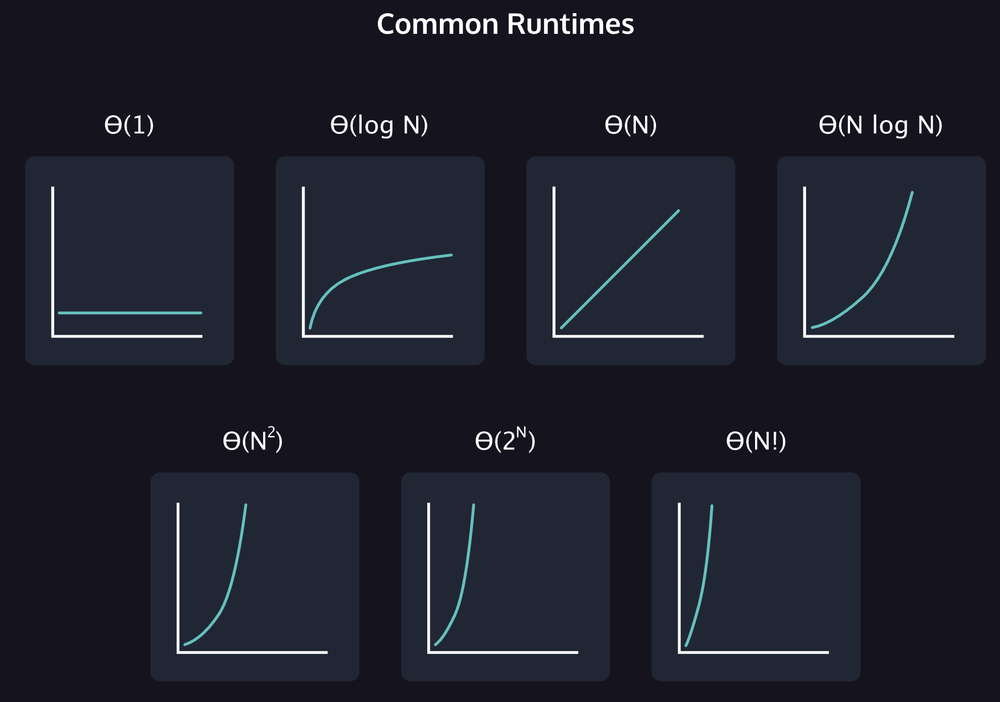

# Asymptotic Notation

We can't just time the program, however, because different computers run at different speeds. My dusty old PC does not run as fast as your brand new laptop. Programming is also done in many different languages, how do we account for that in the runtime? We need a general way to define a program's runtime across these variable factors. We do this with **Asymptotic Notation**.
With asymptotic notation, we calculate a program's runtime by looking at how many instructions the computer has to perform based on the size of the program's input. For example, if I were calculating the maximum element in a collection, I would need to examine each element in the collection. That examining step is the same regardless of the language used, or the [CPU](https://en.wikipedia.org/wiki/Special:Search?search=CPU) that's performing the calculation. In asymptotic notation, we define the size of the input as N. I may be looking through a collection of 10 elements, or 100 elements, but we only need to know how many steps are performed *relative to the input* so N is used in place of a specific number. If there is a second input, we may define the size of that input as M.

Instead of timing a program, through asymptotic notation, we can calculate a program's runtime by looking at how many instructions the computer has to perform based on the size of the program's input: N.
For instance, a program that has input of size N may tell the computer to run 5N2+3N+2 instructions. (We will get into how we get this kind of expression in future exercises.) Nevertheless, this is still a fairly messy and large expression. For asymptotic notation, we drop all of our constants (the numbers) because as N becomes extremely large, the constants will make minute differences. After changing our constants, we have N2+N. If we take each of these terms in the expression and graph them, we see that the N2 term grows faster than the N term.
For example, when N is 1000:
* the N2 term is 1,000,000
* the N term is 1,000
As you can see, the N2 term is much more significant than the N term. When N is larger than 1000, the difference becomes even more significant. Because the difference is so enormous, we don't even need to consider the N term when calculating the runtime. Thus, for this program, we would describe the runtime in terms of N2. There are three different ways we could describe the runtime of this program: big Theta or Θ(N2), big O or O(N2), big Omega or Ω(N2).
You may see the term **execution count** used in evaluating algorithms. Execution count is more precise than Big O notation. The following method, addUpTo(), depending on how we count the number of operations, can be as low as 2N or as high as 5N + 2

```
public class Main() {
  void int addUpTo(int n) {
    int total = 0;
    for (int i = 1; i <= n; i++) {
      total += i;
    }
  return total;
  }
}

```

## Big theta (Θ)

The first subtype of asymptotic notation we will explore is big Theta (denoted by Θ). We use big Theta when a program has only one case in terms of runtime. But what exactly does that mean? Take a look at the pseudocode for a function that prints the values in a list below:

```
Function with input that is a list of size N:
   For each value in list:
    Print the value

```

The number of instructions the computer has to perform is based on how many iterations the loop will do because if the loop does more iterations, then the computer will perform instructions. Now, let's see how many iterations the loop will do dependent on the value of N.
| Size of List         | -vs.-                | Number of Iterations |
|----------------------|----------------------|----------------------|
| 1                    |                      | 1                    |
| 2                    |                      | 2                    |
| 3                    |                      | 3                    |
| .                    |                      | .                    |
| .                    |                      | .                    |
| .                    |                      | .                    |
| .                    |                      | .                    |
| .                    |                      | .                    |
| N                    |                      | N                    |

As we can see in every case, with a list of size N, the program has a runtime of N because the program has to print a value N times. Thus, we would say the runtime is Θ(N).
Let's look at a more complicated example. In the following pseudocode program, the function takes in an integer, N, and counts the number of times it takes for N to be divided by 2 until N reaches 1.

```
Function that has integer input N:
    Set a count variable to 0
    Loop while N is not equal to 1:
        Increment count
        N = N/2
    Return count

```

Now, let's see how many iterations the loop will perform based on N.
| N                    | -vs.-                | Number of Iterations |
|----------------------|----------------------|----------------------|
| 1                    |                      | 0                    |
| .                    |                      | .                    |
| .                    |                      | .                    |
| .                    |                      | .                    |
| 2                    |                      | 1                    |
| .                    |                      | .                    |
| .                    |                      | .                    |
| .                    |                      | .                    |
| 4                    |                      | 2                    |
| .                    |                      | .                    |
| .                    |                      | .                    |
| .                    |                      | .                    |
| 8                    |                      | 3                    |
| .                    |                      | .                    |
| .                    |                      | .                    |
| .                    |                      | .                    |
| 16                   |                      | 4                    |
| .                    |                      | .                    |
| .                    |                      | .                    |
| .                    |                      | .                    |
| N                    |                      | log2N                |

As we can see, in every case, with an integer N, the loop will iterate log2(N) times. However, because we drop constants in asymptotic notation, we would say that the runtime of this program is Θ(log N).

**Common Runtimes**
* **Θ(1)**. This is *constant* runtime. This is the runtime when a program will always do the same thing regardless of the input. For instance, a program that only prints “hello, world” runs in Θ(1) because the program will always just print “hello, world”.
* **Θ(log N)**. This is *logarithmic* runtime. You will see this runtime in search algorithms.
* **Θ(N)**. This is *linear* runtime. You will often see this when you have to iterate through an entire dataset.
* **Θ(N*logN)**. You will see this runtime in sorting algorithms.
* **Θ(N2)**. This is an example of a *polynomial* runtime. When **N** is raised to the **2nd** power, it's known as a *quadratic* runtime. You will see this runtime when you have to search through a two-dimensional dataset (like a matrix) or nested loops.
* **Θ(2N)**. This is *exponential* runtime. You will often see this runtime in recursive algorithms
* **Θ(N!)**. This is *factorial* runtime. You will often see this runtime when you have to generate all of the different permutations of something. For instance, a program that generates all the different ways to order the letters “abcd” would run in this runtime.


## Big omega (Ω) and big O (O)

Sometimes, a program may have a different [runtime](https://en.wikipedia.org/wiki/Special:Search?search=runtime) for the best case and worst case. For instance, a program could have a best case runtime of Θ(1) and a worst case of Θ(N). We use a different notation when this is the case. We use big Omega or Ω to describe the best case and big O or O to describe the worst case. Take a look at the following [pseudocode](https://en.wikipedia.org/wiki/Special:Search?search=pseudocode) that returns True if 12 is in the list and False otherwise:

```
Function with input that is a list of size N:
    For each value in the list:
        If value is equal to 12:
            Return True
    Return False

```

How many times will the loop iterate? Let's take a list of size 1000. If the first value in the list was 12, then the loop would only iterate once. However, if 12 wasn't in the list at all, the loop would iterate 1000 times. If the input was a list of size N, the loop could iterate anywhere from 1 to N times depending on where 12 is in the list (or if it's in the list at all). Thus, in the best case, it has a constant runtime and in the worst case it has a linear runtime.
There are many ways we could describe the runtime of this program:
* This program has a best case runtime of Θ(1).
* This program has a worst case runtime of Θ(N).
* This program has a runtime of Ω(1).
* This program has a runtime O(N).
In fact, when describing runtime, people typically discuss the worst case because you should always prepare for the worst case scenario! **Often times, in technical interviews, they will only ask you for the big O of a program.**

## Adding runtimes
Sometimes, a program has so much going on that it's hard to find the [runtime](https://en.wikipedia.org/wiki/Special:Search?search=runtime) of it. Take a look at the [pseudocode](https://en.wikipedia.org/wiki/Special:Search?search=pseudocode) program that first prints all the positive values up to N and then returns the number of times it takes to divide N by 2 until N is 1.

```
Function that takes a positive integer N:
    Set a variable i equal to 1
    Loop until i is equal to N:
        Print i
        Increment i

    Set a count variable to 0
    Loop while N is not equal to 1:
        Increment count
        N = N/2
    Return count

```

Rather than look at this program all at once, let's divide into two chunks: the first loop and the second loop.
* In the first loop, we iterate until we reach N. Thus the runtime of the first loop is Θ(N).
* However, the second loop, as demonstrated in a previous exercise, runs in Θ(log N).
Now, we can add the runtimes together, so the runtime is Θ(N) + Θ(log N).
However, when analyzing the runtime of a program, we only care about the slowest part of the program, and because Θ(N) is slower than Θ(log N), we would actually just say the runtime of this program is Θ(N). **It is also appropriate to say the runtime is O(N) because if it runs in Θ(N) for every case, then it also runs in Θ(N) for the worst case. Most of the time people will just use big O notation.**
