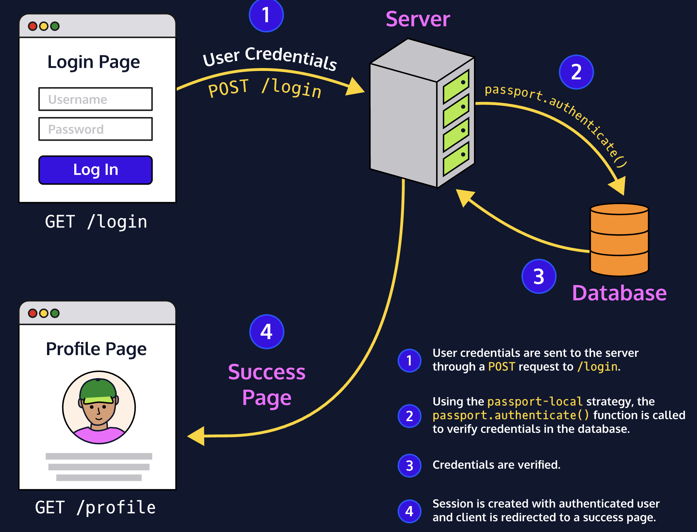

# Passport.js

Passport.js is a flexible authentication middleware for Node.js that can be added to any Express-based application. With Passport.js we can implement authentication using the concept of *strategies*.

Passport strategies are separate modules created to work with different means of authentication. Passport is a very extensible middleware, and it allows you to plug in over 300 different authentication providers like Facebook, Twitter, Google, and more.
In order to offer Passport-supported authentication, we'll need to install and configure the strategies modules that we'd like to use. In this lesson, we'll be focusing on a local Passport strategy, passport-local, and authenticating users using a username and password.


## Configuring Passport.js
One of the great things about using Passport.js is that a lot of the heavy lifting is taken care of by the module. In order to use it, we need to configure it and implement cookies and sessions for persistent logins.

```
npm install passport passport-local

const passport = require("passport");
const LocalStrategy = require("passport-local").Strategy;

```

We're importing the passport-local package with its Strategy instance to authenticate users with a username and password.
Now that we have the package installed, we can initialize it by calling the initialize() method:

```
app.use(passport.initialize());

```

passport is a middleware and must be implemented using app.use(). The initialize() method initializes the authentication module across our app.
Next, we want to allow for persistent logins, and we can do this by calling session() on our passport module:

```
app.use(passport.session());

```

The session() middleware alters the request object and is able to attach a ‘user' value that can be retrieved from the session id.

## Passport's Local Strategy
First, we can configure the local strategy by creating a new instance of it and passing it as middleware into passport:

```
passport.use(new LocalStrategy(
  function(username, password, done) {
    // ...
  }
));

```

The new
     LocalStrategy
  object will take in an anonymous function with the following parameters:
* username
* password
* A callback function called *done*.
The purpose of the
     done
  callback is to supply an authenticated user to Passport if a user is authenticated. The logic within the anonymous function follows this order:
1. Verify login details in the callback function.
2. If login details are valid, the done callback function is invoked and the user is authenticated.
3. If the user is not authenticated, pass false into the callback function.
The
     done
  callback function takes in two arguments:
* An error or null if no error is found.
* A user or false if no user is found.

```
passport.use(new LocalStrategy(
  function (username, password, done) {
    // Look up user in the db
    db.users.findByUsername(username, (err, user) => {
      // If there's an error in db lookup,
      // return err callback function
      if(err) return done(err);

      // If user not found,
      // return null and false in callback
      if(!user) return done(null, false);

      // If user found, but password not valid,
      // return err and false in callback
      if(user.password != password) return done(null, false);

      // If user found and password valid,
      // return the user object in callback
      return done(null, user)
    });
  })
);

```

## Serializing and Deserializing Users
If authentication succeeds, a session will be established and maintained via a cookie set in the user's browser. However, if a user logs in and refreshes the page, the user data won't persist across HTTP requests. We can fix this by *serializing* and *deserializing* users.
Serializing a user determines which data of the user object should be stored in the session, usually the user id. The serializeUser() function sets an id as the cookie in the user's browser, and the deserializeUser() function uses the id to look up the user in the database and retrieve the user object with data.
When we serialize a user, Passport takes that user id and stores it internally on **req.session.passport** which is Passport's internal mechanism to keep track of things.

```
passport.serializeUser((user, done) => {
  done(null, user.id);
});

```

In the code example, we pass a user object and a callback function called done after successful authentication.
The first argument in the done() function is an error object. In this case, since there was no error we pass null as the argument. For the second argument, we pass in the value that we want to store in our Passport's internal session, the user id. Once configured, the user id will then be stored in Passport's internal session:

```
req.session.passport.user = {id: 'xyz'}

```

For any subsequent request, the user object can be retrieved from the session via the deserializeUser() function. We can implement the deserializeUser function as follows:

```
passport.deserializeUser((id, done) => {
  // Look up user id in database.
  db.users.findById(id, function (err, user) {
    if (err) return done(err);
    done(null, user);
  });
});

```

For the deserializeUser function, we pass the key that was used when we initially serialized a user (id). The id is used to look up the user in storage, and the fetched object is attached to the request object as req.user across our whole application.
This way we're able to access the logged-in user's data in req.user on every subsequent request!

## Logging In
In order to log in a user we first need a POST request that takes in user credentials. We can add passport middleware in order to process the authentication and, if successful, serialize the user for us:

```
app.post("/login",
  passport.authenticate("insertStrategyHere", { failureRedirect : "/insertPathHere"}),
  (req, res) => {
    res.redirect("profile");
  }
);

```

We're passing in passport.authenticate() as middleware. Using this middleware allows Passport.js to take care of the authentication process behind the scenes and creates a user session for us.

     passport.authenticate() takes in:
* A string specifying which strategy to employ. In this case, we should use a local strategy.
* An optional object as the second argument. In this case, we should set the failureRedirect key to "/login". This will redirect the user to the /login page if the login process fails.
Once implemented, we can update the "/profile" endpoint to make use of the serialized user found in the request object, req.user:

```
app.get("/profile", (req, res) => {
  res.render("insertDashboardNameHere", { user: req.user });
});

```

This will render our profile view page along with the user data stored in the session!

## User Registration
Using a custom helper function we created in **users.js**, we can retrieve user data upon registration and update the records array:

```
function createUser(user) {
  return new Promise((resolve, reject) => {
    const newUser = {
      // getNewId creates an updated ID
      // for the new user
      id: getNewId(records),
      ...user,
    };
    records = [newUser, ...records];
    resolve(newUser);
  });
};

```

In the createUser() function, we're creating a Promise in order to prevent events from becoming blocked when running the application.
createUser() creates a new user and inserts them into our database, records. Once created, we resolve the Promise and send back the newly created user. If you need a refresher on promises, take a look at our [Promises cheat sheet](https://owasp.org/www-community/) for a quick overview.
Let's use the createUser() helper function in our routes. We'll add the logic to create users in a POST request to "/register".

```
app.post("/register", async (req, res) => {
  const { username, password } = req.body;
  const newUser = await db.users.createUser({ username, password });
  if (newUser) {
    res.status(201).json({
      msg: "Insert Success Message Here",
      newUser
    });
  } else {
    res.status(500).json({ msg: "Insert Failure Message Here" });
  }

```

## Logging Out
Now, let's take a look at how to log users out. Passport.js exposes a logout function within the request object: req.logout. The function can be called from any route handler in order to terminate a login session. It essentially removes the req.user property and clears the login session (if any).

```
app.get("/logout", (req, res) => {
  req.logout();
  res.redirect("/login");
});

```
