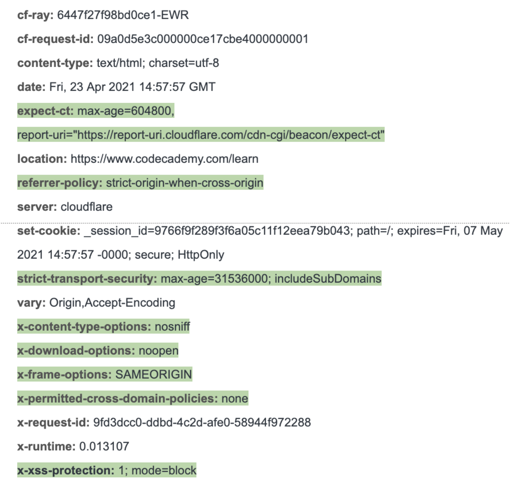

# Security-Related HTTP Headers

HTTP responses can contain headers with extra information that tells the client (browser) how to behave. Security-related headers are added in server-to-client responses to reflect a policy that the website wants to implement, like enforcing HTTPS communications over HTTP, or limiting whether a browser is allowed to render the current webpage in an iframe on another site.

Security headers help protect both the web application and the user. They can help prevent web attacks like Cross-Site Scripting (XSS). It's important to stay updated about these headers and configure them server-side.
Having security headers configured well also increases a website's trustworthiness, which in turn makes it rank higher in web searches (SEO).
Take a look at the headers on the HTTP response from www.example.com when the homepage is loaded. The security-related headers are highlighted.


## Common security headers

### Strict-Transportation-Security

[MDN Web Docs](https://developer.mozilla.org/en-US/docs/Web/HTTP/Headers/Strict-Transport-Security)

This header lets the server tell the browser that only the HTTPS version of the requested site is available. This enforces the use of HTTPS, which is encrypted compared to plain HTTP, ensuring that all communication between the client and the server occurs on a more secure transport layer.
Here's an example of the Strict-Transport-Security header:

```
Strict-Transport-Security: max-age=31536000; includeSubDomains

```

* The includeSubDomains value tells the browser that the current site, including all of its sub-domains, is HTTPS-only.
* The max-age field tells the browser to remember this for the next year (31536000 seconds = 1 year), reducing redirect responses to the HTTPS version of the site in the future.

## Content-Security-Policy
Content-Security-Policy defines an allowlist of sources of content. This restricts the assets that the browser can load while they're on the current website. This can prevent Cross-Site Scripting (XSS) attacks, where scripts from sources outside the site are executed.

```
Content-Security-Policy: script-src 'self';

```

The script-src option restricts which resources JavaScript can be loaded from. The self value indicates that the browser should only run scripts from the current domain.
You can look into [more options for this header on Mozilla MDN Web Docs](https://developer.mozilla.org/en-US/docs/Web/HTTP/CSP).

## X-Frame-Options
This header stops the current page from being hidden in an &lt;iframe&gt; tag in another site's HTML. This helps prevent [clickjacking](https://owasp.org/www-community/attacks/Clickjacking); a situation where an attacker loads your webpage in an iframe, hides the iframe using CSS, and tricks a user into unknowingly clicking on and sending a request to your webpage.

```
X-Frame-Options: DENY

```

means your page can't be hidden in an iframe anywhere, whereas

```
X-Frame-Options: SAMEORIGIN

```

only allows this page to be put into an iframe within your own domain.

```
X-Frame-Options: ALLOW-FROM https://example.com

```

lets you list sites that are allowed to put the current content in an iframe.
Some other common headers include:
* [X-Content-Type-Options](https://developer.mozilla.org/en-US/docs/Web/HTTP/Headers/X-Content-Type-Options)
* [Referrer-Policy](https://developer.mozilla.org/en-US/docs/Web/HTTP/Headers/Referrer-Policy) Additional Resources on security headers:
* [OWASP HTTP Security Headers Guide](https://owasp.org/www-project-secure-headers/)
* [Mozilla resource on HTTP security-related headers](https://developer.mozilla.org/en-US/docs/Web/HTTP/Headers#security)
## How to add security headers

### Nginx
The following line is added to an nginx server's config file to add the Strict-Transport-Security header to all HTTP responses.

```
add_header strict-transport-security 'max-age=31536000; includeSubDomains always;'

```

For more details, here is an [nginx guide to adding the Strict-Transport-Security header](https://www.nginx.com/blog/http-strict-transport-security-hsts-and-nginx/), which you can also use as a guide for adding other headers.

### Apache
To add the Strict-Transport-Security header, you can add the following line to Apache server's config file located at /etc/httpd/conf/httpd.conf:

```
Header always set Strict-Transport-Security "max-age=31536000; includeSubDomains"

```

### Microsoft IIS
If you use Windows IIS, you can add security headers in your the Web.config file's &lt;httpProtocol&gt; section like so:

```
<system.webServer>
  ...

  <httpProtocol>
    <customHeaders>
      <add name="Content-Security-Policy" value="default-src 'self';" />
    </customHeaders>
  </httpProtocol>

  ...
</system.webServer>

```

You can use [https://securityheaders.com/](https://securityheaders.com/) to check which headers are active on your web address.
