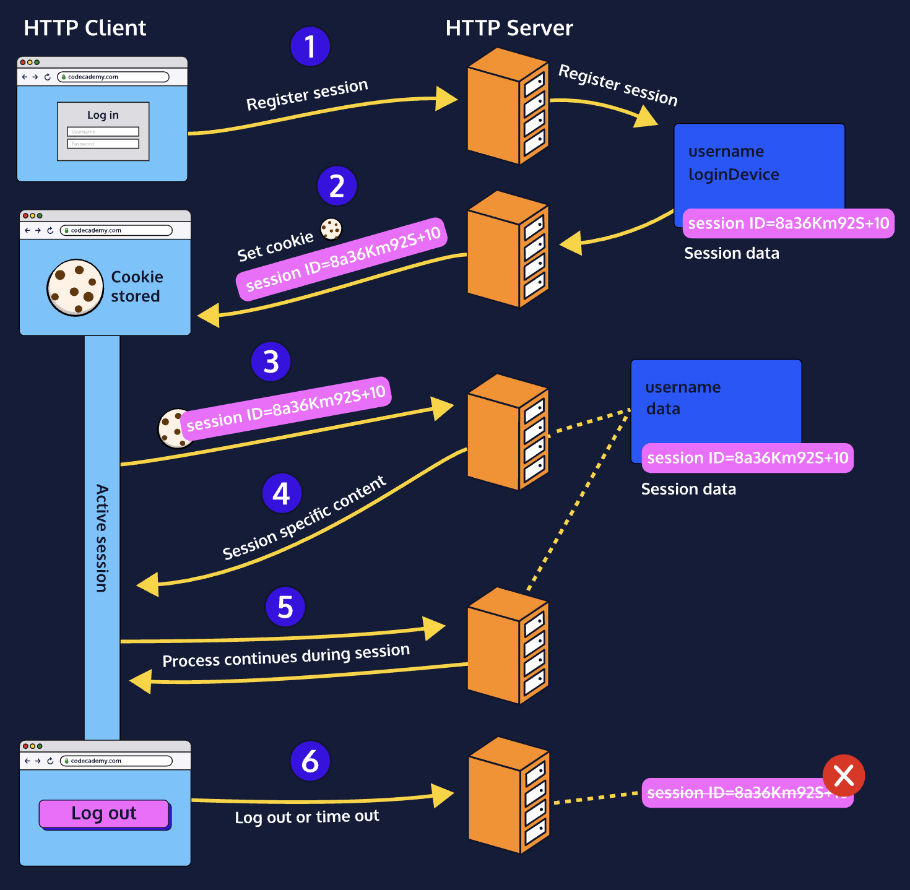

# Sessions in Express

Whether you are browsing through an online shop or accessing your bank account online, your user data persisted across page loads thanks to sessions. Without them, every time you reloaded the window you would be logged out or lose your cart!
We will be configuring sessions and cookies in the next few exercises. Review the diagram to better understand how a session is implemented with cookies,
The diagram shows the process is:
1. A user goes to a site. The web server creates a session and a session ID.
2. In the server's response, it tells the browser to store a cookie with the session ID (should not include any personal information).
3. The session ID cookie automatically attaches to each subsequent HTTP request to the server.
4. When the server reads the session ID cookie sent with the next HTTP request, it returns the session data associated with the ID.
5. The process continues as long as the session is active.
6. The session and session ID cookie expires after a user closes out the browser, logs out, or a predetermined session length (i.e. an hour) passes.


## Installing express-session
In order to implement sessions within an Express application, we can use the NPM module, [express-session](https://www.npmjs.com/package/express-session), as a middleware.
Once the session middleware is implemented, each user that navigates to our app will have a unique session generated for them. This allows us to store their session data server-side under a session identifier and easily retrieve it.

```
npm install express-session

```

 Import the session module and store it in a variable

```
const session = require("express-session")

```

### express-session Configuration
Now that we have
     express-session
  installed, we can configure the middleware and implement it in
     app.js
 . Let's explore a few of the options we can configure:
* secret: The secret property is a key used for signing and/or encrypting cookies in order to protect our session ID.
The next two properties determine how often the session object will be saved.
* resave: Setting this option to true will force a session to be saved back to the session data store, even when no data was modified. Typically, this option should be false, but also depends on your session storage strategy.
* saveUninitialized: This property is a
* [boolean](https://owasp.org/www-community/) value. If it's set to true, the [server](https://owasp.org/www-community/) will store every new session, even if there are no changes to the session object. This might be useful if we want to keep track of recurring visits from the same browser, but overall, setting this property to false allows us to save memory space.

```
app.use(
  session({
    secret: "D53gxl41G",
    resave: false,
    saveUninitialized: false,
  })
);

```

Note that we are using a hardcoded string of characters for the secret property. Usually, this random string should be stored securely in an environment variable, not in the code.
The resave and saveUninitialized properties are set to false in order to avoid saving or storing unmodified sessions. With those options put in place, we have the most basic setup of our middleware!

### Storing Session Data
Sessions are typically stored in three different ways:
* In memory (this is the default storage)
* In a [database](https://owasp.org/www-community/) like MongoDB or MySQL
* A memory [cache](https://owasp.org/www-community/) like Redis or Memcached
Whenever a user makes a request from the same client with a valid session identifier, the server retrieves the valid session information.
express-session provides an in-memory store called, *MemoryStore()*. If no other store is specified, then this is set as the default storage. Let's explore how we would add this to the middleware.

```
const store = new session.MemoryStore();

```

We can add it in the configuration of our session:

```
app.use(
  session({
    secret: "secret-key",
    resave: false,
    saveUninitialized: false,
    store,
  })
);

```

*Note: Storing in-memory sessions is something that should be done only during development, NOT during production due to security risks.*

### Authentication and Sessions: Cookies
We should make use of client-side storage so that the user's browser can automatically send over the session identifier with each incoming HTTP request.

```
app.use(
  session({
    secret: "f4z4gs$Gcg",
    cookie: { maxAge: 1000 * 60 *60 * 24, secure: true, sameSite: "none" },
    saveUninitialized: false,
    resave: false,
  })
);

```

Cookies will have a few default properties set, but we can specify them using key-value pairs. The
     maxAge
  property sets the number of milliseconds until the cookie expires. In this case, we're setting it to expire in 24 hours. We're also providing it with the
     secure
  attribute so it's only sent to the server via HTTPS. Lastly, we're adding a
     sameSite
  property and setting it to
     "none"
  in order to allow a cross-site cookie through different browsers.
Other cookie properties include:
* cookie.expires
* cookie.httpOnly
* cookie.sameSite

### Sessions and Authentication: Logging In
On the right, we have a login form that takes a username and password. If a user logs in with the correct credentials, we want to initiate a session.
We can do this by first looking up the user in our database and then verifying that the password is correct. Once credentials are confirmed, we'll add data to our session.
Once the user is logged in we'll add a property, authenticated within our session object and assign it to true. We'll also set user in the session data and assign it the username and password we received:

```
// Look up user in database, if found, confirm password:
if (password == "codec@demy10") {
  // Attach an `authenticated` property to our session:
  req.session.authenticated = true;
  // Attach a user object to our session:
  req.session.user= {
    username,
    password,
  }
}

```

***Note****: we are demonstrating using a hardcoded password. However, in production, you always want to encrypt your password.*
Once the user is logged in, their session is created and stored in memory. The properties authenticated and user will be accessible and changeable as session data.

### Accessing Session Data
We're able to store and access data in nested objects. Let's say we had saved the number of items in a user's cart in the session data:

```
req.session.user.cartCount = 2;

```

One common use case of session data is to protect specific routes. In the example below, we check that the authorized property exists within the session, and if it's set to true before we move on to the next route handler.

```
function authorizedUser(req, res, next) {
  // Check for the authorized property within the session
  if (req.session.authorized) {
    // next middleware function is invoked
    res.next();
  else {
    res.status(403).json({ msg: "You're not authorized to view this page" });
  }
};

```

In the protected route, we can also pass the user session object:

```
app.get("/protected", authorizedUser, (req, res, next) => {
 res.render("protected", { "user": req.session.user });
});

```

NOTE: res.render() takes in a view page as the first argument and an object whose properties define local variables for the view as the second argument.
