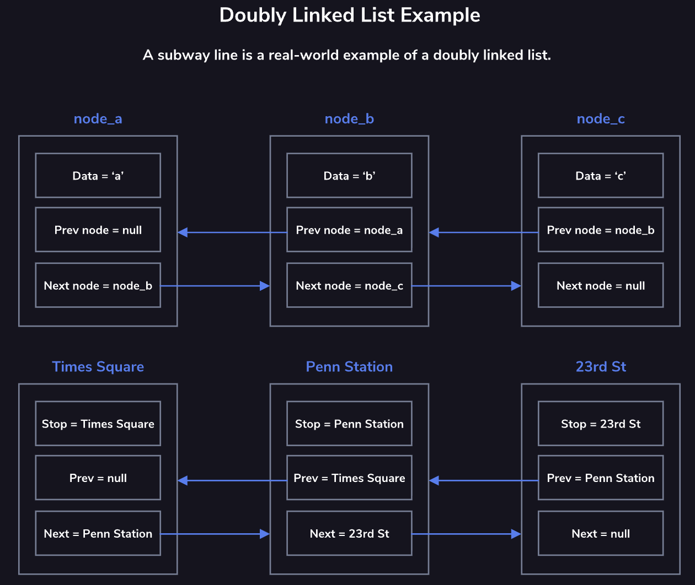
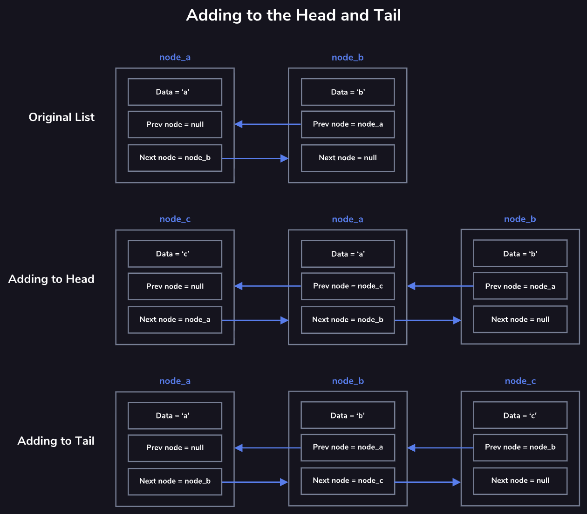
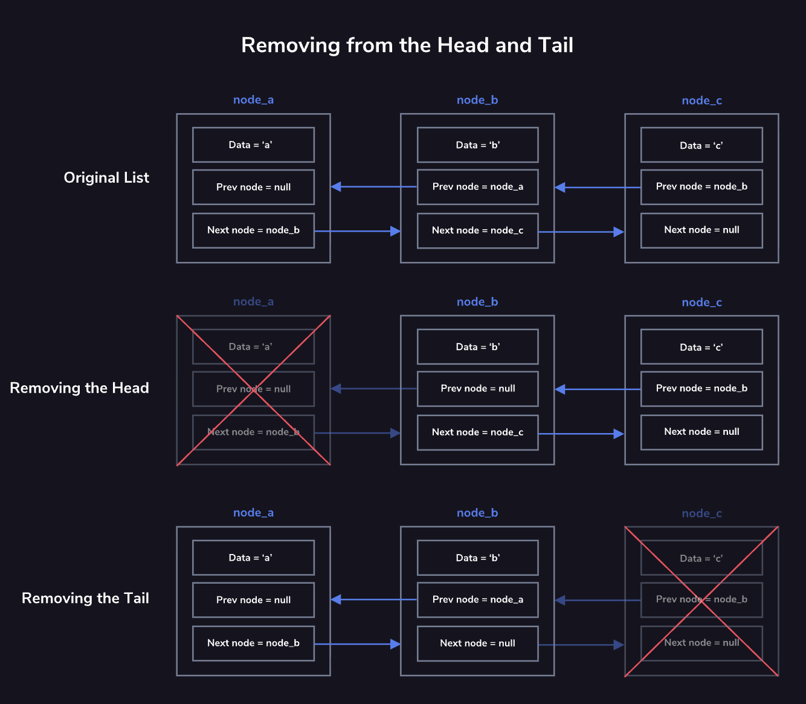
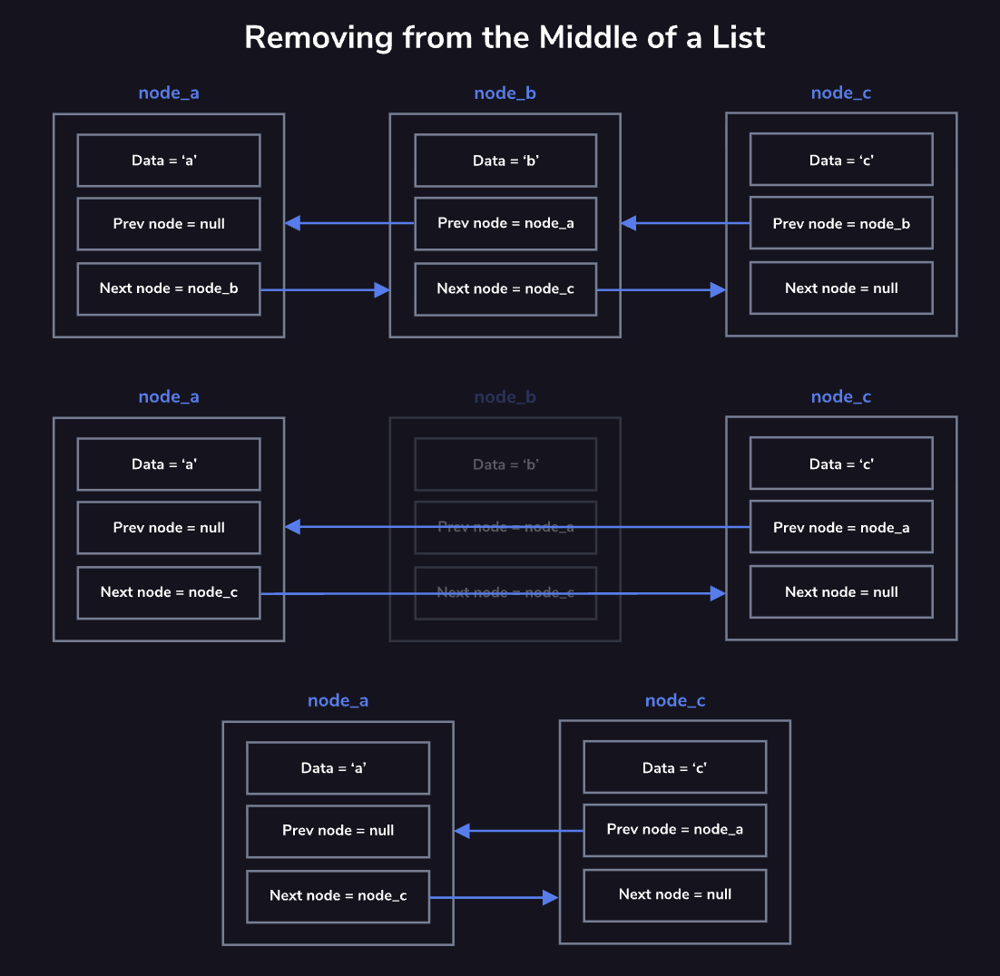

import DoublyLinkedListPlayground from "./components/linear-data-structure-doubly-linked-lists/DoublyLinkedListPlayground.jsx"

# Doubly Linked Lists

While a singly linked list consists of nodes with links from the one node to the next, a doubly linked list also has a link to the node before it. These previous links, along with the added tail property, allow you to iterate backward through the list as easily as you could iterate forward through the singly linked list.
Like a singly linked list, a doubly linked list is comprised of a series of nodes. Each node contains data and two links (or pointers) to the next and previous nodes in the list. The head node is the node at the beginning of the list, and the tail node is the node at the end of the list. The head node's previous pointer is set to
     null
  and the tail node's next pointer is set to
     null
 .

Common operations on a doubly linked list may include:
* adding nodes to both ends of the list
* removing nodes from both ends of the list
* finding, and removing, a node from anywhere in the list
* traversing (or traveling through) the list

## Adding to the Head
When adding to the head of the doubly linked list, we first need to check if there is a current head to the list. If there isn't, then the list is empty, and we can simply make our new node both the head and tail of the list and set both pointers to
     null
 . If the list is not empty, then we will:
* Set the current head's previous pointer to our new head
* Set the new head's next pointer to the current head
* Set the new head's previous pointer to null
## Adding to the Tail
Similarly, there are two cases when adding a node to the tail of a doubly linked list. If the list is empty, then we make the new node the head and tail of the list and set the pointers to
     null
 . If the list is not empty, then we:
* Set the current tail's next pointer to the new tail
* Set the new tail's previous pointer to the current tail
* Set the new tail's next pointer to null

## Removing the Head
Removing the head involves updating the pointer at the beginning of the list. We will set the previous pointer of the new head (the element directly after the current head) to
     null
 , and update the head property of the list. If the head was also the tail, the tail removal process will occur as well.
## Removing the Tail
Similarly, removing the tail involves updating the pointer at the end of the list. We will set the next pointer of the new tail (the element directly before the tail) to
     null
 , and update the tail property of the list. If the tail was also the head, the head removal process will occur as well.

## Removing from the Middle of the List
It is also possible to remove a node from the middle of the list. Since that node is neither the head nor the tail of the list, there are two pointers that must be updated:
* We must set the removed node's preceding node's next pointer to its following node
* We must set the removed node's following node's previous pointer to its preceding node
There is no need to change the pointers of the removed node, as updating the pointers of its neighboring nodes will remove it from the list. If no nodes in the list are pointing to it, the node is orphaned.

## Interactive Playground: Doubly Linked List Pointer Updates
**Why this matters:** doubly linked lists require synchronized `next` and `prev` updates.

**What to try:** append and remove from both ends, then verify forward/backward traversal consistency.

<DoublyLinkedListPlayground />
