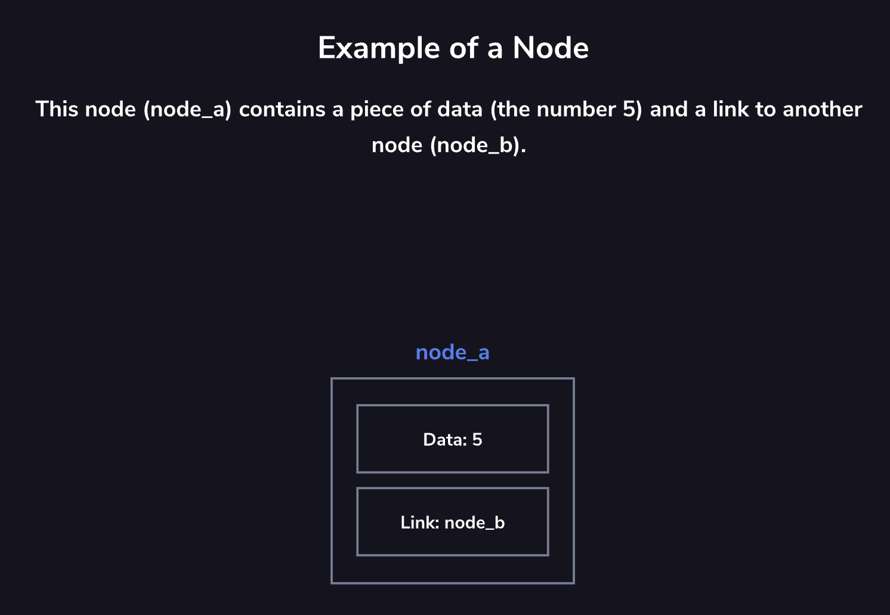

# Nodes

Nodes are the fundamental building blocks of many computer science [data structures](https://en.wikipedia.org/wiki/Special:Search?search=data+structures). They form the basis for linked lists, stacks, queues, trees, and more.
An individual node contains data and links to other nodes. Each data structure adds additional constraints or behavior to these features to create the desired structure.

## Nodes Detail
The data stored inside a node can be different types depending on the programming language being used.
In the previous example, the node contained an integer (
     5
 ), but it could also contain:
* A **string** (e.g., "five")
* A **decimal number** (e.g., 5.1)
* An **array** (e.g., [5, 3, 4])
* Or **nothing** (null) This shows that nodes are flexible containers capable of holding many kinds of data.

### Links and Pointers
Nodes usually contain not only data, but also one or more **links**.
These links are often referred to as **pointers** because they “point” to another node.
In most data structures:
* A node can have one or more links.
* If a link is null, it means the end of that path has been reached.
In other words, a
     null
  link indicates that there are no more connected nodes in that direction.

## Node Linking
In many data structures, a node may only be linked to by a **single other node**.
Because of this, it is extremely important to carefully consider how nodes are modified or removed from a data structure.

### Orphaned Nodes
If you accidentally remove the only link pointing to a node:
* That node becomes unreachable.
* Its data is effectively “lost” to the application.
* Any nodes linked from it may also become inaccessible.
When this happens, the node is called an **orphaned node**.
An orphaned node still exists in memory, but no other node references it, so it cannot be accessed through the structure.
