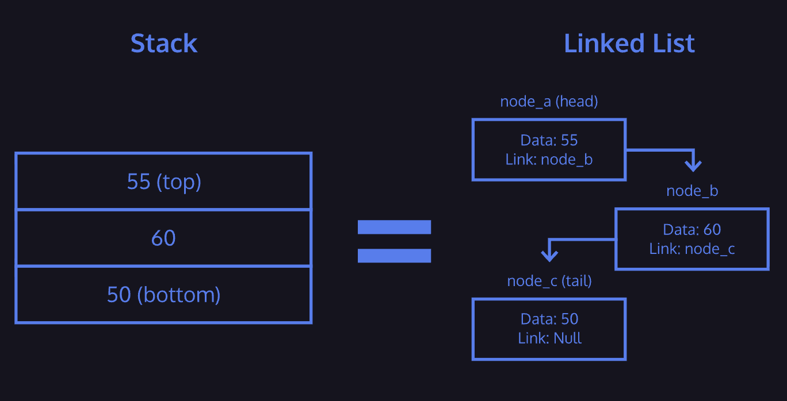

import StackOperationsPlayground from "./components/stacks/StackOperationsPlayground.jsx"

# Stacks

Stacks are another data structure with a perfectly descriptive name. Like a queue, a stack is a linear collection of nodes that adds (pushes) data to one end of the data structure (let's say the top, for the purposes of this example). However, unlike a queue, a stack removes data (pops) from the same end of the data structure. Think of it as a stack of books, where you can only pick up the top book, and add a new book to the top.
Stacks are often thought of as a “First In, Last Out” (FILO) data structure - the first book you add to the stack won't be removed until all other books are removed from the stack.
Queues on the other hand are thought of as a “First In, First Out” (FIFO) data structure - the first person in line will be the first person to leave the line.

A stack is a data structure which contains an ordered set of data.
Stacks provide three methods for interaction:
* Push - adds data to the “top” of the stack
* Pop - returns and removes data from the “top” of the stack
* Peek - returns data from the “top” of the stack without removing it
At any point, the only weight you can remove, or *pop*, from the stack is the top one. You can *peek* and read the top weight **without removing it from the stack.**
 Stacks can be implemented using a linked list as the underlying data structure.
Depending on the implementation, the top of the stack is equivalent to the head node of a linked list and the bottom of the stack is equivalent to the tail node.
A constraint that may be placed on a stack is its size. This is done to limit and quantify the resources the data structure will take up when it is “full”.
Attempting to push data onto an already full stack will result in a *stack overflow*. Similarly, if you attempt to pop data from an empty stack, it will result in a *stack underflow*.

## Interactive Playground: Stack Operations
**Why this matters:** LIFO rules are clearer when you apply push and pop step by step.

**What to try:** push a value, pop twice, and verify that the last pushed value leaves first.

&lt;StackOperationsPlayground /&gt;
