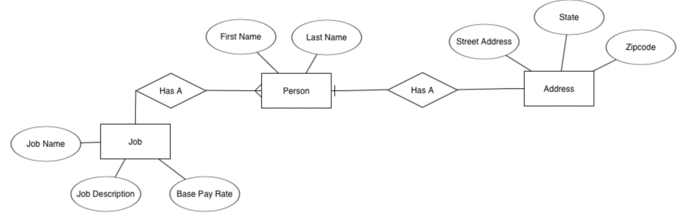

# Designing a Relational Databases

When designing a database schema consider the following steps:
* Define the purpose of your database
* Find the information that make up the database
* Organize your information into tables
* Structure your tables into columns of information
* Avoid redundant data that leads to inaccuracy and waste in space
* Identify the relationships between your tables and implement them
You can design database schemas by hand or by software. Here are a few examples of free online database design tools:
* [DbDiagram.io](http://dbdiagram.io/) - a free, simple tool to draw ER diagrams by just writing code, designed for developers and data analysts.
* [SQLDBM](http://sqldbm.com/home) - SQL Database Modeler
* [DB Designer](http://dbdesigner.net/) - online database schema design and modeling tool
* [lucidchart.com](https://www.lucidchart.com/pages/examples/database-design-tool)
## What is a schema?
When designing a database, the most common thing seen among most teams will be a *database schema*. Database schemas are often drawn as diagrams - big pictures showing every table and how they are connected. These schemas will usually include the columns in each database and arrows showing how a table relates to another table. There are a few different ways to draw out these diagrams, but in this article, we'll cover an Entity Relationship Diagram, which is a slightly higher level than a basic database schema.

## What's an Entity Relationship Diagram?
Source: [https://www.lucidchart.com/pages/er-diagrams#section_5](https://www.lucidchart.com/pages/er-diagrams#section_5)

An *Entity Relationship Diagram*, or *ERD*, is a method of diagramming a database with a little more description put into it to allow a designer to better understand the database and the relationships between the tables. This is done by using several different items within the schema. Including:
* *Entities*. Entities are usually represented as rectangles and indicate the table's name.
* *Attributes*. Attributes can be found in one of two places, either inside of the entity's rectangles as rows or outside of the entity represented by an oval that is connected to the entity. In both places, an attribute means the same thing and is the individual columns that will be found within that table or entity.
* *Actions*. Actions are seen as diamonds within the ERD and describe the relationships between different entities. For instance, if we have two entities, a Customer and a Credit Card that are both connected, we can put an action in between those two that says “has” to show the designer that a Customer has a Credit Card.
* *Connecting Lines*. These lines, just like in a basic schema, are used to show the connection between each entity, action, and attribute.
An example of an entity-relationship diagram can be seen below. Notice that the connecting lines have special symbols on the ends, this will be talked about in more detail later.

## Other Schema Types
While this article mainly looked at the ERD, there are still several different schema options available to use. Some being more complicated than others and some being less complicated. For example, some lower level schema types are the hierarchical model, the network model, and the relational model. Most schemas will use the relational model. If a higher level is needed than ERD we could use the star schema or the snowflake schema. These higher levels deal more with the design of the database and making it more efficient rather than trying to display more information about the schema.
