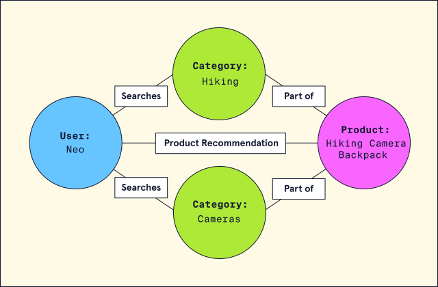
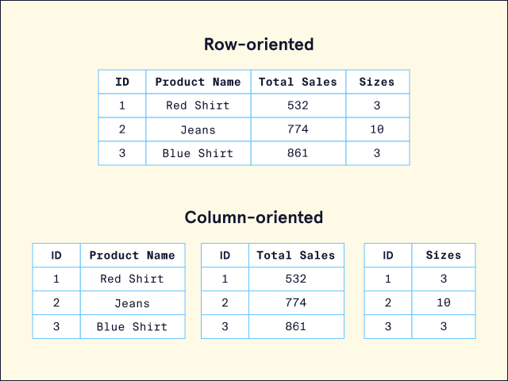

# NoSQL

However, a new type of database, **NoSQL**, started to rise in popularity in the early 21st century.
NoSQL is short for “not-only SQL”, but is also commonly called “non-relational” or “non-SQL”. Any database technology that stores data differently from relational databases can be categorized as a NoSQL database.

## Relational vs Non relational databases
When considering what database suits an application's needs, it's important to note that relational and non-relational (NoSQL) databases each offer distinct advantages and disadvantages. While not an exhaustive list, here are some notable benefits that a NoSQL database may provide:
* **Scalability**: NoSQL was designed with scalability as a priority. NoSQL can be an excellent choice for massive datasets that need to be distributed across multiple servers and locations.
* **Flexibility**: Unlike a relational database, NoSQL databases don't require a schema. This means that NoSQL can handle unstructured or semi-structured data in different formats.
* **Developer Experience**: NoSQL requires less organization and thus lets developers focus more on using the data than on figuring out how to store it.
While these are important benefits, NoSQL databases do have some drawbacks:
* **Data Integrity**: Relational databases are typically [ACID](https://en.wikipedia.org/wiki/ACID) compliant, ensuring high data integrity. NoSQL databases follow BASE principles (basic availability, soft state, and eventual consistency) and can often sacrifice integrity for increased data distribution and availability. However, some NoSQL databases do offer ACID compliance.
* **Language Standardization**: While some NoSQL databases do use the Structured Query Language (SQL), typically, each database uses its unique language to set up, manage, and query data.

## Types of NoSQL Databases
### Key-Value
A key-value database consists of individual records organized via key-value pairs. In this model, keys and values can be any type of data, ranging from numbers to complex objects. However, keys must be unique. This means this type of database is best when data is attributed to a unique key, like an ID number. Ideally, the data is also simple, and we are looking to prioritize fast queries over fancy features. For example, let's say we wanted to store shopping cart information for customers who shop in an e-commerce store. Our key-value database might look like this:
| Key                                               | Value                                             |
|---------------------------------------------------|---------------------------------------------------|
| customer-123                                      | &#123; “address”: “...”, name: “...”, “preferences”: &#123;...&#125; &#125; |
| customer-456                                      | &#123; “address”: “...”, name: “...”, “preferences”: &#123;...&#125; &#125; |

Amazon [DynamoDB](https://aws.amazon.com/dynamodb/) and [Redis](https://redis.com/) are popular options for developers looking to work with key-value databases.

**Document**
A document-based (also called document-oriented) database consists of data stored in hierarchical structures. Some supported document formats include JSON, BSON, XML, and YAML. The document-based model is considered an extension of the key-value database and provides querying capabilities not solely based on unique keys. Documents are considered very flexible and can evolve to fit an application's needs. They can even model relationships!
For example, let's say we wanted to store product information for customers who shop in our e-commerce store. A products document might look like this:

```
[
  {
    "product_title": "Codecademy SQL T-shirt",
    "description": "SQL > NoSQL",
    "link": "https://shop.example.com/products/sql-tshirt"
    "shipping_details": {
      "weight": 350,
      "width": 10,
      "height": 10,
      "depth": 1
    },
    "sizes": ["S", "M", "L", "XL"],
    "quantity": 101010101010,
    "pricing": {
      "price": 14.99
    }
  }
]

```

[MongoDB](https://www.mongodb.com/) is a popular option for developers looking to work with a document database.

**Graph**
A graph database stores data using a [graph structure](https://en.wikipedia.org/wiki/Graph_(abstract_data_type)). In a graph structure, data is stored in individual nodes (also called vertices) and establishes relationships via edges (also called links or lines). The advantage of the relationships built using a graph database as opposed to a relational database is that they are much simpler to set up, manage, and query. For example, let's say we wanted to build a recommendation engine for our e-commerce store. We could establish relationships between similar items our customers searched for to create recommendations.


In the graph above, we can see that there are four nodes: “Neo”, “Hiking”, “Cameras”, and “Hiking Camera Backpack”. Because the user, “Neo”, searched for “Hiking” and “Cameras”, there are edges connecting all 3 nodes. More edges are created after the search, linking a new node, “Hiking Camera Backpack”.
[Neo4j](https://neo4j.com/) is a popular option for developers looking to work with a graph database.

**Column Oriented**
A column-oriented NoSQL database stores data similar to a relational database. However, instead of storing data as rows, it is stored as columns. Column-oriented databases aim to provide faster read speeds by being able to quickly aggregate data for a specific column. For example, take a look at the following e-commerce database of products:


If we wanted to analyze the total sales for all the products, all we would need to do is aggregate data from the sales column. This is in contrast to a relational model that would have to pull data from each row. We would also be pulling adjacent data (like size information in the above example) that isn't relevant to our query.
Amazon's [Redshift](https://aws.amazon.com/redshift/) is a popular option for developers looking to work with a column-oriented database.
