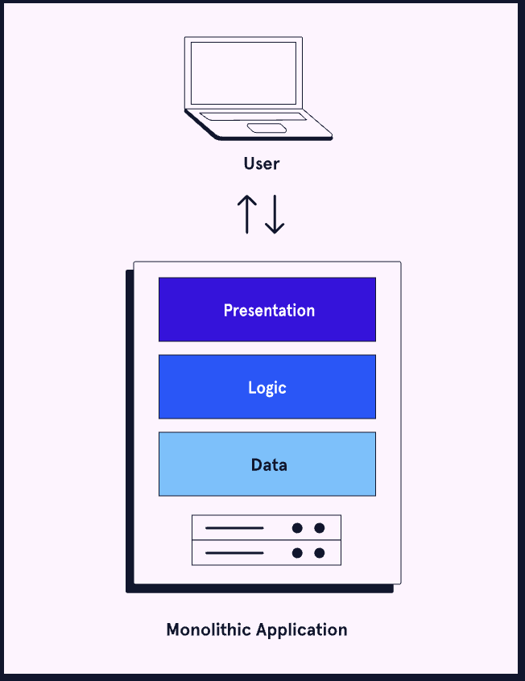
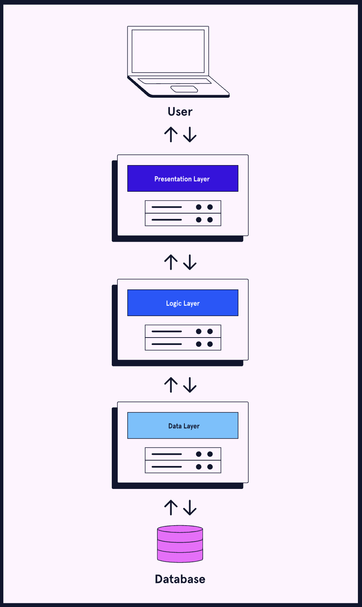
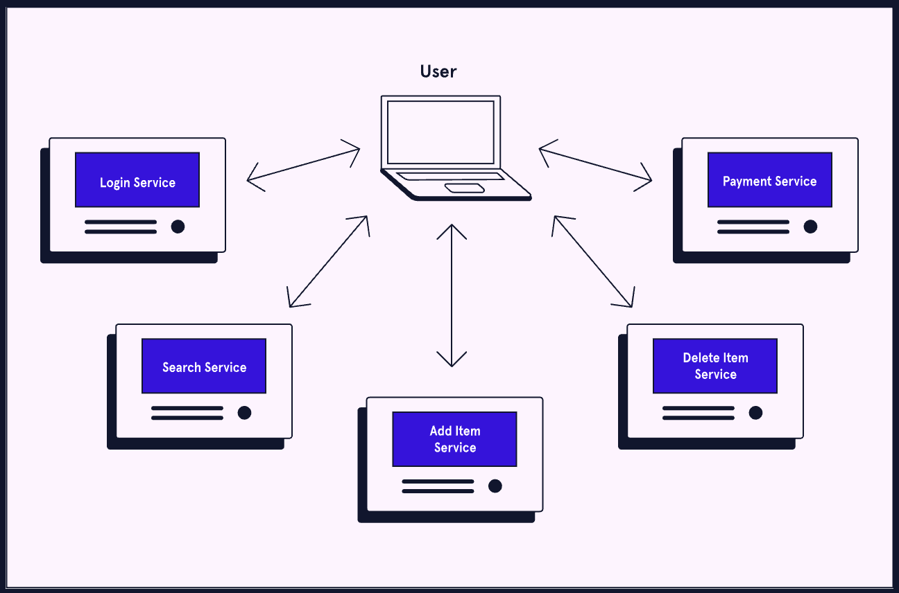

# Application Architectures

## Monolithic Architecture
In a **monolithic architecture**, an entire application and all its features live within a single codebase. The application is written in a single language. When developers add features, they must redeploy the entire application.
Monolithic applications, or monoliths, have been around since in-house infrastructure was the norm. Since then, several other types of architecture have also become popular. Still, a monolithic architecture has its benefits over other types.

A **monolithic architecture** is simple and easy to start with. It allows for **fast initial development**, **easy deployment** (single codebase, single process), and **simple testing** since everything runs together on one system.
However, as the application grows, drawbacks appear. It becomes a **single point of failure**, meaning one issue can break the entire system. Scaling is **inefficient** because the whole application must be scaled even if only one feature needs more resources. Over time, the **codebase becomes large and complex**, making maintenance harder and increasing the risk of bugs.

### Monolithic Architecture Use Cases
Despite the advent of newer architectures, monoliths still have their uses. A monolithic architecture can be a good choice when:
* Developing small, internal applications
* Starting a large application and then switching architectures when complexity increases
There is another architecture which mitigates some of the issues faced by a monolith while only slightly increasing its complexity. This architecture is n-tier architecture.

## N-Tier Architecture
An **n-tier architecture** splits an application into several layers. Each layer has a distinct responsibility. When a layer is hosted on its own dedicated server, it is called a **tier**. Other names for this architecture are multi-tier and multi-layer architecture.
A three-tier application is the most common type of n-tier architecture. This application consists of the following layers:
* Presentation layer: This layer is what the user sees and interacts with.
* Logic layer: This layer contains all the business logic and decision making.
* Data layer: This layer handles interacting with a database.

Plant Pals could implement an n-tier architecture by maintaining their website front-end in the presentation layer, handling payments in the logic layer, and managing user data and inventory in the data layer.
N-tier architecture, like the monolithic architecture, has been around for a long time. It is a time-tested approach for enterprise applications. Let’s see why n-tier could be used over a monolithic architecture.

An **n-tier architecture** improves on monolithic design by separating the application into layers with distinct responsibilities. This creates **clear separation of concerns**, allowing teams to work independently and safely. It also enables **better scalability**, since each tier can be scaled separately based on demand.
However, it still has drawbacks. Each tier can become a **point of failure**, potentially disrupting the whole application. Deployment is also **more complex**, requiring careful setup of communication, logging, and monitoring between tiers.

### N-Tier Use Cases
N-tier architectures are a good middle ground between monolithic and more complex architectures (discussed next). Many companies have sustained successful n-tier applications for years. This architecture can be a suitable choice for:
* Large internal applications
* Enterprise applications when other architectures are deemed undesirable
The final architecture we’ll examine is the most complex. It is known as microservices architecture.

## Microservices Architecture
**Microservices architecture** refers to an application where features are spread across different services. Each service is responsible for a tightly defined component of business logic. Services should aim to have smaller, independent codebases. These aspects make microservices a more granular approach than architectures like n-tier.

The microservices architecture is relatively new compared to monolithic and n-tier architectures. It is closely associated with DevOps and cloud-based infrastructure. Let’s see how microservices solve many of the issues faced by other architectures.

A **microservices architecture** breaks an application into many small, independent services. Its benefits include **high fault tolerance** (no single point of failure), **independent and efficient scalability**, **flexibility in technology choices**, and **smaller, more maintainable codebases** managed by separate teams.
However, this architecture is more complex. It has **slower initial development**, **complicated deployment** (due to inter-service communication, monitoring, etc.), and **more difficult testing**, since services depend on each other and often require mocking other components.

### Microservices Architecture Use Cases
Microservices applications are complex to set up. However, they provide many long-term benefits over other architectures. So, they are generally used for one purpose: large, enterprise applications. Netflix, Facebook, Amazon, and Google are just some popular applications that deploy microservices.
