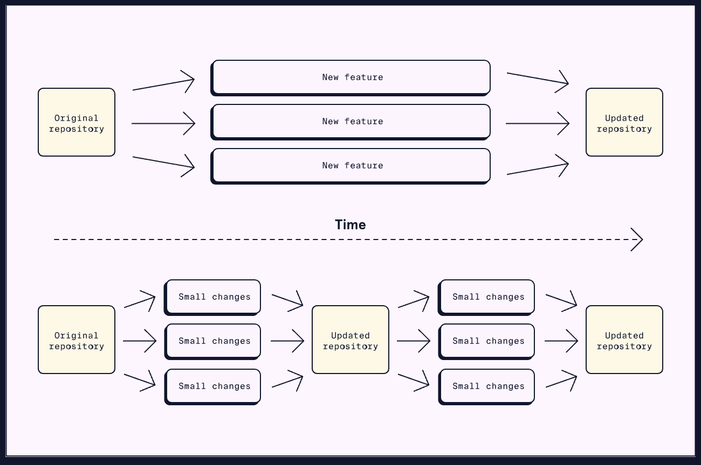
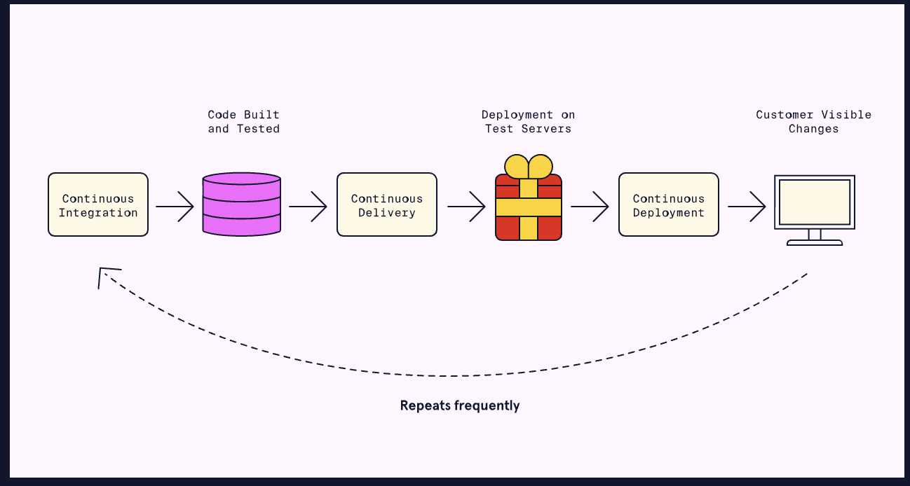

import DeliveryPipelinePlayground from "./components/devops-automation/DeliveryPipelinePlayground.jsx"

# DevOps Automation

**Automation** is using tools or programming to perform repetitive and time-consuming tasks. When compared to doing the work by hand, automation is:
* Faster — automated processes can perform operations much faster than people.
* Less error-prone — automation is able to perform a task more consistently than a person.
* Cheaper — workers don’t have to be paid to do these repetitive workflows.
We can integrate automation into nearly every aspect of software development. Let’s take a look at some of the ways automation can play a role in software development:

## Planning
Many project planning tools such as [Jira](https://www.atlassian.com/software/jira), [Monday](https://monday.com/), and [Slack](https://slack.com/) have automation features. These features allow:
* Recurring meetings and standups to be auto-generated
* Notifications to be sent to team members when items are completed

## Building, testing, and deploying
One of the main areas of automation in DevOps is building, testing, and deploying our code. The main practice for this is continuous integration and continuous deployment (CI/CD). CI/CD tools allow for automated building, testing, and deployment of application code. CI/CD helps ensure a working prototype is available and running with the most recent changes.

## Monitoring
Automation is useful for processing logs and collecting metrics when monitoring software. Visualization tools allow for the processed data to be converted to interactive diagrams.
Let’s see what tools we can use for these tasks!

## Popular automation tools
There are many tools available to assist in DevOps automation. In this section, we will be taking a brief look at some of the most popular automation tools used in DevOps.
* [Jenkins](https://www.jenkins.io/) - most popular and well-known
* [GitHub Actions](https://github.com/features/actions) - integrated into Github
* [Gradle](https://gradle.org/) - a focus on building and compiling
While they have their differences, all three automatically build, test, and deploy code. Learning these tools allows us to automate aspects of our DevOps workflows. When learning one tool, keep an open mind about learning the others as well. Each DevOps team will have their own DevOps automation workflow. Having flexibility with our tooling can be a great asset.

## Continuous Integration
Continuous integration (CI) is a practice that consists of two main components:
* Merging source code changes on a frequent basis.
* Building and testing the changes in an automatic process.
The combination of these components ensures new additions are built and tested often.
*CI practices can be implemented on their own. However, they are often mentioned alongside continuous delivery and deployment (CD). The combination of continuous integration, delivery, and deployment is called CI/CD. More can be learned about continuous delivery and deployment* *[here](https://developer.mozilla.org/en-US/search?q=here)**.*
CI often requires changing the way we work with source control management. Let’s take a look at why CI might make us want to move away from traditional feature branch development.

## Feature branch development
In the past, traditional source control management approaches used long-lived branches. These branches were merged only once a feature was completed, hence the name, **feature branch development**. This works well for smaller projects or for a single developer. However, issues arise with bigger projects:
* There are long review periods for relatively larger feature branches.
* There could be many conflicts when merging large branches into the main repository.
Remember that the goal of CI is to frequently merge, build, and test code changes on one main branch. Feature branch development cannot be the solution due to the slow cycle of merges and relatively larger branch sizes.

## Trunk-based development
**Trunk-based development** is frequently merging small changes into the main branch (or trunk). Some of the benefits of trunk-based development include:
* Discovering problems early (known as “shifting left”) instead of at the end of a large merge attempt.
* Small changes mean fewer conflicts and simpler fixes.

## CI with trunk-based development
CI combines trunk-based development and the automation of building and testing. After each small merge into main, the codebase is automatically built and tested. This process ensures that the repository always has valid code ready to be deployed.

## Popular CI tools
Many of the CI tools use servers to watch for changes or triggers from the project repository. The tools can be configured to run automated tests and notify developers of any problems. Some of the most popular tools for CI are:
* **[Jenkins](https://www.jenkins.io/)**: Open source and self-hosted which allows for complete control and configuration.
* **[Github Actions](https://github.com/features/actions)**: Embedded within the popular source control management system.
* **[CircleCI](https://circleci.com/docs/first-steps)**: Works with many different source control management systems.

## Implementing CI
Implementing CI on an entire project has a few steps:
1. Make sure that the project is using one main source branch.
2. Pick one of many CI servers to control automatic builds and tests.
3. Configure the CI server to trigger automatic builds when merges occur.
4. Develop tests and configure the CI server to run them.
5. Set up notifications for build or test failures.

## Continuous Delivery and Deployment

## Continuous delivery
**Continuous delivery** automates the preparation of software for deployment. Continuous delivery begins where CI finishes, with the application built and tested. Automated processes move the application through staging environments while executing more tests. Continuous delivery ensures the newest version of the project is ready for production.
When the application moves between environments, the differences in how those environments were configured can cause problems. For example, code may build in a development environment but break in staging. These breakages could be due to differences in dependency versions or other issues.
A practice called containerization can reduce these differences. Containerization packages the application and its dependencies into a *container*. This packaging allows the entire container to migrate between environments with ease. Adding containers to continuous delivery simplifies the application movement across its environments.
After continuous delivery, the project has been built and tested in production-like environments. The project would still need to be manually deployed to a production environment to be visible to users. This step can be automated using continuous deployment.

## Continuous deployment
**Continuous deployment** automatically deploys an application to the production environment. Continuous integration and delivery must prepare the application before continuous deployment. Through continuous deployment, customers will always have the newest version of the application.
When using continuous deployment in combination with continuous integration, rapid merges take priority over completed features. We can use feature flags and dark launches to prevent users from accessing incomplete features.
* **Feature flags** are a coding technique that prevents users from accessing certain features. We can implement feature flags with simple conditional statements (such as an “if” statement). We can change the condition once the feature is ready to be released. But what if we want only a specific group of users to access a service?
* **Dark launching** is similar to feature flags, but certain users have access to new features while others are kept “in the dark”. Dark launching uses feature flags but specifically with conditions based on the type of user. Once a small group of real users tests the new feature, it can be gradually released to all users.
Implementing continuous delivery and deployment (CD) can further improve the automated processes started by continuous integration (CI). Together, these three processes form the CI/CD pipeline, also referred to as a *deployment pipeline*

## The CI/CD pipeline
Let’s walk through the full CI/CD process. Keep in mind that CI and CD processes are automated:
1. A developer makes a change and commits their code.
2. The change is merged by CI.
3. CI builds the changed codebase and runs initial tests.
4. The “delivery” part of CD puts the build onto test and staging environments.
5. Another set of tests are run by the “delivery” part of CD.
6. Then, the “deployment” part of CD moves the build from staging to production.
7. Customers can potentially see the changes in the product.
### Benefits
CI/CD automates code merging, deployment, and testing to improve speed and quality. With these automated processes in place, a number of benefits are achieved:
* With less time needed to devote to these tasks, team members can focus on developing.
* Through monitoring, developers can use feedback from the pipeline to make further speed and quality improvements.
* Frequent builds allow CI/CD tools to have a record of many older releases. When an issue occurs, developers can quickly revert to one of these previous versions. Developers can then fix the issue, and a new release can go through the pipeline.

To use CD in a project, we can do the following:
1. Make sure that CI practices are already being used in the project.
2. Configure the CD server to deploy builds to test and staging environments automatically.
3. Write post-deployment tests which trigger after continuous delivery.
4. Monitor the deployments and alert if any problems arise.
5. Configure the CD server to deploy to a production environment if no issues occur.
Since CD is often implemented along with CI, many CI tools also contain CD capabilities. If CI is set up for a project, the same tool can likely be used when setting up the CD servers.

## Interactive Playground: Delivery Pipeline Gates
**Why this matters:** automation gates prevent risky releases caused by manual shortcuts.

**What to try:** disable one gate at a time and verify when deployment should stay blocked.

<DeliveryPipelinePlayground />
