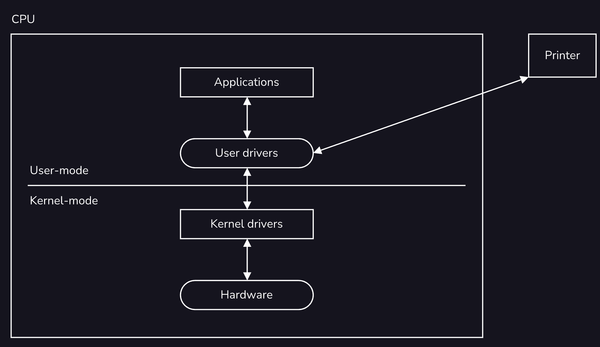

# I/O systems

IO systems are a combination of hardware and software tools that help a user interact with a computer successfully. The I in IO stands for *input* and the O stands for *output*. The main role of IO systems is to accept input (e.g., from a mouse or keyboard) from users for a computer and provide output (e.g., through a screen or headphones) from a computer to users.
A computer can receive lots of input and provide numerous output while a user is active on a computer. For example, a computer can produce the output of audio while also accepting input from a keyboard. The management of such input and output is handled by the operating system on a computer. The operating system oversees the queue of IO messages and handles them from the moment they are received until they provide output to a user.
IO systems are composed of two main components which we will explore in the next two lessons: *IO hardware* and *IO software*. *IO hardware* refers to the physical devices that a user interacts with. Some examples include a keyboard, a mouse, display screens, speakers, and headphones. *IO software* is the code that supports *IO hardware* so that a CPU may understand the input from a user and provide an appropriate output.

## IO Hardware
IO, or Input/Output, devices refer to any physical devices that interact with a [CPU](https://developer.mozilla.org/en-US/search?q=CPU). Input devices send signals to a computer and output devices allow for computers to send information out from a computer.
*Human readable devices* are devices that can be interpreted/understood in a natural language structure by humans. Some examples include printers, keyboards, and a mouse.
*Machine readable devices* are devices that are formatted to allow communication between different hardware, without the need for human interpretation. Some examples include hard drives/disks, controllers, and SD cards.
*Communication devices* are devices that allow devices to interact over a network. A network is a set of devices that are linked to share some resources over a shared medium. Some examples of communication devices include modems and Bluetooth adapters.

## Drivers & Controllers
Device drivers and device controllers are important components of IO systems. *Device drivers* exist as software programs that the OS uses to communicate with device controllers. *Device controllers* are hardware units that work as an interface between physical IO devices, and device drivers. An *interface* can be thought of as a bridge that brings the software side and hardware side together.
Device drivers and controllers are crucial for different IO devices to communicate with the OS.
Device controllers work as a translator between an operating system that may understand code, and hardware that uses signals. The device drivers can be thought of as the service the translator provides.

## Transferring Data
Devices are designed to read or write data in one of the following three ways:
*Character devices* are represented as a sequential series of bytes. They are accessed one byte at a time. The operating system interacts with these devices with read/write system calls. One example of a character device is a USB. A USB has data written on it in a sequential manner.
*Block devices* have memory stored in blocks of a fixed size. They allow for system calls where memory does not need to be read sequentially. Block devices allow for “random access”, meaning we can read or write to any place within the device. Most devices have blocks of the size 512 bytes or greater. Hard disks are a perfect example of block devices.
*Network devices* are different from character and block devices because they require a different interface (such as a socket interface) for access to other devices. An example of a network device is an ethernet card which is used to send and receive data over multiple devices.

## Blocking vs. Non-blocking
When an IO device makes a request an application can respond in one of two ways: *blocking*, and *non-blocking*.
**Blocking Requests**
Most IO requests are considered blocking requests. When the IO makes a request, an application typically cannot continue executing other requests until it has the necessary information changes from the IO. Therefore, blocking calls requires a process to stop and wait for input/output. Consider a word processing software - when we have a new document open, the application halts while waiting for the user to type some words.
**Non-blocking Requests**
Non-blocking requests get placed into a queue while waiting so that the [CPU](https://developer.mozilla.org/en-US/search?q=CPU) resources can be used to complete other tasks in an event pool. The event pool is the queue mentioned earlier. IO device responses can be handled later, as long as the request has been acknowledged by the OS. Non-blocking is also commonly referred to as asynchronous. Think about a collaborative application in which there are multiple requests being made by different users simultaneously. The application does not halt for every user each time it is waiting for some input from a single user.

## Interrupts & Polling
An *interrupt* is a signal that is sent from the hardware of an IO device to a computer to get its immediate attention. Because interrupts are handled on the hardware’s end, they decrease overhead on the software side. When a device sends an interrupt signal, the [CPU](https://developer.mozilla.org/en-US/search?q=CPU) is notified via some trigger and will immediately halt the task at hand. It will send the interrupt over to an interrupt handler. The interrupt handler is like a pool or queue of interrupts being sent to the CPU. Once the interrupt has been responded to, the CPU can go back to resuming its task.
*Polling* provides similar functionality to interrupts; however, it is not a hardware mechanism. Polling is a CPU [protocol](https://developer.mozilla.org/en-US/search?q=protocol), in which there are regular intervals set up for the CPU to take some time to check on whether any IO device requires its attention. Just as an interrupt handler takes care of interrupt requests, the CPU is responsible for handling IO requests in polling.

## Memory-mapped IO vs Direct-Memory Access
*Memory-mapped IO* refers to a system that is designed to allow both an IO device that is connected to a computer, and the memory of the computer to share address space to the interface.
There are a few advantages to using memory-mapped IO. It allows for similar sets of instructions to be used over multiple hardware components. IO devices are not treated differently from other kinds of memory devices. A separate set of instructions is not required for IO devices to communicate with a computer.

*Direct memory access (DMA)* refers to a [method](https://developer.mozilla.org/en-US/search?q=method) in which IO devices have direct access to the main memory of a computer without too much involvement of the [CPU](https://developer.mozilla.org/en-US/search?q=CPU). For DMA, a CPU will trigger the execution of data to/from an IO device to a computer, but then will continue to complete other tasks while the data transfer executes. In order to implement the DMA method, computers use hardware devices known as *Direct-memory access controllers*.
One advantage of using DMAs is that it removes overhead for the CPU so that the CPU may process other tasks. However, using DMA may result in *cache coherency discrepancies*. This means that if a computer has a [cache](https://developer.mozilla.org/en-US/search?q=cache), and a DMA only has access to the main memory, it may update the main memory and so the cache, which has not been updated, will not match.

## IO Software
*IO software* refers to the code that interprets those signals and plans the execution of IO requests. There are different types of IO software to handle different tasks. Some IO requests can be processed by software that is more generic and meant for multiple devices.
For example, the software used to accomplish the request to retrieve and store data to a hard drive is similar to the software used to retrieve and store data from a USB. This type of software is referred to as device-independent software. Other IO requests can be processed by software that is designed for specific devices. This type of software is known as a device driver. An example of a device driver may be the software you install to your computer to be able to connect a printer.

## User-space, Kernel-space, & Hardware
The *user-space* is the space in memory that holds and runs user processes. Think about when we connect our Bluetooth device to the audio system of a car. The memory in which the Bluetooth mounts to the car can be considered to be the user-space. Pressing play or selecting a song on different phones can be considered independent calls that exist in user libraries that access the kernel through calls, and result in output in the car. User libraries hold more complex, modifiable, user-controlled code that interfaces with the kernel.
The *kernel-space* is the place in memory where the kernel performs its functionality. The software behind the Engine Control Unit (ECU) of a car is the kernel-space. Just like the ECU controls or manages the electric functions of a car, the kernel manages resources and requests. The kernel manages the scheduling of tasks, buffering (storing data in memory when transferring between a computer and IO devices), spooling (holding output data for an IO device), etc.

## Layers of IO Systems
In IO systems, IO software is made up of multiple layers due to the many different responsibilities they have.
* **User-level IO software or user processes:** This is the level at which IO requests are made. It is at this level that a system call is made in the user-space to be sent to the kernel-space.
* **Device-independent software:** This layer refers to software components that are generic and applicable to multiple devices. These calls are not dependent on or exclusive to any single IO device.
* **Device drivers:** This layer refers to the software components that are specific to an IO device. They often code snippets that have been developed by the manufacturer of the IO device and must be installed by the user before the IO device can interact with a computer.
* **Interrupt handlers:** Interrupt handlers are snippets of code that provide the functionality to device drivers. They process interrupts made by IO devices.
* **Hardware:** This layer refers to the physical IO device which interacts with device drivers through input such as pressing a key on a keyboard or output such as displaying data onto a screen.
### Device Drivers
*Device drivers* are software components, or blocks of code, that are specific to a device. They are often written by the manufacturer of IO devices and must be installed into a computer before an IO device may successfully interface with a computer.
Unlike device-independent IO software, device drivers are great for taking IO hardware beyond generic functionality. Device drivers allow for an IO device to be used to perform tasks that are specific to its hardware.
There are two types of device drivers:
* **Kernel-mode drivers:** These drivers allow for basic functionality on a [CPU](https://developer.mozilla.org/en-US/search?q=CPU). They even contribute to the start-up of an operating system when we turn on our computers.
* **User-mode drivers:** When a user adds additional hardware to their computer, that additional hardware comes with its own set of drivers that need to be installed. For example, when we are in the process of installing a new printer and connecting it to our laptop.

### Device-Independent IO Software
Unlike device drivers, *device-independent* IO software is not specific to any single IO device. It holds functions that are more generic and can be used by all devices. It includes generic interface calls, buffering, providing a generic block size that an IO device and the computer can use to transfer data, etc. Generic interface calls include initializing the hardware, allocating resources, turning off a device, etc. Device-independent software calls for *buffering* refer to storing some data in memory when transferring it from one device to the other.
Device-independent software also has the capability to report errors that occur between the interaction of IO devices and the computer. Due to the fact that device-independent software must be applicable to all devices that connect to a computer, its functionality is not extremely complex or intricately connected to any single device and can be handled in the kernel-space in IO systems.

### Interrupt Handlers
*Interrupt handlers* refer to the software components that manage the pool of interrupts that are sent to the [CPU](https://developer.mozilla.org/en-US/search?q=CPU). Interrupt handlers receive and acknowledge that a signal has been received, place it in a queue, and execute the interrupts by priority. When an interrupt is received the interrupt handler notifies the CPU. The CPU will then halt its current processes, and wait for the execution of the interrupt before continuing.
