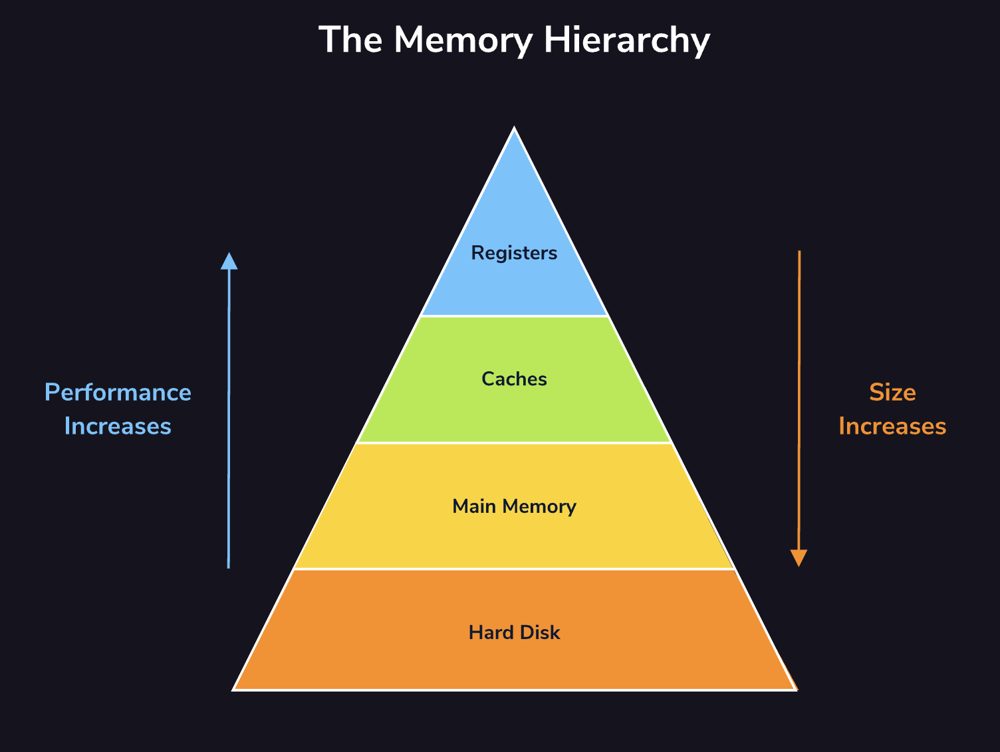
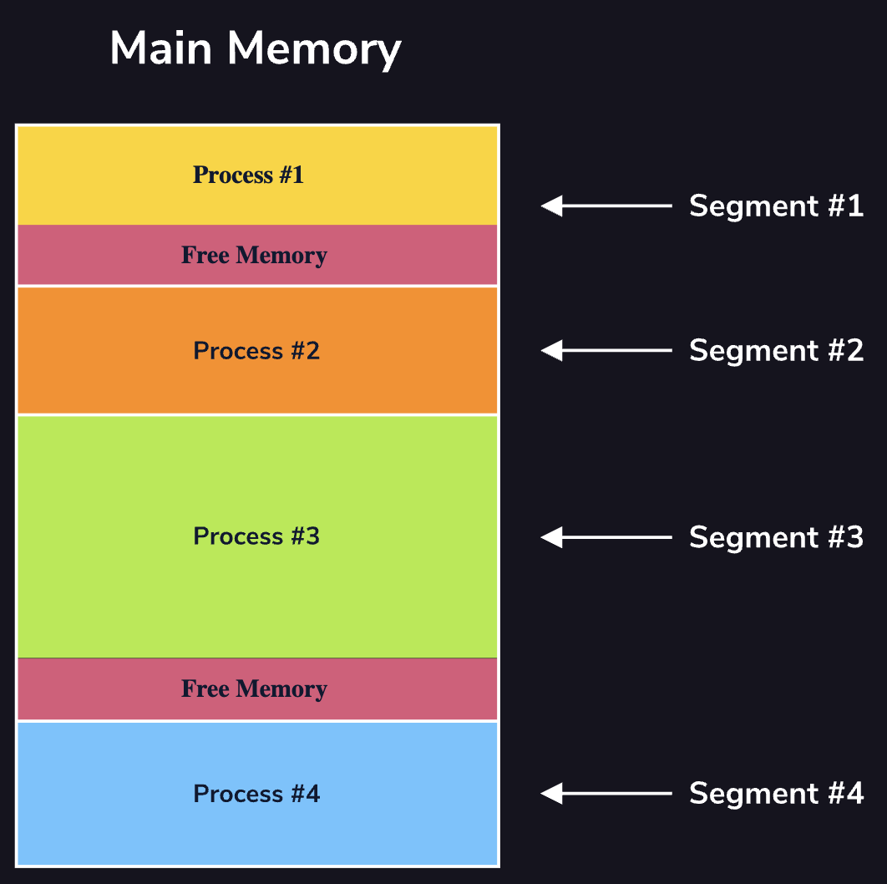
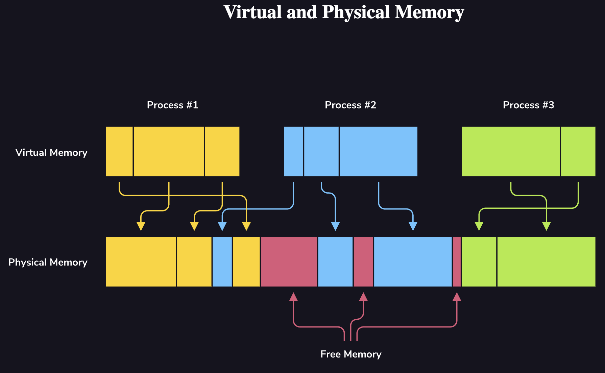
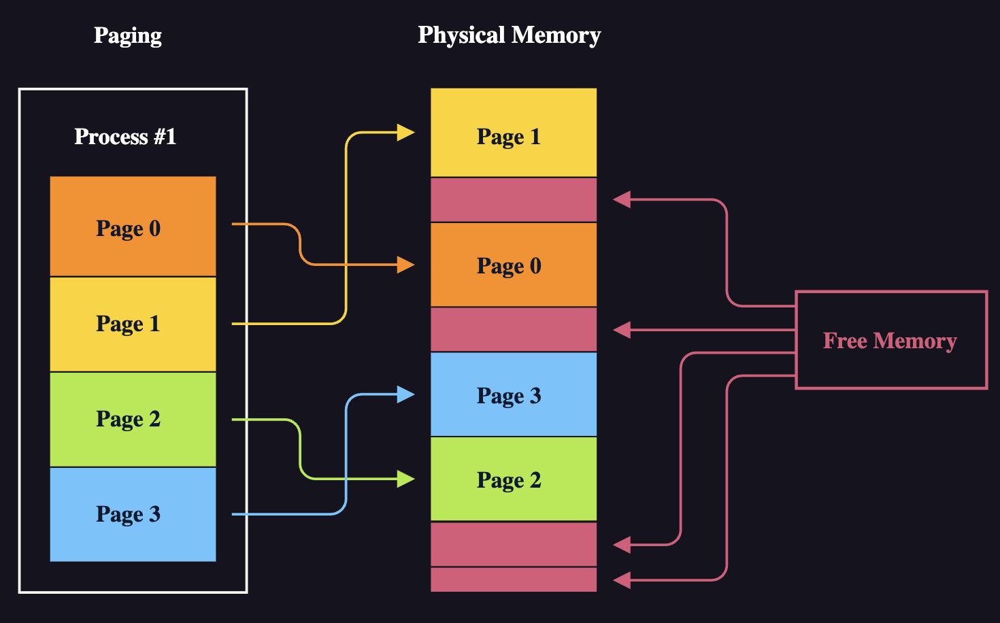
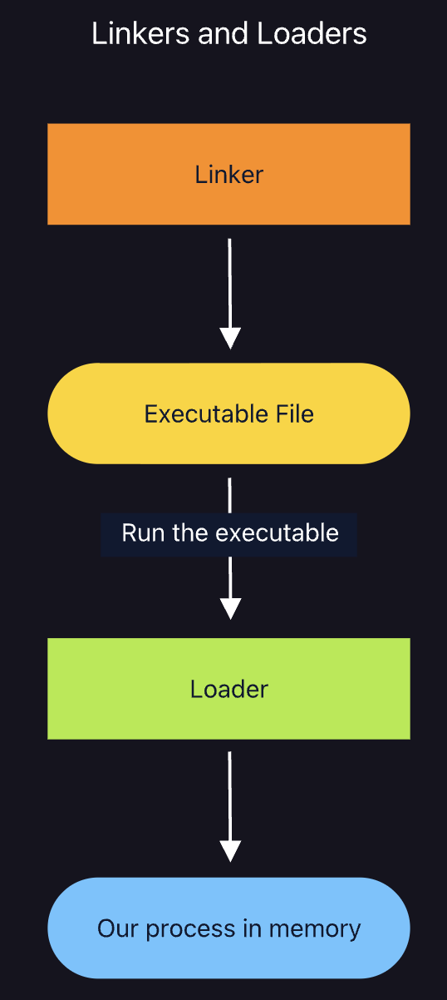

import MemoryPagingPlayground from "./components/memory-management/MemoryPagingPlayground.jsx"

# Memory management

One of the jobs of the operating system is to control processes’ access to our computer’s shared hardware resources, including and especially its memory. Memory stores the information necessary for our processes to function.
At the lowest level, data in memory is just a sequence of 0s and 1s which represent a piece of information. A handful of 0s and 1s might represent a number, while a great many could represent an image or a video.
But memory is a finite resource; we only have so much of it. This is why our computers can only store a limited number of files before we have to get rid of some in order to add new ones.
Given that memory is limited, the job of the OS is not only to provide our processes access to memory, but to do so efficiently. And since memory stores information critical to our computer’s functions, the OS must make sure that the access it provides is safe and secure.
Not all memory is the same though. In a grocery store like the one to the right, some of the more popular, smaller items like chewing gum and candy bars are stored close to the register. Bulkier, less popular items are stored further away. The same is true of memory, our computers have tons of space in deep storage but relatively little in the faster-access regions of memory. It is the job of the OS to determine what goes where at what time.

## The Memory Hierarchy

- Registers are the closest form of memory to the processor. For that reason, they are the fastest. But they also store the least amount of information. A computer’s registers contain the actual values the processor does calculations with. Executing a line of code like
     x = x + 1
  entails fetching the current value of
     x
  from wherever it exists in memory, putting it into a register, and adding
     1
  to it.
- Cache memory acts as a staging ground to store data that will be needed by the processor in the immediate future. Most computers have more than one [cache](https://developer.mozilla.org/en-US/search?q=cache), these levels vary in size and speed. The cache can prevent bottlenecks between the processor and the main memory (RAM) by storing copies of the most frequently used data.
- Main memory is further removed from the processor. It is larger and slower than the cache and stores the data and instructions the processor is currently working on. The main memory can only hold information while it has power, it is a temporary memory location.
- Finally, there is disk. Think of disk as a form of deep storage, like a box collecting dust in the closet. Disk is where we can store the largest amount of information. But it is also the slowest. Much like retrieving files from the closet, retrieving information from disk is more involved and, for that reason, slower than retrieving information from locations closer to the processor.

## Segmentation
In addition to their being multiple types of memory, there are also multiple ways of storing information in memory (in this case, main memory, or RAM). The first and simplest one is *segmentation*.
Using segmentation, process data is stored in blocks of contiguous, meaning adjacent or back-to-back, memory which vary in size. These blocks are called segments. When a process requests a piece of information from disk, a contiguous block of free memory must be found and then allocated (that is, have data written to it). If no block of memory is currently available, the process will wait for one before proceeding.

## Fragmentation
If memory is allocated contiguously (which is the case under segmentation) think about what will happen over time as more and more blocks of memory are allocated and freed.
At the beginning, our allocated memory is easily collapsed into contiguous blocks. But as we free some of those blocks and try to allocate new ones, the address space gets messy.
Because our operating system cannot anticipate the future needs of our processes, we begin to have smaller and smaller blocks of free memory. As a result, we may have 50 bytes of free memory in total, but if these are split across five blocks of 10 bytes, when we need room for a block of 20 bytes, it has nowhere to go.
As the size of these contiguous blocks of memory gets smaller, we say our memory is becoming more fragmented. Fragmentation is a main cause of memory inefficiency since fragmented memory stalls processes with large allocation needs.

## Virtual Memory and Privilege Separation

Like any other of the computer’s shared hardware resources, the OS must protect memory so that rogue processes cannot disrupt the computer’s (and the other processes running on it) ability to run. Consider that the operating system itself exists in memory.
The kernel space (the area where the core of the operating system is stored) is a section of memory just like the others, but the information stored here is absolutely essential for our computer to be able to run safely and securely (or really, run at all). Therefore, the information here must never be accessed by any user-space (or non-kernel) process.
If a user-space process had access to kernel memory, it could corrupt the OS and take our whole computer down. A malevolent process with access to the kernel-space could try to steal information like passwords or, even worse, seize control of the computer and undertake rogue tasks. A cell-phone whose OS is hijacked is one thing, but consider the implications if the computer whose kernel is compromised is responsible for the functioning of an airplane or a nuclear plant.
To protect processes from each other and to protect the kernel, we can use virtual memory. Virtualization gives the OS the ability to start a process, give it a certain amount of memory to work with, and have it seem to the process as though that is the only memory that exists.

## Paging

Recall that, as memory is allocated and freed using segmentation, the size of contiguous blocks of free memory tends to decrease. In other words, our memory becomes fragmented.
A far more efficient memory management technique is called paging. Paging differs from segmentation in two fundamental respects.
1. Process information is stored in equal-sized blocks of memory known as pages
2. Pages belonging to a given process are stored at non-contiguous addresses in physical memory
With paging, any data needing to be placed in or removed from memory will be a page-sized block of data. So, unlike with segmentation, the space between blocks of memory will never change. Since fragmentation was caused by these spaces tending to become smaller over time, paging does not risk the fragmentation problem.
Any benefit from paging would be lost, though, if the pages had to be stored in contiguous locations in memory. There is no difference between allocating 100 bytes of contiguous memory or 10 contiguous blocks of 10-byte-sized pages. So, the real power of paging comes from the ability to spread out a given processes’ memory across non-contiguous locations.
To add a wrinkle, though, we still want our process to think that the OS has allocated its memory contiguously. Therefore, we must use virtualization. Our OS gives each process a certain number of pages which are stored at contiguous addresses in virtual memory. So, from the process’ perspective, its memory is stored contiguously. Importantly though, these addresses in virtual memory need not map to contiguous addresses in physical memory.

## Linkers and Loaders
Most programs, but particularly larger ones, have a long list of dependencies. At execution time, our computer needs to have instructions it can comprehend not only for our program but for all of the programs ours depends on. The linker’s job is to connect our program with these dependencies. The linker outputs a file called an executable which is what the computer will actually use to run our program.
When we run that executable, the first step to execute our program is called loading. The loader takes information from the executable file and loads the information necessary to run the process into main memory.
It is important to understand that both linking and loading can occur either statically or dynamically.
If a program is linked statically, the entirety of the dependencies necessary to run the program are linked when an executable is created. Conversely, if a program is linked dynamically, the linking takes place at [runtime](https://developer.mozilla.org/en-US/search?q=runtime) which gives our OS the opportunity to see whether some dependencies already exist in memory before linking with them again.
On the loading side, if a program is statically loaded, then the entirety of the program and its dependencies are loaded into memory at execution time. With dynamic loading, the OS only loads the parts of the program that are needed at a given time.
The result is that dynamic linking and loading tend to be much more efficient with memory. However, the tradeoff is speed. Statically linked/loaded programs tend to execute faster because there is no back and forth of fetching dependencies once the program is running.

## Interactive Playground: Paging Capacity Estimator
**Why this matters:** page size choices influence memory efficiency and fragmentation.

**What to try:** vary process and page sizes to see how page count and internal fragmentation change.

<MemoryPagingPlayground />
