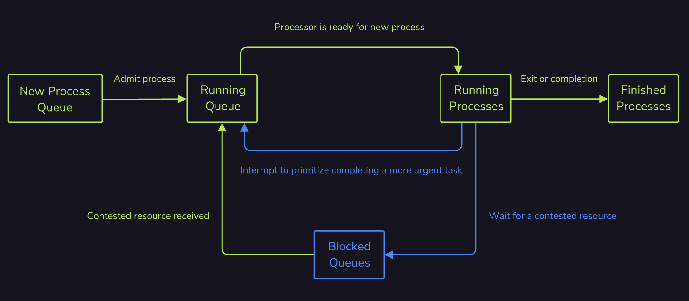
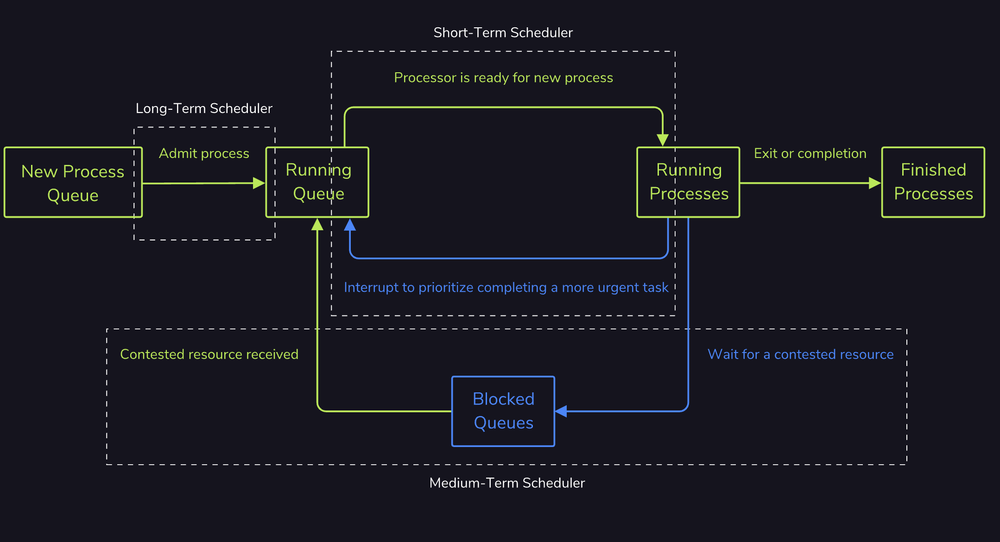

import SchedulingPolicyPlayground from "./components/process-scheduling/SchedulingPolicyPlayground.jsx"

# Process Scheduling

Computers have a limited amount of resources, be it processor cores, hard drives, or network links, but the number of tasks that it may need to run are ever-growing. Therefore, a form of rationing is needed to maintain the feasibility of the system and provide each process with the resources it needs.
The method of assigning these resources can differ greatly on the intended goal:
* Maximizing the total amount of processes completed per unit of time, or throughput.
* Maximizing the equality of distribution of computer resources.
* Minimizing the amount of time until a process becomes ready after being started, or wait time.
* Minimizing the amount of time a process finishes after becoming ready, also known as latency or response time.
* Completing all tasks before a set deadline.
Not all of these goals are possible as some of them, such as throughput and latency, fundamentally conflict. For example, in a machine (like a car) where each component has a strict deadline on how quickly it should be processed, there will likely always be a buffer of compute resources available to fill these last second commands. This buffer allows for completing these high priority tasks when needed, but lowers the throughput of the system by just waiting to be used.

## Processing States and Queues
Waiting is commonly done in a queue which is a first in, first out data structure. The first process to be added to the queue is the first to be executed by the processor down the line. This works great for the blocked state, where many processes may want to write to the same file, as the most intuitive procedure is to just have them go ahead one at a time in order of their request. However, this data structure may need some modifications to best accommodate the ready queue.
Different processes may have different priorities, and with that, a *priority queue* becomes the more relevant abstraction. Here, processes are organized in order of their priority instead of when they first arrived, with the process that has the highest priority always being executed first. How this priority is calculated is determined by the scheduling [algorithm](https://developer.mozilla.org/en-US/search?q=algorithm) and is represented by some integer value or category such as low, medium, or high.

## Long-Term Schedulers
Just as there are multiple queues throughout the process lifecycle, there are also multiple schedulers to manage these queues. These are the long-term, medium-term, and short-term schedulers and their locations within the context of the process lifecycle is shown to the right.
The *long-term scheduler* is the first scheduler encountered by a process and determines which of these newly created processes are loaded into memory and admitted into the ready queue. This allows the long-term scheduler to play a crucial role in the memory management of the system by determining the level of multitasking possible by the computer.
With a lot of available memory, the long-term scheduler can add many processes to the ready queue. This allows the processes to easily interleave with one another in order to quickly enter and exit the [CPU](https://developer.mozilla.org/en-US/search?q=CPU), and for all of them to execute over time, giving the appearance of parallel execution even if it is not possible on the system.
The long-term scheduler is also able to be more decisive because it runs less frequently. This decisiveness is important for maximizing system utilization between IO-bound processes that mostly access hard drives and CPU-bound processes that mostly perform computations.

### Short-term Scheduler
After the long-term scheduler moves a process into the ready queue, the *short-term scheduler* operates next to pass it onto the [CPU](https://developer.mozilla.org/en-US/search?q=CPU). Alongside this power to admit processes, the short-term scheduler can also forcibly recall processes from the CPU through preemption. This is useful if a higher priority process suddenly comes along and needs to be executed right away. The scheduler can also preempt set time intervals in order to more fairly share the processor and prevent a single long-running process from hogging the CPU. All of this is accomplished by having the short-term scheduler be the sole maintainer of context switches, storing and reloading the relevant process information as needed.

### Medium-term Scheduler
However this is an expensive operation, so it is best done infrequently to mitigate the impact to throughput from the increased overhead. When a process attempts to access a resource that is not available or has a prolonged lack of activity, the *medium-term* scheduler kicks in to remove the process from the CPU and free up the necessary cores for other processes. This is done by blocking the process, and some longer waits also cause the process to be moved to a special swap section of the hard drive to further free up memory.

## First Come First Served
The most basic type of scheduling algorithm is *first come, first served*, in which processes are simply put into a standard queue and then executed in the order that they arrived. An example of processes being executed by their arrival time can be seen on the right.
This algorithm does have some drawbacks that reserve it only for special use cases such as generally low throughput due to the convoy effect. This is where a long process can solely occupy the [CPU](https://developer.mozilla.org/en-US/search?q=CPU) while doing minimal computations. Similarly, there is no concept of priority, so latency and wait times can be excessively long as a process’s execution depends solely on its arrival in the queue and the arbitrary amount of time a previous process takes.

However, the simplicity does have some benefits such as minimal scheduling overhead from only context switching when a process ends. Also, assuming each process eventually completes, every process should be able to run and not have to suffer from starvation by never being executed.
[6C430C1E-D7CE-49ED-82FD-0C147D6A51A9](attachments/6C430C1E-D7CE-49ED-82FD-0C147D6A51A9.mov)

## Priority Scheduling Algorithms
*Priority scheduling* is an [algorithm](https://developer.mozilla.org/en-US/search?q=algorithm) that assigns each process a numeric priority before organizing those processes according to this priority.
For example, a live video chat might have a high priority due to its latency requirements, while the process rendering the computer’s wallpaper may have a lower priority due to it being considered more inconsequential. With priority scheduling, the processing of the wallpaper would be delayed or even interrupted in order to provide sufficient resources for the video chat.
Shortest job first, as shown in the example to the right, is a variation of priority scheduling that prioritizes running the process with the shortest execution time first. If the scheduler supports preemption, then a similar algorithm for shortest remaining time can be used instead. This reevaluates the priority of the processes every time an interruption occurs.
This algorithm typically works best in specialized situations where all of the process times can be reasonably estimated beforehand.
While this algorithm minimizes the average amount of time each process has to wait until it is fully executed and thereby maximizes throughput, this comes at a cost. Some longer processes may become “starved” and never execute if shorter processes are continually prioritized in front of them. This can be mitigated by “aging” each process such that the priority of a process increases the longer it has been waiting.
This algorithm also has a fair amount of overhead as processes can be arbitrarily interrupted whenever a shorter one comes along. Similarly, the sorted queue at the heart of the algorithm must be maintained as processes are added, removed, or modified.
[FB8B40AF-EB4E-4D9E-953C-FCED56B03124](attachments/FB8B40AF-EB4E-4D9E-953C-FCED56B03124.mov)

## Round Robin
*Round robin* is a scheduling [algorithm](https://developer.mozilla.org/en-US/search?q=algorithm) where a fixed amount of execution time called a time slice is chosen and then assigned to each process, continually cycling through all of these processes until they are completed. Processes that do not finish during their assigned time are rescheduled to allow all other processes an opportunity to run first. This can be seen in the example to the right where each process is given a maximum of 2 seconds to run before the next process is handed to the scheduler.
Overall this algorithm provides a balanced throughput between first come, first served and shortest job first due to treating each process equally and giving each process an opportunity to run. On average, longer jobs are completed faster than in shortest job first, and shorter jobs are completed faster than in first come, first served.
Starvation also can not occur as there is no preference for a certain subset of processes. Each process will be run occasionally as the scheduler makes its rounds. This leads to lower latency and response times as they only correspond to the number of processes running and the time slice allotted to each process. However, this can cause high waiting times as, while each process can be run often, it may not necessarily complete quickly.
Deadlines are also largely ignored, making this algorithm not the best fit for real-time devices such as car safety systems that need to guarantee the deployment of an airbag by some set time. The greatest weakness of this algorithm is that due to the context switching required at every time slice, round robin has extensive scheduling overhead that steals [CPU](https://developer.mozilla.org/en-US/search?q=CPU) utilization away from all of the other processes on the system.
[542A1F3C-E52A-4044-AF40-4A17A3067F31](attachments/542A1F3C-E52A-4044-AF40-4A17A3067F31.mov)

## Multiple-level Queues Scheduling
*Multiple-level queue scheduling* is an [algorithm](https://developer.mozilla.org/en-US/search?q=algorithm) that attempts to categorize processes before placing them in a relevant prioritized subsection of the ready queue. In the example to the right, the middle subsection of the ready queue, also called a level, contains IO-bound tasks while the other levels contain higher and lower-priority CPU-bound tasks. This categorization allows higher-priority CPU-bound tasks to be executed before IO-bound tasks, while the IO-bound tasks are in turn able to be run before lower-priority CPU-bound tasks.
Tasks are executed one at a time by level, such that all of the processes in the topmost level are executed first before moving on to lower levels. If a process is placed at a higher level while a lower-level one is being processed, the scheduler will temporarily move back up to take care of the higher-level task first. For example, if the scheduler was focusing on executing the CPU-bound processes while an IO-bound process was added to the ready queue, the scheduler would preempt and prioritize completing this new IO-bound process before returning to finish the CPU-bound tasks. Processes also do not move between levels. This can cause starvation if the scheduler never processes a lower level.
Each level can also have its own scheduling algorithm. In the example to the right, the top, high-priority level uses round robin, while the middle IO level uses first come, first served to best account for possible resource blocks. The bottom, low-priority level is left with shortest job first to organize longer-running background tasks. This mixing of different algorithms attempts to combine the best qualities of each. However, this also creates intense complexity as there are many independently moving parts.
[24F30B57-84BC-4159-BC0F-462DEC2D3A65](attachments/24F30B57-84BC-4159-BC0F-462DEC2D3A65.mov)

## Interactive Playground: Scheduling Policy Comparison
**Why this matters:** scheduling policy directly affects responsiveness and throughput.

**What to try:** compare FIFO and SJF using the same burst list and inspect execution order.

<SchedulingPolicyPlayground />
