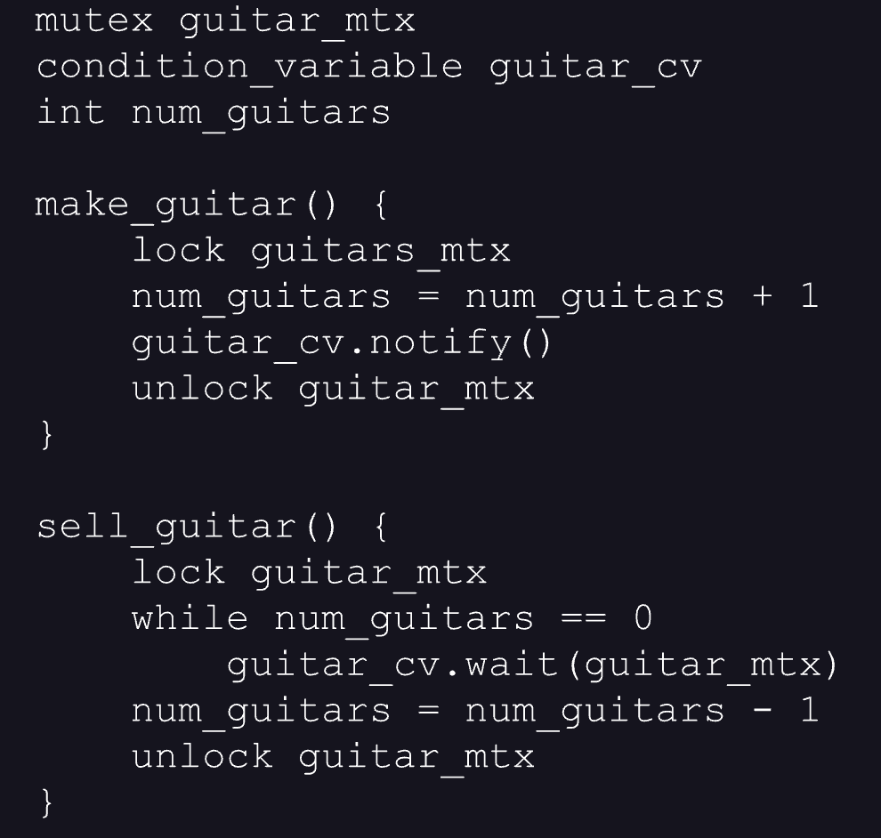
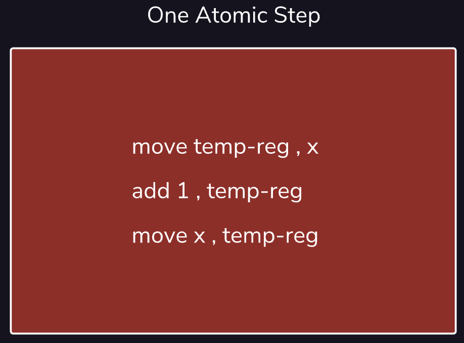

# Synchronization

## The increment-a-number problem
Consider the following problem. Given a number,x, which has been initialized with the value 0, create a program that increments x one-hundred times so that when the program is finished executing, x equals 100.
We could implement this program without concurrency, using a single thread which increments x once, then again, and again until it has done so one-hundred times.
Alternatively, we could write a program that spawns one-hundred threads which will individually increment x once, but collectively increment x one hundred times.
From the processor’s perspective this seemingly simple task actually takes three operations to complete:
1. Move the value of x into a register
2. Add 1 to that value
3. Set the value of x to be the value in that register
Consider what can happen when two threads attempt to increment
     x
  at the same time. If Thread 1 and Thread 2 both move the value of
     x
  into a register before the other has completed its work, our processor could potentially execute these six operations in the following order:
| Order                                      | Operation                                  |
|--------------------------------------------|--------------------------------------------|
| 1                                          | Thread 1 moves 0 into register A           |
| 2                                          | Thread 2 moves 0 into register B           |
| 3                                          | Thread 1 adds 1 to the value in register A |
| 4                                          | Thread 2 adds 1 to the value of register B |
| 5                                          | Thread 1 sets x to the value in register A |
| 6                                          | Thread 2 sets x to the value in register B |

So now two threads have both completed their task of incrementing
     x
 , and yet
     x = 1
 . Note that a perfect interleaving of operations is unnecessary to get this result. All that is necessary is for the first operation of each thread (loading the value of
     x
  into a register) to take place before the final operation of the other is finished.
That
     x
  has not been incremented properly is the result of this race condition. To fix this, we must make sure that only one thread can modify
     x
  at a given time. In the next exercise, we discuss one way to do this.

## Locking (mutex)

Our program from the last exercise failed because multiple threads were allowed to access
     x
  at the same time in defiance of the mutual exclusion condition. Remember that condition says that there must only be one thread at a time with access to a critical section.
A common way to fix this issue is with a mutual exclusion lock, or mutex.
Previously, our
     increment() function contained one line,
     x = x + 1
 , which was the only critical section in our program. Now, as we can see with the image on the right, we have surrounded our critical section with functions of our mutex object,
     lock() and
     unlock()
 .
If a thread calls
     lock()
 , it receives the mutex. If
     thread_one
  calls
     lock()
 , the mutex,
     mtx
 , will belong to it. Any other thread that calls
     lock() on
     mtx
  will wait indefinitely until thread 1 releases it by calling
     unlock()
 .
Think of the critical section as a room only one person is allowed in at a time. A mutex is like the lock on the door. One person enters the room and locks the door behind them while the others wait outside. Once that person leaves, they unlock the door which allows for the next person to enter, and so on.
This pattern of receiving the mutex, incrementing
     x
 , and giving up the mutex will repeat until every thread has called
     increment()
 , completing the program.

## Condition variables


We create two threads representing a maker and a seller. When the maker thread calls make_guitar(), the num_guitars variable is incremented. When seller thread calls sell_guitar(), num_guitars is decremented as long as num_guitars is greater than 0.
Both threads must access the shared variable num_guitars which means, in order to synchronize our program, we must enforce mutual exclusion on num_guitars.
Up until now, locking was our only tool to achieve this. Using locks, the seller thread could continuously request a lock on num_guitars, check whether it was greater than one, and then unlock it. This lock, check, unlock cycle is incredibly inefficient.
A more efficient way to handle this is to notify the seller thread when num_guitars is greater than 0. We can do this by using what is called a condition variable.
Let’s walk through sell_guitar(). First, the seller thread locks guitar_mtx so it can check that the value of num_guitars() is greater than 0. While num_guitars == 0 is true, the seller thread waits indefinitely to continue executing until the condition becomes false. It does this by calling the wait() function on the condition variable, guitar_cv, and passing it into guitar_mtx. The wait() function frees the mutex, allowing the maker thread to execute, and then waits for the signal to continue.
On the maker thread side, each time it calls make_guitar(), num_guitars is increased by 1, and the condition variable is notified. The notification alerts the seller thread, which then locks the mutex again and continues on with execution.
The biggest advantage here is that the seller thread is not constantly requesting the mutex to check whether num_guitars is greater than 0. It simply waits to be notified, then retrieves the mutex.

### Summary
If you use only locks, the seller thread would have to keep checking if guitars are available, which is inefficient.
With a condition variable, the seller thread waits until it is notified that guitars are available. When the maker thread increases num_guitars, it sends a notification to the seller thread, which can then continue. This way, the seller thread does not need to check all the time, but just waits for the notification.

## Atomic variables
Recall the increment-a-number problem. In the no-locks solution, the race condition arose because the x = x + 1 operation actually takes place in three atomic steps. If two threads try to complete those steps at the same time, the value of x will not be set properly.
The solution from exercise three was to use locks to ensure that only one thread at a time had access to x. But there is another solution which is far simpler: make x an *atomic variable*.
An atomic variable is a variable that can be modified in an inherently thread-safe manner without the use of locks or any other synchronization mechanism. The variable is atomic because the operations required to modify it take place, from our threads’ perspective, in exactly one atomic step.
So, if we simply declare x with type atomic_int, we can forgo using locks to synchronize our program. Because each x = x + 1 operation will take place in one atomic step, by definition, it cannot take place concurrently with any other atomic step. So, we are at no risk of a race condition.


## Semaphores
ne of the classic problems in synchronization is the producer-consumer problem (also known as the bounded buffer problem). We can think about the problem like this: let us return to our guitar store where we are constantly both selling the guitars we have in stock as well as making new ones. But we only have enough space in our store to hold n guitars at a time.
Programmatically, we can represent the spots for guitars in our store as places in a buffer. Since we can have a maximum of n guitars in the store at a time, our buffer is of length n. The problem we face is synchronizing the buffer such that multiple threads can write to it and read from it in a thread-safe manner.
There are two rules: if the buffer is empty, no thread can read from it, and if the buffer is full, no thread can write to it.
One solution could be for each thread to lock the entire buffer, see whether it can do its operation, and then unlock it. But consider how inefficient this is, especially as n becomes large and the number of threads increases. If we can hold five thousand items and have a hundred threads writing to and reading from our buffer, then each time a thread performs a task, the other ninety-nine are forced to wait.
The best solution is to use *semaphores*. Semaphores are essentially just integers that will keep track of two values, num_free for how many empty places and num_occupied for how many occupied places there are in the buffer.

```
write() wait until num_free > 1
        decrement num_free
    add to the buffer
    increment num_occupied

read() wait until num_occupied > 1
        decrement num_occupied
    read from the buffer
    increment num_free

```

As a result, the adding and removing of items from the buffer and corresponding semaphore values will look like the graphic to the right. As elements are added to the buffer, the number of taken spaces increases, and the number of empty spaces decreases. The same occurs in reverse when elements are removed from the buffer. When there are no empty spaces, the producer thread must wait. Conversely, when there are no taken spaces, the consumer thread must wait.

## Deadlocks
Locks provide mutual exclusion on the critical sections of our code; they guarantee that only one thread at a time may enter areas of our code that contain shared resources. But while mutual exclusion is a necessary condition for our programs to be *synchronized*, it is not a sufficient one. There are two others, *progress* and *bounded waiting*.
The bounded waiting condition states that each thread that asks for permission to enter a critical section will, eventually, receive it. In other words, no thread should ever get stuck waiting indefinitely. This might seem simple to implement. Can’t we very easily make sure that threads give up their locks? A difficult problem, though, arises when multiple locks exist in our program. A situation known as a *deadlock* can occur, and it has the potential to cripple our multi-threaded programs.

### Causes of deadlocks
The following diagram shows very simply how one can occur. Let us briefly walk through it.
| thread_1        | thread_2        |
|-----------------|-----------------|
| lock(foo_mtx)   | lock(bar_mtx)   |
| lock(bar_mtx)   | lock(foo_mtx)   |
| Do something    | Do something    |
| unlock(foo_mtx) | unlock(bar_mtx) |
| unlock(bar_mtx) | unlock(foo_mtx) |

We create two threads, thread_1 and thread_2. Each thread attempts to lock both mutexes foo_mtx and bar_mtx, do some task (Do Something), and then unlock the mutexes. Both threads begin by locking one of the mutexes: thread_1 locks foo_mtx and thread_2 locks bar_mtx. Having each received one lock, both threads now try to lock the second mutex. But this will never happen since neither thread will give up its first lock until it gets its second! Since thread_1 and thread_2 are both waiting for locks they will never receive, they will both spin forever. **They are deadlocked.**

### Prevention and Recovery
Of course, the best way to avoid deadlocks is to implement our programs in a way such that deadlocks, inherently, cannot happen. In this example, that might mean reordering the locking of the mutexes so that both thread_1 and thread_2 request the mutexes in the same order.
Sometimes, though, this may not be possible or practical. As our programs get larger and larger, it will become more difficult for us as the programmer to trace our threads’ paths of execution. It will likewise become more difficult as the number of potentially-deadlocking mutexes increases.

### Termination
Our first recovery method is called *termination*. If two threads are deadlocked, one possible way to recover from that deadlock is to terminate one of the threads and release its locks. One of the drawbacks of this is that we lose any work the thread may have completed up to the point when we terminated it. The thread may also have been executing an important task that will now either not be completed or delayed.
Using the example above, that might mean terminating thread_1 so that it gives up its lock on foo_mtx. This would then allow thread_2 to receive it and finish executing. It is then up to the OS or the process itself to decide whether to respawn the terminated thread so that it may complete its task.

### Release
The second main way to recover from a deadlock is to, instead of terminating a thread and releasing all of its locks, simply release the lock on the shared resource which is causing the deadlock. However, here we run into a synchronization problem since, by releasing the lock early, we can no longer guarantee mutual exclusion.
Using the above example, thread_1 will release its lock on foo_mtx, which allows thread_2 to complete its task and then release its locks. This, in turn, allows thread_1 to get a lock on bar_mtx and execute its task.
The benefit here is that both threads execute their tasks without the inefficiency of having to destroy and respawn one of them; however, since thread_1 did not have a lock on foo_mtx at the time it completed its task, we have no guarantee of mutual exclusion. Therefore, we are now susceptible to race conditions.
