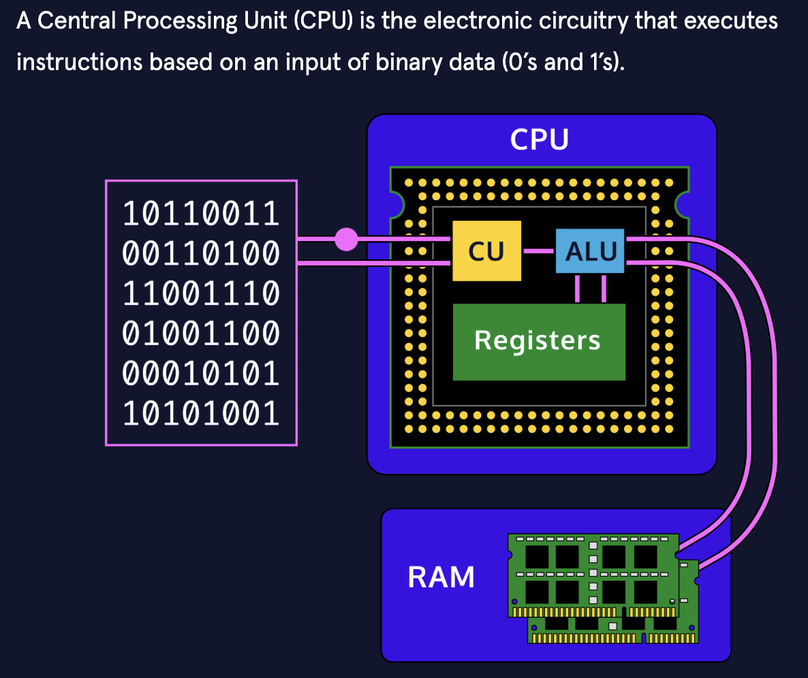
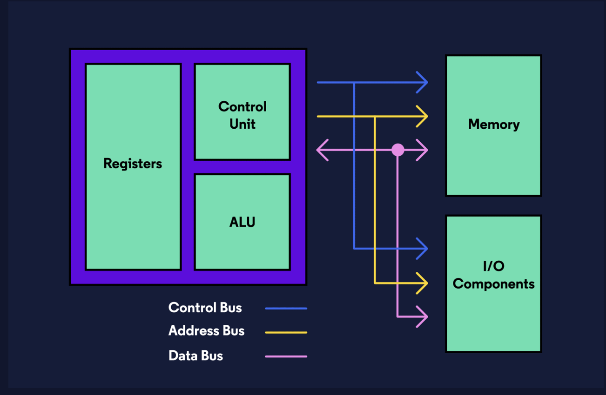

# The computer hardware

## CPU
The CPU consists of three main components:
* Control Unit (CU)
* Arithmetic and Logic Unit (ALU)
* Registers (Immediate Access Store)

These components are all wired in very specific ways in order to process data. It is important here to remember that data, to our hardware, is a series of binary, on and off, electrical pulses. These pulses are run through different wires, semiconductors, and components as a means to process and return data that is usable by the software.

## Control Unit
The *Control Unit (CU)* is the overseer of the CPU, responsible for controlling and monitoring the input and output of data from the computer’s hardware. The Control Unit is the component receiving instructions from the software and running the show. Its primary job is making sure that data is sent to the right component, at the right time, and arrives with integrity.
Part of this job is keeping all the hardware working on the same schedule. It does this with a clock, which sends out a regular electrical signal to all components at the same time to coordinate activities.

## ALU
The *Arithmetic and Logic Unit (ALU)* is where all the processing on your computer takes place. Even as you scroll this text box, the ALU is calculating pixel changes on the screen and sending that output to the monitor. The ALU is the fundamental building block of the CPU, the brains of the entire computer. Nearly all functional processing occurs in this chip. As the name implies, the ALU’s functions can be divided into two primary areas:
* Arithmetic operations that deal with calculating data (e.g. 5 * 4 = 20)
* Logic operations that deal with comparisons and conditionals (e.g. 25 > 10)

## Registers
The *register*, or immediate access store, is limited space, high-speed memory that the CPU can use for quick processing. Registers are small pieces of memory right on the CPU. They are fixed in number and defined in the Instruction Set Architecture. There are typically 8, 16, 32, or 64 registers depending on the architecture and are also fixed in size based on the size of the number it can hold. They provide the CPU with a place to store and access values that are crucial to the immediate calculations the ALU is processing.

## Memory
The CPU is just a single component of the computer’s hardware, other important components of hardware include Random Access Memory (RAM), buses (high-speed wires), as well as a hard disk and other non-volatile memory.

### Random Access Memory
*Random Access Memory*, or RAM, is additional high-speed memory that a computer uses to store and access information on a short-term basis. In general, a computer’s performance can be directly correlated to the amount of RAM it has available to use. RAM is considered primary volatile memory, which means it loses whatever is stored on it as soon as power is disconnected.

## Buses
A *bus* is an engineering term for a job-specific high-speed wire. These wires are often group together in bundles and will transfer electrical signals either in parallel or in serial, that is many signals at once or one pulse at a time. Buses can be grouped into three functions: data buses, address buses, and control buses.

***Data buses*** carry data back and forth between the processor and other components. Data buses are bidirectional, which means that they transfer data both to and from other locations.
*Address buses* carry a specific address in memory and are unidirectional. We can visualize all of our memory like a village with each house representing a package of data. Every house/data has an address. When our computer tells a program or component what data to use, it sends the address and then the component knows where to find the data when it needs it.

***Control buses*** are also unidirectional and are responsible for carrying the control signals of the CU to other components as well as the clock signals for synchronization.

## Hard Disks
Hard disks, or hard drives, are responsible for the long-term, or secondary storage of data and programs. This is an example of non-volatile memory, meaning that it will retain its information when we shut down our computer.

## The Mainboard
The mainboard, or motherboard, is a printed circuit board that houses important hardware components via ports. Hardware such as the CPU, the hard drive, various USB devices, and more are connected through ports on the mainboard. The mainboard allows these components to communicate easily.

## Ports
A port is a physical outlet used to connect outside, IO (Input/Output) devices to a computer. A computer typically contains multiple ports. This connection allows for communication between the IO device and our computers. Examples of IO devices include keyboards, mice, and monitors.
