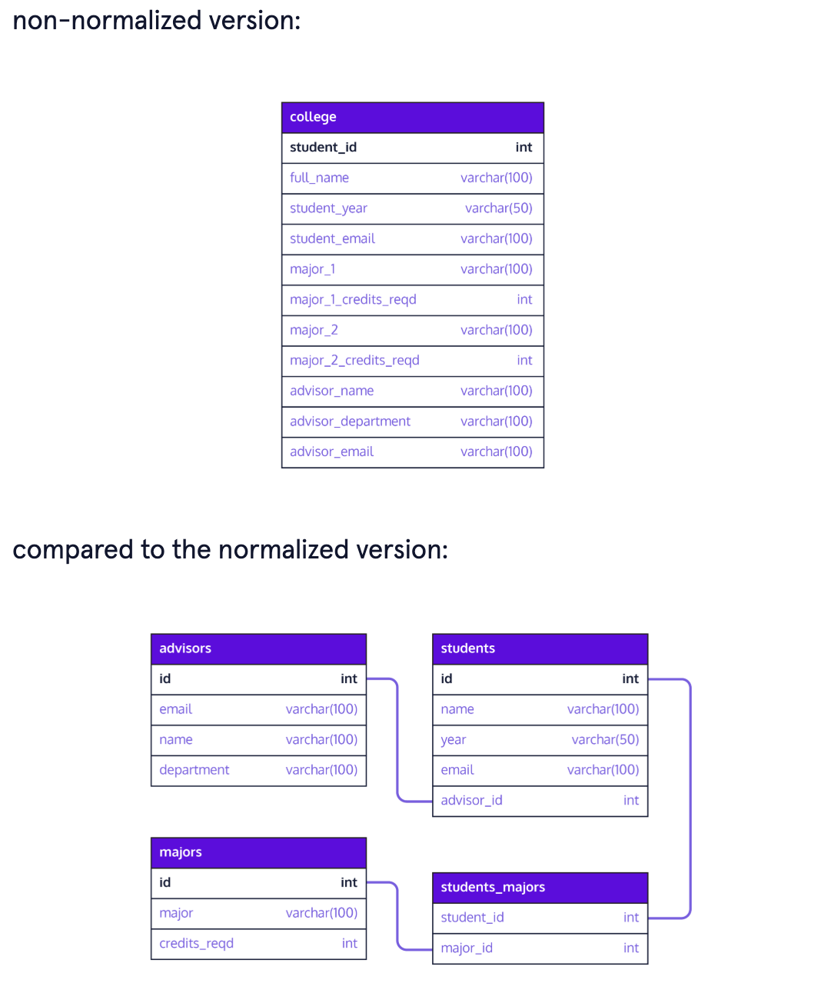

# Normalization

The process of restructuring a database in this way is called *normalization*. If you look up “database normalization,” you'll see that there are formal names and definitions for different levels of restructuring; the most common are first, second, and third normal form (1NF, 2NF, 3NF). In practice, the formal vocabulary tends to be used in academic settings, and would be important to understand if you want to read a paper about how to optimize your database schema. Database engineers think about the underlying concepts of normalization on a day-to-day basis, but rarely use the technical names and definitions. This lesson is therefore focused on the ideas behind normalization, rather than the formal vocabulary.

## Duplicated data
When columns of a database table do not depend on (i.e., describe) the primary key, the same data may be duplicated in multiple places.
This can be especially problematic if we want to modify the duplicated information, because we'll have to make the same updates in multiple locations.
Unfortunately, there is another potential problem that can arise when all columns in a table do not depend on the primary key: new data cannot be inserted into the table until a primary key is known.
This structure can make queries related to a student's major less efficient (and more messy).

## Restructuring columns
To create a new table from an existing one, we can precede any query with CREATE TABLE new_table_name AS. For example, the following code selects the unique values of major_1 and major_1_credits_reqd from the original college table and inserts them into a newly created table called majors:

```
CREATE TABLE majors AS
SELECT distinct major_1, major_1_credits_reqd
FROM college;

```

We can also delete columns from our original table once we have moved them. For example, the following code drops the columns major_1 and major_1_credits_reqd from the college table:

```
ALTER TABLE college
DROP COLUMN major_1,
DROP COLUMN major_1_credits_reqd;

```



## Academic Normalization
In most academic situations, the terms 1NF, 2NF, and 3NF will be the formal vocabulary for describing a normalized database. But what do these terms mean? In each term, the *NF* stands for *Normal Form*. The numbers stand for what level of normalization the database is.

### A 1NF Database
The first type of database we'll talk about is a *1NF* database, or a *1 Normal Form* database. A 1NF database is an *atomic* database. An atomic database is when each cell contains one value, and each row is unique. We use the term atomic to indicate that the data is no longer divisible, like an atom. An example of a non-1NF database can be seen below.
| Book Title                        | Book Author                       | Author Address                    | Book Sales                        |
|-----------------------------------|-----------------------------------|-----------------------------------|-----------------------------------|
| A Wrinkle in Time                 | Madeleine L'Engle                 | 123 Street Road                   | $1.3 million                      |
| The Lord of the Rings, The Hobbit | J.R.R. Tolkien                    | 47 The Shire                      | $9.9 million                      |

We can look at this database and see that we have two different values in the Book Title column for The Lord of the Rings and The Hobbit. This causes problems for us if we wanted to get information specific for The Lord of the Rings, as we would get information for The Hobbit as well. To fix this issue, we would separate the two books into their own rows, like this:
| Book Title            | Book Author           | Author Address        | Book Sales            |
|-----------------------|-----------------------|-----------------------|-----------------------|
| A Wrinkle In Time     | Madeleine L'Engle     | 123 Street Road       | $1.3 million          |
| The Lord of the Rings | J.R.R. Tolkien        | 47 The Shire          | $5.6 million          |
| The Hobbit            | J.R.R. Tolkien        | 47 The Shire          | $4.3 million          |

### A 2NF Database
The next step when normalizing a database would be to make the database *2NF*. When a database is 2NF, it means that the database is 1NF and does not contain any partial dependencies. But what is a partial dependency? A *partial dependency* is when an attribute depends on part of the table's primary key rather than the whole primary key. For an example, let's take a look at the table below:
| Book ID (PK)          | Book Title            | Book Sales            | Author ID             | Book Author           | Author Address        |
|-----------------------|-----------------------|-----------------------|-----------------------|-----------------------|-----------------------|
| 1                     | A Wrinkle in Time     | $1.3 million          | 1                     | Madeleine L'Engle     | 123 Street Road       |
| 2                     | The Lord of the Rings | $5.6 million          | 2                     | J.R.R. Tolkien        | 47 The Shire          |
| 3                     | The Hobbit            | $4.3 million          | 2                     | J.R.R. Tolkien        | 47 The Shire          |

With this table we can see that there is an ID for the book and an ID for the author. We can determine the Book Title based on the Book ID and the Author based on the Author ID. These are both partial dependencies since the Author ID depends partially on the Book ID. To remove these dependencies we need to split this table into two different tables. One for the Book fields and one for the Author fields. The resulting tables would look like this:
| Book ID (PK)          | Author ID (FK)        | Book Title            | Book Sales            |
|-----------------------|-----------------------|-----------------------|-----------------------|
| 1                     | 1                     | A Wrinkle In Time.    | $1.3 million          |
| 2                     | 2                     | The Lord of the Rings | $5.6 million          |
| 3                     | 2                     | The Hobbit            | $4.3 million          |

| Author ID (PK)    | Author Name       | Author Address    |
|-------------------|-------------------|-------------------|
| 1                 | Madeleine L'Engle | 123 Street Road   |
| 2                 | J.R.R. Tolkien    | 47 The Shire      |

This also helps prevent a few anomalies when updating and deleting data from the database. For instance, if we wanted to update the address of J.R.R. Tolkien, instead of finding every one of his books in the Book.db table and updating his address, we can update his address from the Author.db table once. This decreases the chances that we miss updating one of the Author Address records which would lead to J.R.R. Tolkien having two separate addresses in the database rather than one. This would be called an *update anomaly*.
This also keeps us from deleting an author from the database unless we want to, otherwise known as causing a *deletion anomaly*. This is because in the original database, if we deleted every book made by an author we would end up getting rid of the author completely when we just wanted to get rid of their books from the database. Now we can delete every book by an author in the Book.db table, without deleting the author from the Author.db table.

### A 3NF Database
The last level of normalization we'll cover in this article is to make the database *3NF*. A database is described as 3NF when it is 2NF but also has no transitive functional dependencies. A *transitive functional dependency* is when a non-prime attribute depends on another non-prime attribute rather than a primary key or prime attribute.
Let's go back to our book database to see an example of this. let's say we wanted to find the author's address. We would first go from the book table to the author table, and from the author table, we can find their address. This might not seem like a big deal, but the address is dependent on the author, meaning if we were to delete the author we would come across another deletion anomaly. To fix this, we would create a table for the addresses. This would make our database look like the one below:
| Book ID (PK)          | Author ID (FK)        | Book Title            | Book Sales            |
|-----------------------|-----------------------|-----------------------|-----------------------|
| 1                     | 1                     | A Wrinkle In Time     | $1.3 million          |
| 2                     | 2                     | The Lord of the Rings | $5.6 million          |
| 3                     | 2                     | The Hobbit            | $4.3 million          |

| Author ID (PK)    | Address ID (FK)   | Author Name       |
|-------------------|-------------------|-------------------|
| 1                 | 1                 | Madeleine L'Engle |
| 2                 | 2                 | J.R.R. Tolkien    |

| Address ID (PK) | Address         |
|-----------------|-----------------|
| 1               | 123 Street Road |
| 2               | 47 The Shire    |

Another modification we can make to our database is to make the Book Sales a table of its own. This would be useful if we add books before they are published as it would prevent *insertion anomalies* from happening. An insertion anomaly occurs when a row is added to a database without all the data it needs. For instance, if we wanted to add a book to the database before it sold a copy, Book Sales would be NULL causing an incomplete row which could prevent us from adding the book to the database. But for now we'll just assume that with our database the books are added after they make their first sales.

### Beyond 3NF
In further research, other NFs will be described such as BCNF, 4NF, and 5NF. These are just deeper levels of normalization to help organize the database to make it more relational and to keep more of these anomalies from happening. In some places, 6NF is even described. This is because relational databases are still being researched, meaning deeper levels of normalization are being reached as people discover more about how to structure a database. This means that someday there could even be a 7NF!
