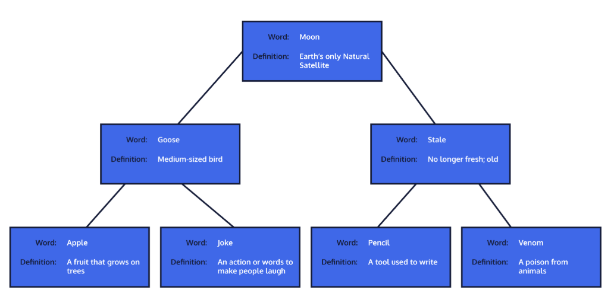
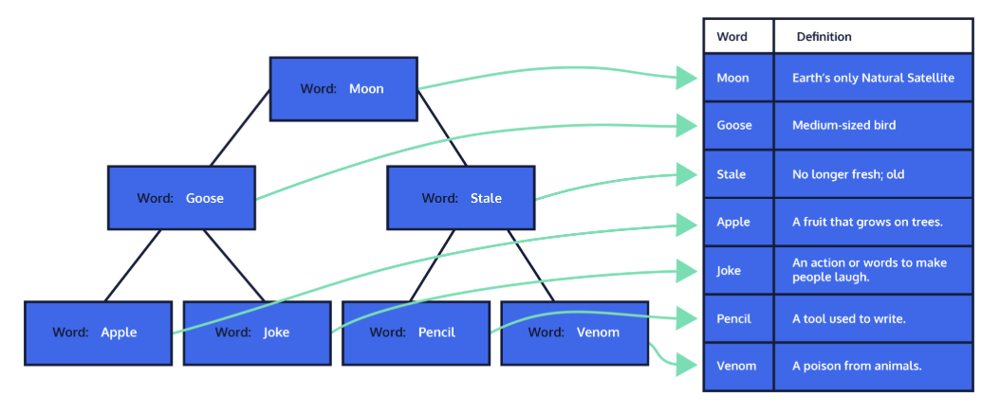

# Partial Index

# **Partial Index**

A partial index allows for indexing on a subset of a table, allowing searches to be conducted on just this group of records in the table. So in our example, you would be searching an index of ~258 Thousand instead of 70+ Million. Think how powerful this addition to your index toolset can be if you find yourself working with massive databases.
All you have to do is create an index like you normally would with a WHERE clause added on to specify the subgroup of data your index should encompass. Let's assume that in our example the users are stored in a users table and we want an index based on user_name. If we know that all internal employees have an email_address ending in '@wellsfargo.com', we would write the partial index like this:

```
CREATE INDEX users_user_name_internal_idx ON users (user_name) WHERE email_address LIKE '%@wellsfargo.com';

```

Notice that the filtering of the index does not have to be for a column that is part of your index.

## Order by
If you are commonly ordering your data in a specific way on an indexed column, you can add this information to the index itself and PostgreSQL will store the data in your desired order. By doing this, the results that are returned to you will already be sorted. You won't need a second step of sorting them, saving time on your query.
To specify the order of an index, you can add on the order you want your index sorted in when you create the index. Say you have a logins table that tracks the user_name and date_time each time a login occurs. If you wanted to check to see who has been logging in recently to use your site you could run:

```
SELECT
    user_name,
    date_time
FROM logins
WHERE date_time >= (NOW() - INTERVAL'1 month') ORDER BY date_time DESC;

```

If you were running this query regularly you could improve the speed by creating your index like this:

```
CREATE INDEX logins_date_time_idx ON logins (date_time DESC, user_name);

```

If your column contains NULLs you can also specify the order they appear by adding NULLS FIRST or NULLS LAST to fit your needs. By default, PostgreSQL orders indexes by ascending order with NULLs last, so if this is the order you desire, you do not need to do anything.

## Primary Keys and Indexes
PostgreSQL automatically creates a unique index on any primary key you have in your tables. It will also do this for any column you define as having a unique constraint. A unique index, primary key, and unique constraint all reject any attempt to have two records in a table that would have the same value (multicolumns versions of these would reject any record where all the columns are equal).
As a note, the primary key index standard is to end in _pkey instead of _idx to identify it as a specific type of index. It is also the way the system names it when created automatically.

## Clustered Index
To expand on this, all indexes are either a clustered index or a non-clustered index. For now, let's focus on the clustered index. A clustered index is often tied to the table's primary key.
When a clustered index is created for a table, the data is physically organized in the table structure to allow for improved search times. You can think of the clustered index like searching a dictionary. In a dictionary, the data (words) and all their related information (definition) are physically ordered by their index (words sorted alphabetically). Just like a dictionary, you can seek your word by quickly jumping to the letter in the alphabet the word you're looking for starts with. Then, even within that letter, you can get a good idea how deep in that subset your word will probably be ('bat' will be near the front of the b's while 'burgundy' will be near the end).
 This is how the clustered index physically organizes the data in your table, reorganizing it to allow faster searches. Because it is physically organizing the data in the table, there can only be one clustered index per table. In the next exercise, we'll look into how non-clustered indexes are different.
When the system creates, alters, or refreshes a clustered index, it takes all the records in your database table that are in memory and rearranges them to match the order of your clustered index, physically altering their location in storage. Then when you go to do your searches for records based on this index, the system can use this index to find your records faster.
Something to note that PostgreSQL does differently than other systems is that it does not maintain this order automatically. When inserting data into a table with a clustered index on other systems, those systems will place the new records and altered records in their correct location in the database order in memory. PostgreSQL keeps modified records where they are and adds new records to the end, regardless of sorting. If you want to maintain the order, you must run the CLUSTER command again on the index when there have been changes. This will “re-cluster” the index to put all of those new records in the correct place.
Because PostgreSQL does not automatically recluster on INSERT, UPDATE and DELETE statements, those statements might run faster than equivalent statements using a different system. The flip side of this coin though is that after time, the more your table is modified the less useful the cluster will be on your searches. Reclustering the table has a cost, so you will need to find a balance on when to recluster your table(s). There are tools that can be used to help you identify when this would be useful, but these tools fall outside of this lesson.
To cluster your database table using an existing index (say products_product_name_idx) on the products table you would use:

```
CLUSTER products USING products_product_name_idx;

```

If you have already established what index should be clustered on you can simply tell the system which table to apply the cluster on.

```
CLUSTER products;

```

And if you want to cluster every table in your database that has an identified index to use you can simply call

```
CLUSTER;

```

## Non-Clustered Index
Non-clustered indexes have records of the columns they are indexing and a pointer back to the actual data in the table. If you are searching for just the records in the non-clustered index, the system will simply seek for your query results and return them. When you search on a non-clustered index for more information than is in the indexed columns, there are two searches. The first to find the record in the index and another to find the record the pointer identifies. There are some things you can do, such as creating a multicolumn index, that in some cases can help cut down or eliminate the need for the look back to the main table in memory.
 The keywords you are looking for are organized (by type, alphabetically, by the number of appearances, etc) and can be found quickly. However, the index doesn't contain information beyond that. Instead, it contains a pointer (page number, paragraph number, etc) to where the rest of the data can be found. This is the same way non-clustered indexes in databases work. You have a key that is sorted and a pointer to where to find the rest of the data if needed.


## Index-Only Scans

```
CREATE INDEX customers_idx ON customers (last_name, first_name);

```

This will improve the speed when searching for customers by last_name and first_name. What happens when we frequently want to know the customers email_address as well? For each record found, it will use the index to find a pointer then look up the email_address matched to that record found in the index to return the last_name, first_name, and email_address. If you include the information that is regularly looked for, even if it isn't used in the filtering, as part of the index, a secondary search can be avoided. So in this example, you could add email_address as another column in the index to prevent the lookup step. Remember the order the columns are in when creating the index should be whatever is most useful for your particular situation for searches and filtering.

## Combining Indexes
the server can combine indexes together to speed the filter.
Like anything automatically handled by a system, there are some things to keep in mind when using this convenience.
* A single multicolumn index is faster (if ordered well) than the server combining indexes.
* A multicolumn index is less efficient than a single index in cases where a single index is needed.
* You could create all of them (two single indexes and one multicolumn index), and then the server will try to use the best one in each case, but if they are all not used relatively often/equally then this is a misuse of indexes.
Take for example, searching for
     first_name
  and
     last_name
  in the
     customers
  table.
* If searches are most often for only one of the columns, then you should use that single index.
* If searches are most often last_name and first_name, then you should have a multicolumn index.
* If the searches are frequent and evenly spread among first_name alone, last_name alone, and the combination of the two; that is a situation where you would want to have all three indexes (two single indexes and one multicolumn index).

## Indexes Based On Expressions
For example, if you want to ensure the company_name in a manufactures table is unique, you can add the UNIQUE option to make a unique index constraint on the results on your index. Any duplicate will then be rejected. Using UNIQUE here tells the system that your index also needs to be a constraint and only allow one record in the system that matches the criteria for your index. In other words, by creating an index with UNIQUE the system will automatically create the constraint to match the logic in the index at the same time. Just like the creation of a constraint, if you try to create an index in this way where the data already in the table does not pass, the system will reject your creation and notify you of the issue.
You can add a function on your index to convert all your company_name data to lower case by using LOWER. This ensures that 'ExampleCompany' would be considered the same as 'examplecompany'. This combination of the UNIQUE constraint and the use of the function LOWER would look like this:

```
CREATE UNIQUE INDEX unique_manufacture_company_name_idx ON manufacture(LOWER(company_name));

```

These special indexes compound the pros and cons of indexes. Because the results of the expression are stored in the index, it saves the search function from having to perform it on every row on future searches. However, every change in the table data that impacts the index means it has to do the expression again, making Inserts and Updates more expensive on these indexes than a basic index. Be especially thoughtful about when to use indexes that use functions or expressions.
