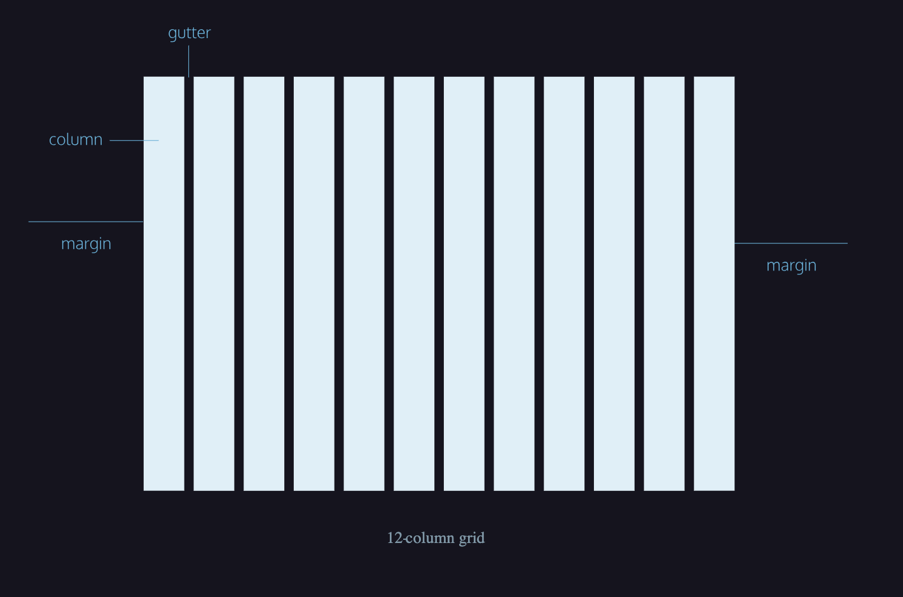

# Grid layout

## Grid columns

## Grid rows
*Rows* are the horizontal lines on a grid. Think of rows as invisible boxes that group content together by height. Rows are commonly used in web designs to group content together and re-order other content to allow for more whitespace.
For example, let’s say you have a set of items that all span the same amount of columns and you want them to align across the page without being disrupted by other elements. One way to achieve this outcome is to wrap the content in a row component. This will force any content, not inside of the row, to be pushed away.

## Grid gutters
*Gutters* make up the negative space between columns. This design element helps to provide a natural break between elements aligned horizontally, while also helping to break rows of content vertically.
Note, there will always be one less gutter than the total number of columns. For example, if you are designing on a 12 column grid, then you will only have 11 gutters, one for every gap that separates each column.
While there is no set standard for a gutter width, it’s best practice to select a size that visually separates horizontal columns but is significantly thinner than the width of a column. The same can be said for vertical gutters.

## Responsive design

     ## On a large or desktop device you may start with a 12 column grid, but on a small or mobile device, you adjust the 12 column grid to a 4 column grid.

## Whitespace
Space is an important aspect of creating balanced and harmonious layouts in web design. As a designer, it’s important to understand how space can enhance as well as hurt your designs.
*Whitespace*, or negative space, refers to the emptiness between elements, whether that’s in the gutter of the columns, or additional padding around a block of text. As a designer, don’t be afraid of using space to enhance the usability of your site and prioritize the content.

## Passive whitespace
passive whitespace is sometimes referred to as the unconsidered space. The most frequent use of passive whitespace comes within text elements.
Different font families have varying amounts of passive whitespace and you can control aspects of them within your design by altering CSS properties such as line-height or margin when setting type.
By adjusting the space between your lines of text, you can improve the design’s overall legibility and balance.

## Active Whitespace
Unlike passive whitespace, which occurs more naturally, *active whitespace* is intentional. Also called *macro whitespace*, active whitespace refers to enhancing the overall page structure through space to emphasize content or guide users from one point to the next.
By adding active whitespace to a site’s design, we can spread our different sections out. This technique helps guide the user through the page’s content more effectively, allowing users to consume and absorb content more easily.
Active whitespace comes in many forms. But traditionally, it is achieved by adding space between a site’s elements. For instance, adding space to an article’s sidebar helps to visually separate the content from the page’s main content.
