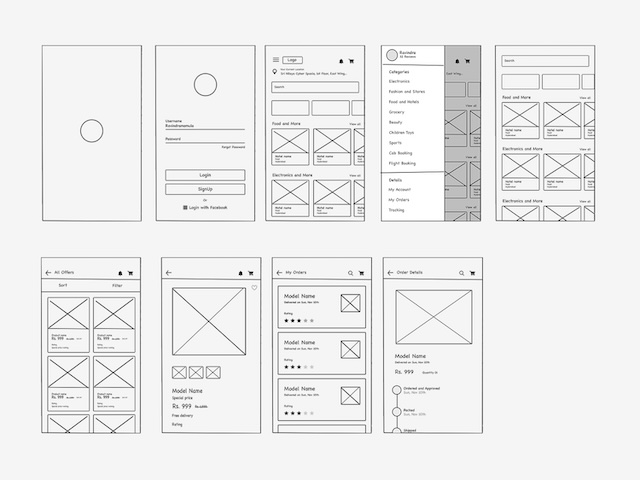

# Wireframe

E’ solo uno schema a blocchi (senza colori né font reali) Find definition
Source: [https://medium.com/thinking-design/everything-you-need-to-know-about-wireframes-and-prototypes-76f828a1bcbc](https://medium.com/thinking-design/everything-you-need-to-know-about-wireframes-and-prototypes-76f828a1bcbc)

## Overview
Use this page as a quick reference for create a website wireframe. Focus on practical decisions and adapt examples to your project context.
