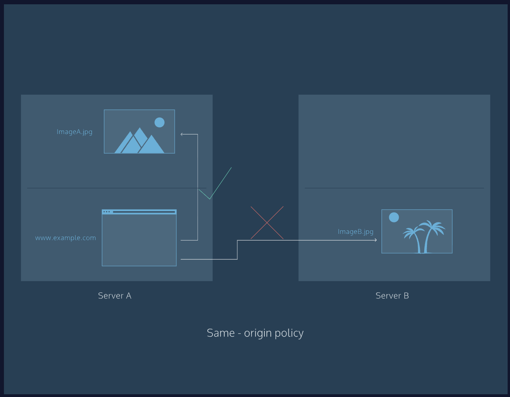
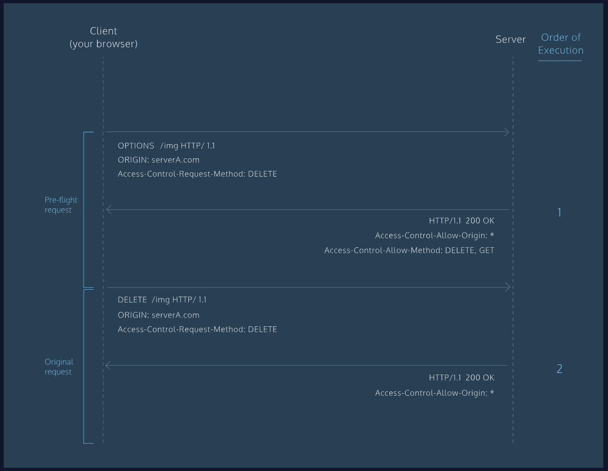

# CORS

Servers are used to host web pages, applications, images, fonts, and much more. When you use a web browser, you are likely attempting to access a distinct website (hosted on a server). Websites often request these hosted resources from different locations (servers) on the Internet. Security policies on servers mitigate the risks associated with requesting assets hosted on different server. Let’s take a look at an example of a security policy: *same-origin*.
The same-origin policy is very restrictive. Under this policy, a document (i.e., like a web page) hosted on server A can only interact with other documents that are also on server A. In short, the same-origin policy enforces that documents that interact with each other have the same *origin*.
An origin is made up of the following three parts: the protocol, host, and port number. The details of these individual parts aren’t necessary at the moment, but it is important to illustrate how the same-origin policy uses these parts.
Consider the following URL:

```
http://www.example.com/foo-bar.html

```

Let’s call it **URL1** (for short).
If you used a web browser to navigate from **URL1** to
     http://www.example.com/hello-world.html
 , you would be allowed to do so because the protocol (HTTP), host (example.com), and port (80) of each URL match one another. (Port 80 is the default port.) The same-origin policy requires that all parts of the origin match.
Navigating to
     https://www.en.example.com/hello.html
  from URL1, however, would not be allowed because of the different protocol (HTTPS) and host (en.example.com).
As you can see, not having a security policy can be risky, but a security policy like same-origin is a bit too restrictive. Thankfully, there are security policies that strike a mix of both, like *cross-origin*, which has evolved into the *cross-origin resource sharing* standard, often abbreviated as CORS.


## CORS
A request for a resource (like an image or a font) outside of the origin is known as a *cross-origin* request. CORS (cross-origin resource sharing) manages cross-origin requests.
Once again, consider the following URL:

```
http://www.example.com/foo-bar.html

```

Let’s call it *URL1* (for short).
Unlike same-origin, navigating to https://www.ejemplo.com/hola.html from **URL1** could be allowed with CORS. Allowing cross-origin requests is helpful, as many websites today load resources from different places on the Internet (stylesheets, scripts, images, and more).
Cross-origin requests, however, mean that servers must implement ways to handle requests from origins outside of their own. CORS allows servers to specify who (i.e., which origins) can access the assets on the server, among many other things.

The CORS standard is needed because it allows servers to specify not only who can access the assets, but also *how* they can be accessed.
Cross-origin requests are made using the standard HTTP request methods. Most servers will allow GET requests, meaning they will allow resources from external origins (say, a web page) to read their assets. HTTP requests methods like PATCH, PUT, or DELETE, however, may be denied to prevent malicious behavior. For many servers, this is intentional. For example, it is likely that server A does not want servers B, C, or D to edit or delete its assets.
With CORS, a server can specify who can access its assets and which HTTP request methods are allowed from external resources.

## How does CORS manage requests from external resources?
You can find a description of each CORS header at the following: [CORS Headers](https://developer.mozilla.org/en-US/docs/Web/HTTP/Headers#CORS).
An HTTP header is a piece of information associated with a request or a response. Headers are passed back and forth between your web browser (also referred to as a client) and a server when the web page you are on wants to use resources hosted on a different server. Headers are used to describe requests and responses. The CORS standard manages cross-origin requests by adding new HTTP headers to the standard list of headers. The following are the new HTTP headers added by the CORS standard:
* Access-Control-Allow-Origin
* Access-Control-Allow-Credentials
* Access-Control-Allow-Headers
* Access-Control-Allow-Methods
* Access-Control-Expose-Headers
* Access-Control-Max-Age
* Access-Control-Request-Headers
* Access-Control-Request-Method
* Origin
These are all important, but let’s focus on the following header:
* Access-Control-Allow-Origin
The
     Access-Control-Allow-Origin
  header allows servers to specify how their resources are shared with external domains. When a
     GET
  request is made to access a resource on Server A, Server A will respond with a value for the
     Access-Control-Allow-Origin
  header. Many times, this value will be
     *
 , meaning that Server A will share the requested resources with *any* domain on the Internet. Other times, the value of this header may be set to a particular domain (or list of domains), meaning that Server A will share its resources with that specific domain (or list of domains). The
     Access-Control-Allow-Origin
  header is critical to resource security.

## Pre-flight Requests
As mentioned before, most servers will allow
     GET
  requests but may block requests to modify resources on the server. Servers don’t just blindly block such requests though; they have a process in place that first checks and then communicates to the client (your web browser) which requests are allowed.
When a request is made using any of the following HTTP request methods, a standard *preflight* request will be made before the original request.
* PUT
* DELETE
* CONNECT
* OPTIONS
* TRACE
* PATCH
Preflight requests use the
     OPTIONS
  header. The preflight request is sent *before* the original request, hence the term “preflight.” The purpose of the preflight request is to determine whether or not the original request is safe (for example, a
     DELETE
  request). The server will respond to the preflight request and indicate whether or not the original request is safe. If the server specifies that the original request is safe, it will allow the original request. Otherwise, it will block the original request.
The request methods above aren’t the only thing that will trigger a preflight request. If any of the headers that are automatically set by your browser (i.e., user agent) are modified, that will also trigger a preflight request.


## How do I implement CORS?
For example, if you are using Node, you can use setHeader(), as shown below:

```
response.setHeader('Content-Type', 'text/html');

```

If you are using Express, you can use CORS middleware:

```
$ npm install cors

var express = require('express');
var cors = require('cors');
var app = express();

app.use(cors());

app.get('/hello/:id', function (req, res, next) {
  res.json({msg: 'Hello world, we are CORS-enabled!'});
});

app.listen(80, function () {
  console.log('CORS-enabled web server is listening on port 80');
});

```
