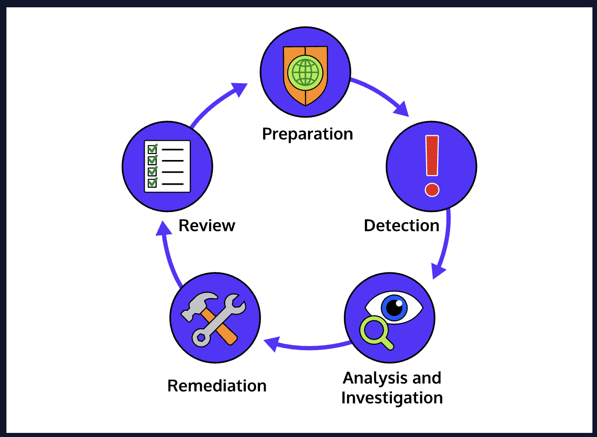

# Remediation and Incident Response

## Remediation
NIST defines remediation as “The act of mitigating a vulnerability or a threat”. In simple terms, remediation is simply “the process of fixing a security issue”. It could be patching a vulnerability in a piece of software, removing malware from an infected computer, or kicking a malicious attacker out of a network. Not all remediation comes as the result of an incident; arguably the best remediation happens before the security issue can evolve into an incident.

## Incident Response
NIST defines incident response as “The mitigation of violations of security policies and recommended practices.”, but a simpler definition might be “everything that needs to happen to investigate and recover from an incident”.
Incident response begins before an incident even occurs, with preparations to ensure that an organization is able to respond quickly when an incident does occur. These preparations can include training, ensuring access to tools, and creating incident response plans that contain details about what to do when an incident happens.
 When an incident is detected, lots of things happen. The security team’s primary concerns will usually be analysis, containment, and remediation. Other groups within an organization will have their own tasks, such as handling disclosure, communicating with law enforcement, etc. In some cases, usually involving cyberattacks, remediation may be delayed to allow investigators to gather information without tipping the attackers off.
After an incident, an organization will conduct reviews of what happened, and use that knowledge to improve security and procedures, to prevent similar incidents, and respond more effectively to incidents in the future. Depending on the nature of the incident, the organization may need to dedicate additional resources to recovering from the incident; data, software, and even hardware may need to be repaired or replaced.

### A Hypothetical Scenario
Let’s look at an imaginary company responding to an incident: a ransomware attack. The ransomware was quickly detected and isolated before it could spread to more than a few machines, but there’s still a lot to do.
**The Security Team**
The security team is investigating how the malware got in, making sure it can’t come back, and collecting malware samples to be analysed. They’re also investigating what exactly the malware did: if it stole information in addition to encrypting it for ransom, they need to know. If the analysis yields information about who is responsible, it can be passed onto law enforcement. Because the attack was small, law enforcement isn’t directly involved, but the security team is still communicating with them.
**IT, PR, and Legal**
The IT team is busy replacing the computers that have been taken offline, and restoring clean backups, while the PR team prepares a press release on the breach. Members of the legal team are busy making sure that the company has proof they did their due diligence for security.
**Incident Response Playbooks**
Incidents can be chaotic and stressful, and aren’t a good time to try to formulate a plan of action. That’s why organizations create what’s called an *Incident Response Playbook* that contains procedures outlining what needs to happen to respond to an incident. These playbooks contain information on what constitutes an incident, what procedures should be enacted and by who, who needs to be contacted, etc…
Even if you’re not part of a security team, it’s not a bad idea to familiarize yourself with your organization’s incident response playbook. Knowing what to do during an incident, or who to contact if you discover something suspicious, can be important.
