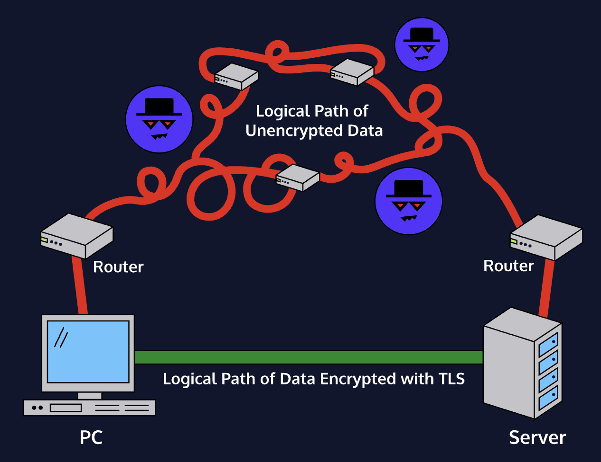
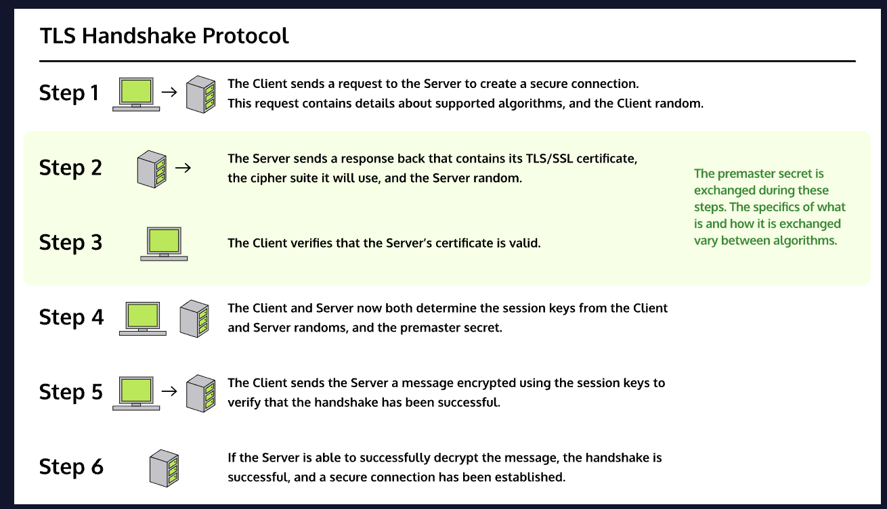

# Transport Layer Security (TLS) Transport Layer Security (TLS) is a protocol for establishing secure connections between computers. TLS’s largest claim to fame is that it powers [HTTPS](https://owasp.org/www-community/), the protocol that lets us browse the web securely.
As suggested by its name, TLS provides security for data that is sent through transport layer protocols. It does this by creating a secure connection (often conceptualized as a *tunnel*) through which data can be transmitted to its destination. You can think of TLS as a wrapper for transport layer protocols. TLS makes use of other [algorithms](https://owasp.org/www-community/) and protocols to handle things like encryption and key exchange. However, TLS is not itself an encryption algorithm.
 TLS uses public-key *certificates* in order to make sure that [servers](https://owasp.org/www-community/) (and sometimes clients) are who they say they are. These certificates are created using the ability of asymmetric cryptography to digitally sign data, verifying its authenticity and provenance.

## TLS vs SSL
[Secure Sockets Layer (SSL)](https://owasp.org/www-community/) is the predecessor of TLS. Like TLS, it is a protocol meant to establish secure communications between computers. The primary difference between SSL and TLS is that SSL has a history of serious security vulnerabilities, with the final version being deprecated in 2015.
Both SSL and TLS use the same kind of certificate, and TLS was originally created to replace SSL. Because SSL was around first, it’s still common to refer to ‘SSL/TLS certificates’ as just ‘SSL certificates’. For the most part, whenever you hear someone talk about SSL, you can probably assume they’re actually talking about TLS.

## How TLS works
TLS handshakes are a multistep process used to create a secure connection between a client and a server. In order to create a secure connection, two things need to happen:
1. The client needs to authenticate the server.
2. The client and server need to exchange a shared secret with which to communicate.
The details of the handshake differ depending on the encryption and key exchange algorithms supported by the client and the server. In general, the process works like this:
1. Client sends a “hello” message to the server, containing their supported protocol versions, cipher suites, and a random string of data called the *client random*.
2. The server responds with its TLS/SSL certificate, the cipher suite it has chosen, and another random string of data called the *server random*.
3. The client uses the server’s TLS/SSL certificate to authenticate the server.
4. The client and the server exchange a piece of information called a *premaster secret*. The details of this exchange vary depending on the key exchange algorithm, but the result is that both the client and the server end up with the same premaster secret. The client and the server use the premaster secret, client random, and server random to generate session keys.
5. The client and server send each other messages encrypted using the session keys to test the connection.
6. If everything worked correctly, an encrypted connection has been established.

## Authentication
TLS uses [public key infrastructure (PKI)](https://owasp.org/www-community/) to handle authentication for servers. PKI is a system where a trusted 3rd party called a *certificate authority* verifies ownership of a server’s public key, and digitally signs the server’s SSL/TLS certificate. A client can verify the certificate’s authenticity using the certificate authority’s public key. In practice, this involves a hierarchy of certificate authorities and certificates, some of which are a part of a computer’s operating system.

TLS is a core protocol for the modern internet, enabling secure communications, web browsing, and more. Websites that don’t support TLS will find themselves unable to use HTTPS to securely communicate with visitors, running the risk of sensitive data exposure. Additionally, modern browsers flag any website that does not use HTTPS, or has expired/invalid TLS certificates as insecure, often preventing users from visiting them. How you implement TLS will depend on the combination of technologies you’re using, but, in order to create a secure experience on the modern web, developers need to ensure their websites support TLS.
