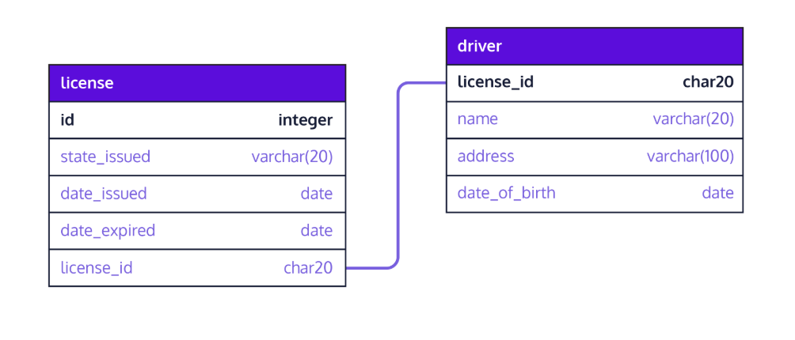
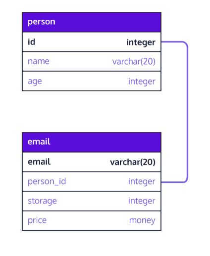
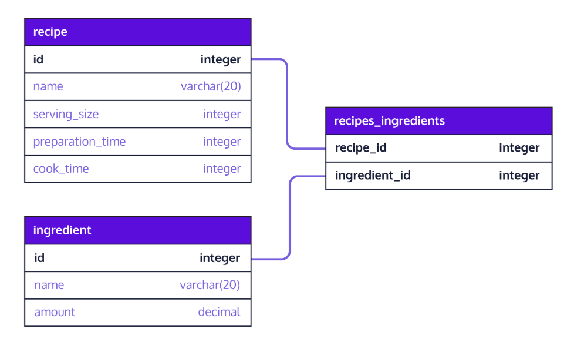
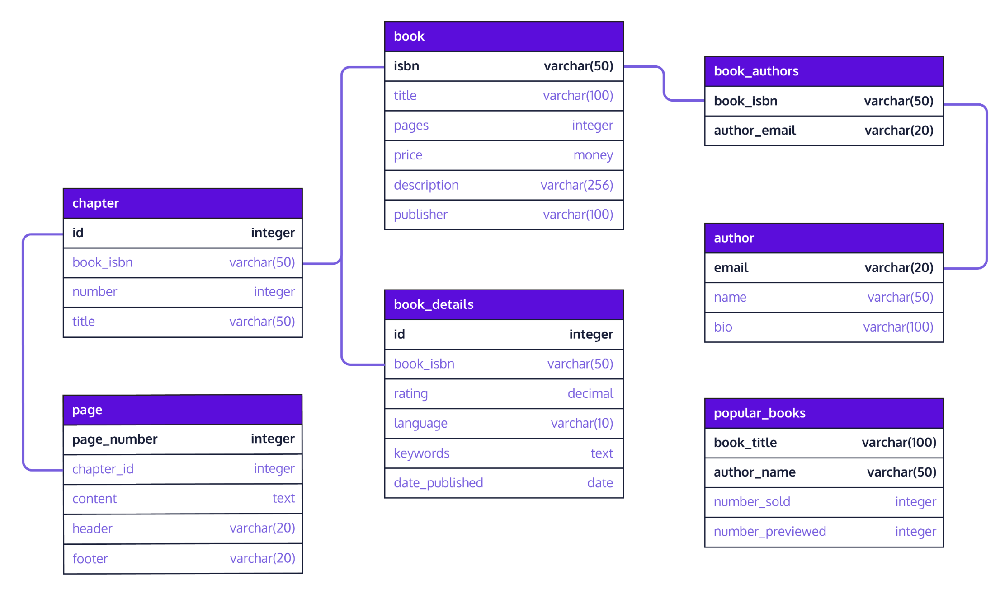

import RelationshipsModelPlayground from "./components/relationships/RelationshipsModelPlayground.jsx"

# Relationships

A database relationship establishes the way in which connected tables are dependent on one another.
There are three types: one-to-one, one-to-many and many-to-many.

## One-to-One Relationship
 In a one-to-one relationship, a row of table A is associated with exactly one row of table B and vice-versa.
To establish a one-to-one relationship in PostgreSQL between these two tables, we need to designate a foreign key in one of the tables.
To enforce a strictly one-to-one relationship in PostgreSQL, we need another keyword,
     UNIQUE
 . By appending this keyword to the declaration of the foreign key, we should be all set.

```
license_id char(20) REFERENCES driver(license_id) UNIQUE

```

For example

```
CREATE TABLE driver (
    license_id char(20) PRIMARY KEY,
    name varchar(20),
    address varchar(100),
    date_of_birth date
);

CREATE TABLE license (
    id integer PRIMARY KEY,
    state_issued varchar(20),
    date_issued date,
    date_expired  date,
    license_id char(20) REFERENCES driver(license_id) UNIQUE
);

```

## One-to-Many Relationship
 As opposed to one-to-one, a one-to-many relationship cannot be represented in a single table. Why? Because there will be multiple rows that need to exist for a primary key and this will result in redundant data that breaks the constraint placed upon a primary key.

```
CREATE TABLE chapter (
  id INTEGER PRIMARY KEY,
  title VARCHAR(100)
);

CREATE TABLE page (
  id INTEGER PRIMARY KEY,
  chapter_id INTEGER REFERENCES chapter(id),
  content TEXT
);

```

## Many-to-Many Relationship
Consider the following examples of many to many relationships:
* A student can take many courses while a course can have enrollments from many students.
* A recipe can have many ingredients while an ingredient can belong to many different recipes.
* A customer can patronize many banks while a bank can service many different customers.
In each of the above examples, we see that a many-to-many relationship can be broken into two one-to-many relationships.
To implement a many-to-many relationship we would create a third cross-reference table also known as a join table. It will have these two constraints:
* foreign keys referencing the primary keys of the two member tables.
* a composite primary key made up of the two foreign keys.


```
CREATE TABLE student (
  id INTEGER PRIMARY KEY,
  name VARCHAR(100)
);

CREATE TABLE course (
  id INTEGER PRIMARY KEY,
  title VARCHAR(100)
);

CREATE TABLE student_course (
  student_id INTEGER REFERENCES student(id),
  course_id INTEGER REFERENCES course(id) PRIMARY KEY (student_id, course_id)
);

```

## Complete example


## Interactive Playground: Relationship Modeling
**Why this matters:** selecting the wrong relationship pattern leads to brittle schema design.

**What to try:** toggle relationship types and check the recommended table strategy.

<RelationshipsModelPlayground />
