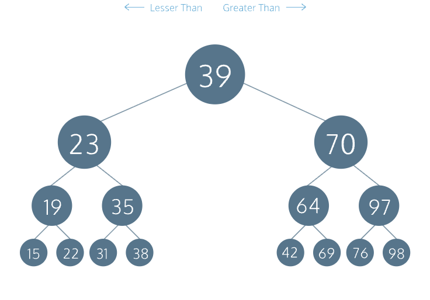

# 1.2. Js Binary search trees


**A binary tree is an efficient data structure for fast data storage and retrieval due to its** O(log N) <u>[runtime](https://www.codecademy.com/resources/docs/general/runtime)</u>. It is a specialized tree data structure that is made up of a root node and at most two child branches or subtrees. Each child node is itself a <u>[binary](https://www.codecademy.com/resources/docs/general/binary)</u> tree.
Each node has the following properties:
* .data — the value stored by the instance
* .depth — where a depth of 1 indicates the top level of the tree and a depth greater than 1 is a level somewhere lower in the tree
* .left — a pointer to the left child, which is itself a binary tree and must have a .data value less than the parent node’s data
* .right — a pointer to the right child, which is itself a binary tree and must have a .data value greater than the parent node’s data

## 
## Inserting a Value
When inserting a new value into a <u>[binary](https://www.codecademy.com/resources/docs/general/binary)</u> tree, we compare it with the root node’s value:

```
If the new value is less than the root node's value
  If a left child node doesn't exist 
    Create a new BinaryTree with the new value at a greater depth and assign it to the left pointer
  Else
    Recursively call .insert() on the left child node  
Else
  If a right child node doesn't exist
    Create a new BinaryTree with the new value at a greater depth and assign it to the right pointer
  Else
    Recursively call .insert() on the right child node

```

Let’s illustrate the insertion procedure with a tree whose root node has the data 100.

```
Insert 50
50 < 100, left child node doesn't exist, create a left child node
       100
       /
     50 
Insert 125
125 > 100, right child node doesn't exist, create a right child node
        100
       /   \
      50    125
Insert 75
75 < 100, left child node of 50 exists, recursive insert at left child
75 > 50, right child node doesn't exist, create a right child node
        100
       /   \
      50    125
       \
       75 
Insert 25
25 < 100, left child node of 50 exists, recursive insert at left child
25 < 50, left child node doesn't exist, create a left child node
        100
       /   \
      50    125
     /  \
    25  75

```


## **Retrieve a Node by Value**
Recall that a <u>[binary search tree](https://www.codecademy.com/resources/docs/general/binary-search-tree)</u> provides a fast and efficient way to store and retrieve values. Like with  <span style="font-family: .AppleSystemUIFontMonospaced-Regular; font-size: 12.0;text-align: left;">
     .insert()
 </span>, the procedure to retrieve a tree node by its value is recursive. We want to traverse the correct branch of the tree by comparing the target value to the current node’s value.
The base case for our recursive <u>[method](https://www.codecademy.com/resources/docs/general/method)</u> is that when the values match, we return the current node. The recursive step is to call itself from an existing left or right child node with the value.

```
If target value is the same as the current node value
  Return the current node
Else
  If target value is less than the root node's value and there is a left child node
    Recursively search from the left child node
  Else if there is a right child node
    Recursively search from the right child node

```

Given the following tree:

```
        100
       /   \
      50    125
     /  \
    25  75

```

To retrieve 75, the <u>[algorithm](https://www.codecademy.com/resources/docs/general/algorithm)</u> would proceed as follows:

```
At the root node, 75 < 100, and there is a left child

        100
       /   \
 ==>  50    125
     /  \
    25  75

At node 50, 75 > 50, and there is a right child

        100
       /   \
      50    125
     /  \
    25  75 <== 

Node 75 = 75, return this node

```


## **Traversing a Binary Tree**
There are two main ways of traversing a binary tree: breadth-first and depth-first. With breadth-first traversal, we begin traversing at the top of the tree’s root node, displaying its data and continuing the process with the left child node and the right child node. Descend a level and repeat this step until we finish displaying all the child nodes at the deepest level from left to right.
With depth-first traversal, we always traverse down each left-side branch of a tree fully before proceeding down the right branch. However, there are three traversal options:
* **Preorder** is when we perform an action on the current node first, followed by its left child node and its right child node
* **Inorder** is when we perform an action on the left child node first, followed by the current node and the right child node
* **Postorder** is when we perform an action on the left child node first, followed by the right child node and then the current node
For this lesson, we will implement the inorder option. The advantage of this option is that the data is displayed in a sorted order from the smallest to the biggest.
To illustrate, let’s say we have a binary tree that looks like this:

```
           15
     /------+-----\
    12            20
   /   \         /   \   
 10     13     18     22
 / \   /  \    / \   /  \
8  11 12  14  16 19 21  25

```

We begin by traversing the left subtree at each level, which brings us to 8, 10, and 11 reside. The <u>[inorder traversal](https://www.codecademy.com/resources/docs/general/binary-search-tree/inorder-traversal)</u> would be:

```
8, 10, 11

```

**We ascend one level up to visit root node 12 before we descend back to the bottom where the right subtree of 12, 13, and 14 resides. Inorder traversal continues with:**

```
12, 12, 13, 14

```

We again ascend one level up to visit root node 15 before we traverse the right subtree starting at the bottom level again. We continue with the bottom leftmost subtree where 16, 18, and 19 reside. The inorder traversal continues with:

```
15, 16, 18, 19

```

We ascend one level up to visit root node 20 before we descend back to the bottom where the rightmost subtree of 21, 22, and 25 resides.
Traversal finishes with:

```
20, 21, 22, 25

```

The entire traversal becomes:

```
8, 10, 11, 12, 12, 13, 14, 15, 16, 18, 19, 20, 21, 22, 25

```

Notice that all the values displayed are sorted in ascending order.

### Full example

```
class BinaryTree {
  constructor(value, depth = 1) {
    this.value = value;
    this.depth = depth;
    this.left = null;
    this.right = null;
  }

  insert(value) {
    if (value < this.value) {
      if (!this.left) {
        this.left = new BinaryTree(value, this.depth + 1);
      } else {
        this.left.insert(value);
      }
    } else {
      if (!this.right) {
        this.right = new BinaryTree(value, this.depth + 1);
      } else {
        this.right.insert(value);
      }
    }
  }
  
  getNodeByValue(value) {
    if (this.value === value) {
      return this;
    } else if ((this.left) && (value < this.value)) {
        return this.left.getNodeByValue(value);
    } else if (this.right) {
        return this.right.getNodeByValue(value);
    } else {
      return null;
    }
  }
  
  depthFirstTraversal() {
    if (this.left) {
      this.left.depthFirstTraversal();
    }
    console.log(`Value=${this.value}, Depth=${this.depth}`);
    if (this.right) {
      this.right.depthFirstTraversal();
    }
  }
};

module.exports = BinaryTree;

```


## **Code Challenges**:
* <u>[Beginner - Binary Search](https://leetcode.com/problems/binary-search/)</u><u>[Beginner - Search Insert Position](https://leetcode.com/problems/search-insert-position/)</u><u>[Beginner - Convert Sorted Array to Bnary Search Tree](https://leetcode.com/problems/convert-sorted-array-to-binary-search-tree/)</u><u>[Beginner - Find Mode in Binary Search Tree](https://leetcode.com/problems/find-mode-in-binary-search-tree/)</u>