# 10. Flexbox


There are two important components to a flexbox layout: *flex containers* and *flex items*. A flex container is an element on a page that contains flex items. All direct child elements of a flex container are flex items. This distinction is important because some of the properties you will learn in this lesson apply to flex containers while others apply to flex items.
To designate an element as a flex container, set the element’s display property to flex or inline-flex. Once an item is a flex container, there are several properties we can use to specify how its children behave. 

## **display: flex**
Any element can be a flex container. Flex containers are helpful tools for creating websites that respond to changes in screen sizes. Child elements of flex containers will change size and location in response to the size and position of their parent container.

```
div.container {
  display: flex;
}

```

In the example above, all divs with the class container are flex containers. If they have children, the children are flex items. Child elements will not begin on new lines.
Display: flex: Turns an element into a flexible container, but it remains a block-level element. It takes up the full available width, like a regular block element.
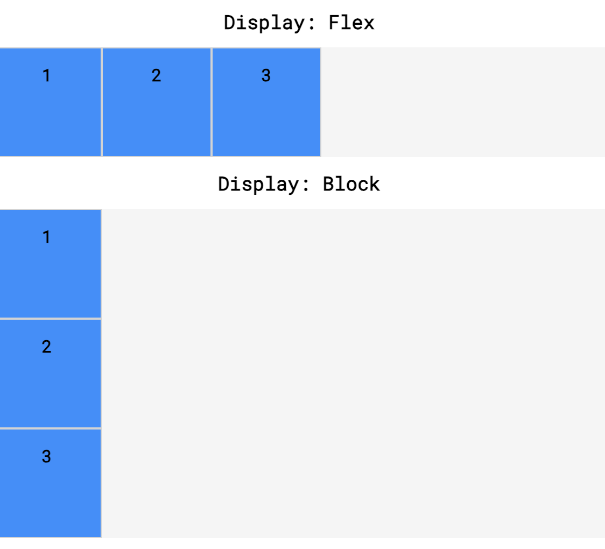
### gap / column-gap / row-gap
When display is flex, a gap can be defined to separate items with a specific value:
- gap: applied both vertically and horizontally
- column-gap: applied vertically
- row-gap: applied horizontally 

## **display: inline-flex**
Allows us to create flex containers that are also inline elements. If the parent element is too small, the flex items will shrink to accommodate the parent container’s size.
Display: inline-flex: Turns an element into a flexible container, but it becomes an inline-level element. It behaves like an inline element, so it can sit next to other inline or inline-block elements, taking up only the necessary space.
Without inline-flex property set:
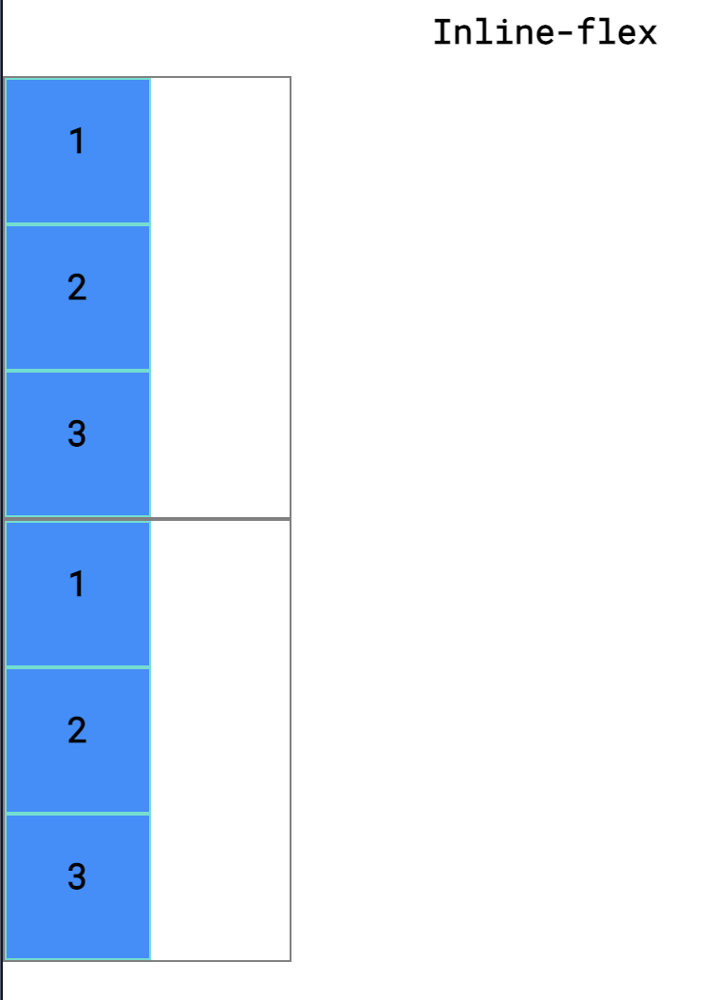
Wit inline-flex property set:
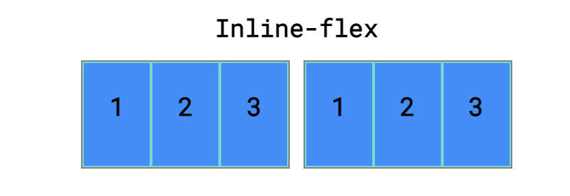

## justify-content: <value>
To position the items from left to right, we use a property called justify-content.
Five commonly used values for the justify-content property:
* flex-start — all items will be positioned in order, starting from the left of the parent container, with no extra space between or before them.
* flex-end — all items will be positioned in order, with the last item starting on the right side of the parent container, with no extra space between or after them.
* center — all items will be positioned in order, in the center of the parent container with no extra space before, between, or after them.
* space-around — items will be positioned with equal space before and after each item, resulting in double the space between elements.
* space-between — items will be positioned with equal space between them, but no extra space before the first or after the last elements.
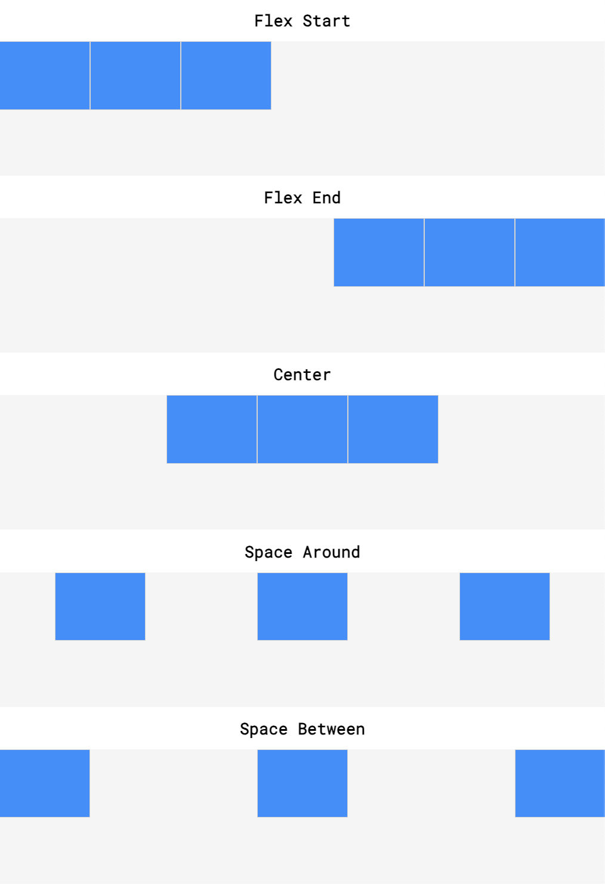

## align-items: <value>
The align-items property makes it possible to space flex items vertically.
Five commonly used values for the align-items property:
* flex-start — all elements will be positioned at the top of the parent container.
* flex-end — all elements will be positioned at the bottom of the parent container.
* center — the center of all elements will be positioned halfway between the top and bottom of the parent container.
* baseline — the bottom of the content of all items will be aligned with each other.
* stretch — if possible, the items will stretch from top to bottom of the container (this is the default value; elements with a specified height will not stretch; elements with a min-height or no height specified will stretch).
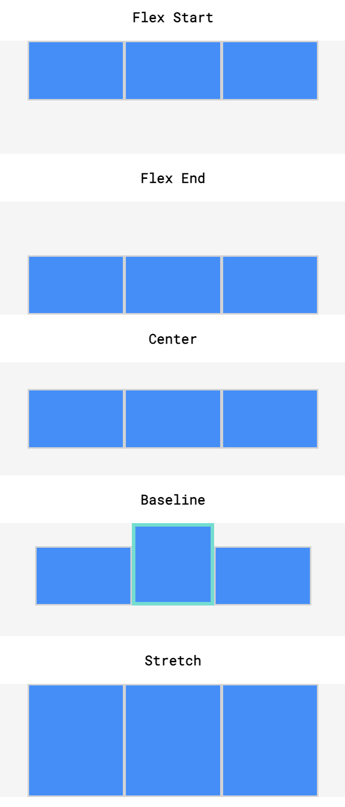

## flex-grow: <value>
The flex-grow property allows us to specify if items should grow to fill a container and also which items should grow proportionally more or less than others.

```
.container {
  display: flex;
}

.side {
  width: 100px;
  flex-grow: 1;
}

.center {
  width: 100px;
  flex-grow: 2;
}

```

In the example above, the .container div has a display value of flex, so its three child divs will be positioned next to each other. If there is additional space in the .container div (in this case, if it is wider than 300 pixels), the flex items will grow to fill it. The .center div will stretch twice as much as the .side divs. For example, if there were 60 additional pixels of space, the center div would absorb 30 pixels and the side divs would absorb 15 pixels each.
The flex-grow value determines how much a flex item will grow relative to other flex items in the same container.
* A flex-grow: 1 means the item will grow to fill available space proportionally with other items having the same value.
* A flex-grow: 2 means the item will grow twice as much as an item with flex-grow: 1.
If a **max-width** is set for an element, it will not grow larger than that even if there is more space for it to absorb. This property is the first we have learned that is declared on flex items.

## **flex-shrink:** <value>
Just as the flex-grow  property proportionally stretches flex items, the  flex-shrink  property can be used to specify which elements will shrink and in what proportions.
NB: you may have noticed in earlier exercises that flex items shrank when the flex container was too small, even though we had not declared the property. This is because the default value of flex-shrink is 1. However, flex items do not grow unless the flex-grow property is declared because the default value of flex-grow is 0. Keep in mind, minimum and maximum widths will take precedence over flex-grow and flex-shrink. As with flex-grow, flex-shrink will only be employed if the parent container is too small or the browser is adjusted.
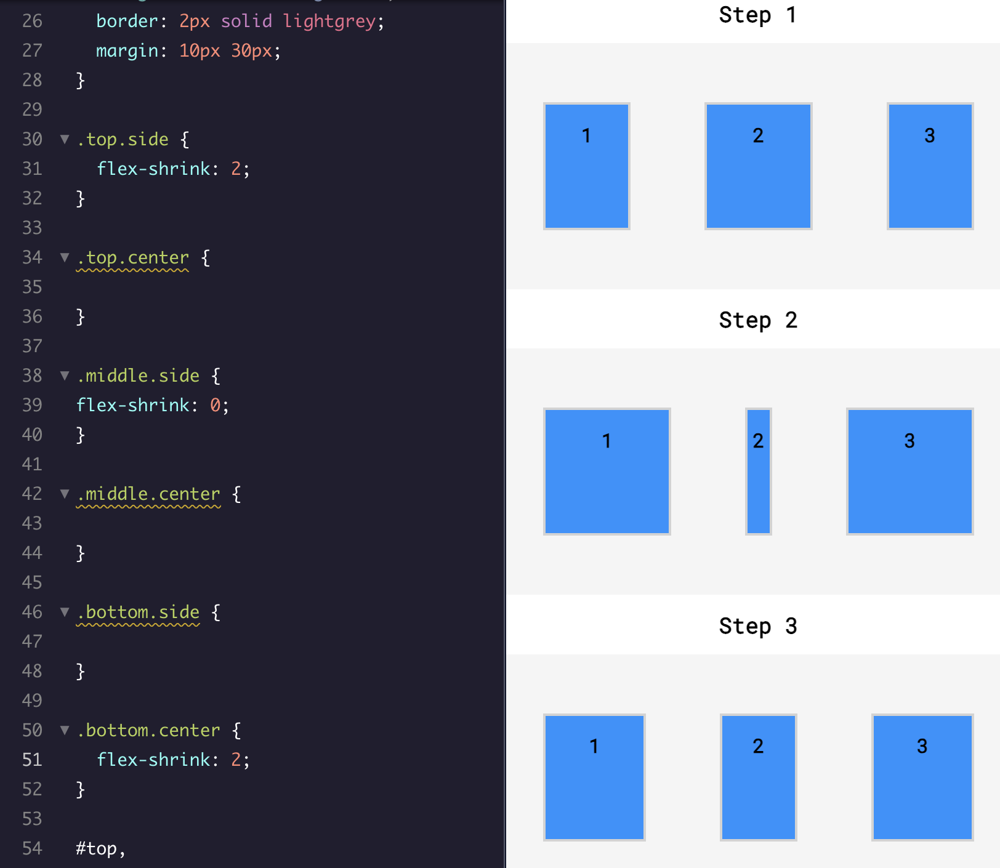

## **flex-basis:** <value>
flex-basis allows us to specify the width of an item before it stretches or shrinks.
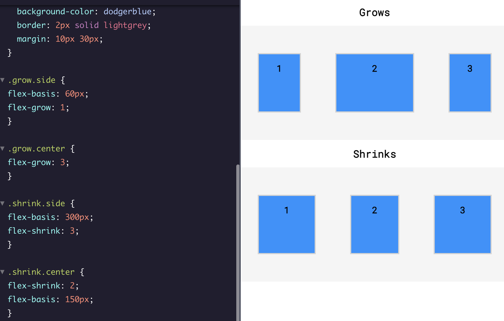

## **flex**
The flex property allows you to declare flex-grow, flex-shrink , and  flex-basis  all in one line.

```
.big {
  flex: 2 1 150px;
}

.small {
  flex: 1 2 100px;
}
```


```


```

In the example above, we use the flex property to declare the values for flex-grow, flex-shrink, and flex-basis (in that order) all in one line.

```
.big {
 flex: 2 1;
}
```


```


```

In the example above, we use the flex property to declare flex-grow and flex-shrink, but not flex-basis.

```
.small {
  flex: 1 20px;
}
```


```


```

In the example above, we use the flex property to declare flex-grow and flex-basis. Note that there is no way to set only flex-shrink and flex-basis using 2 values.

## **flex-wrap**
Sometimes, we don’t want our content to shrink to fit its container. Instead, we might want flex items to move to the next line when necessary.

```
**.container {
  display: inline-flex;
  flex-wrap: wrap;
  width: 250px;
}

.item {
  width: 100px;
  height: 100px;
}**


```

The flex-wrap property can accept three values. It must be defined on flex containers.
* wrap — child elements of a flex container that don’t fit into a row will move down to the next line
* wrap-reverse — the same functionality as wrap, but the order of rows within a flex container is reversed (for example, in a 2-row flexbox, the first row from a wrap container will become the second in wrap-reverse and the second row from the wrap container will become the first in wrap-reverse)
* nowrap — prevents items from wrapping; this is the default value and is only necessary to override a wrap value set by a different CSS rule.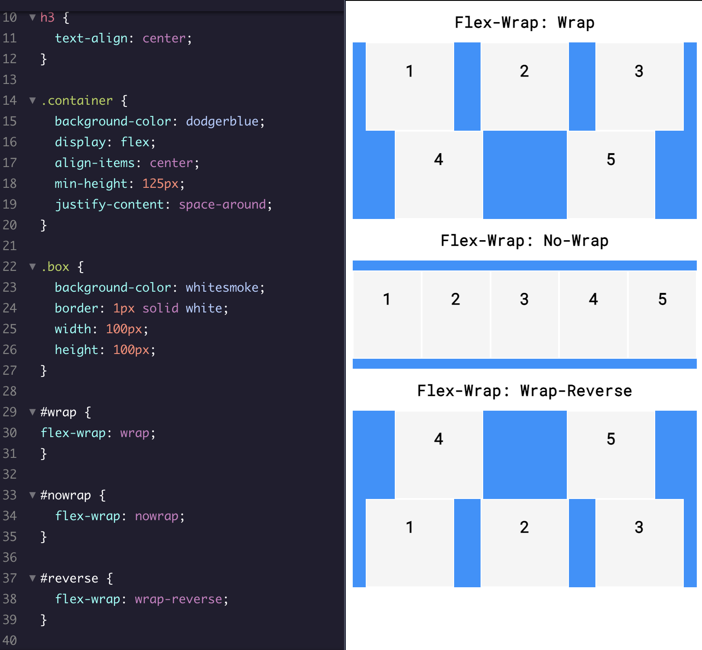

## **align-content**
align-items is for aligning elements within a single row vertically. If a flex container has multiple rows of content, we can use align-content to space the rows from top to bottom (vertically).
Most used values:
* flex-start — all rows of elements will be positioned at the top of the parent container with no extra space between.
* flex-end — all rows of elements will be positioned at the bottom of the parent container with no extra space between.
* center — all rows of elements will be positioned at the center of the parent element with no extra space between.
* space-between — all rows of elements will be spaced evenly from the top to the bottom of the container with no space above the first or below the last.
* space-around — all rows of elements will be spaced evenly from the top to the bottom of the container with the same amount of space at the top and bottom and between each element.
* stretch — if a minimum height or no height is specified, the rows of elements will stretch to fill the parent container from top to bottom (default value).
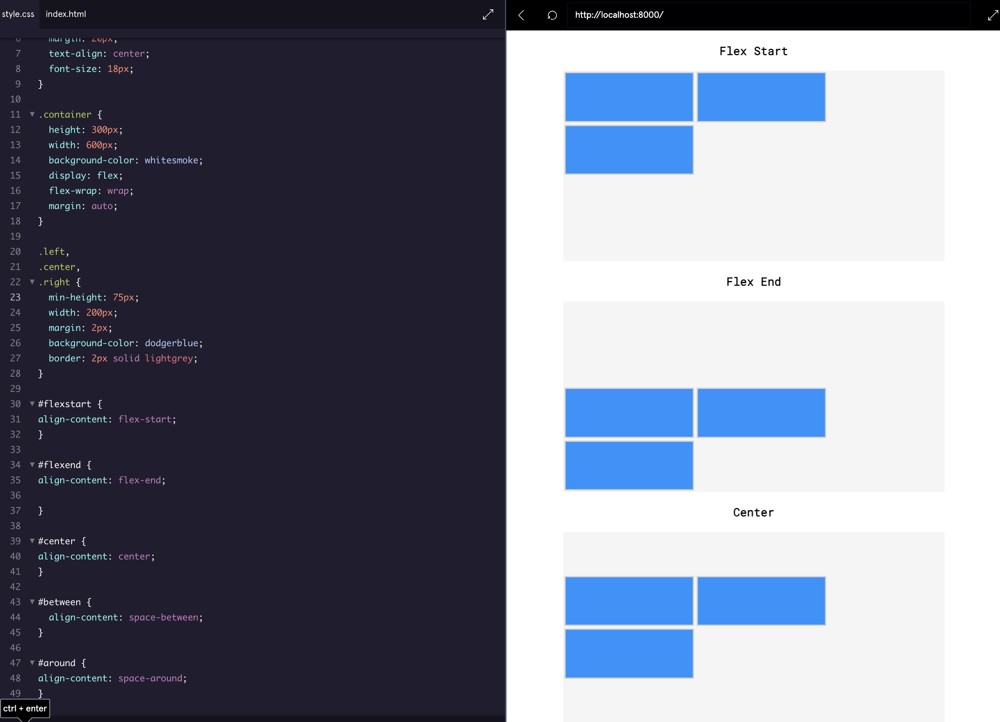
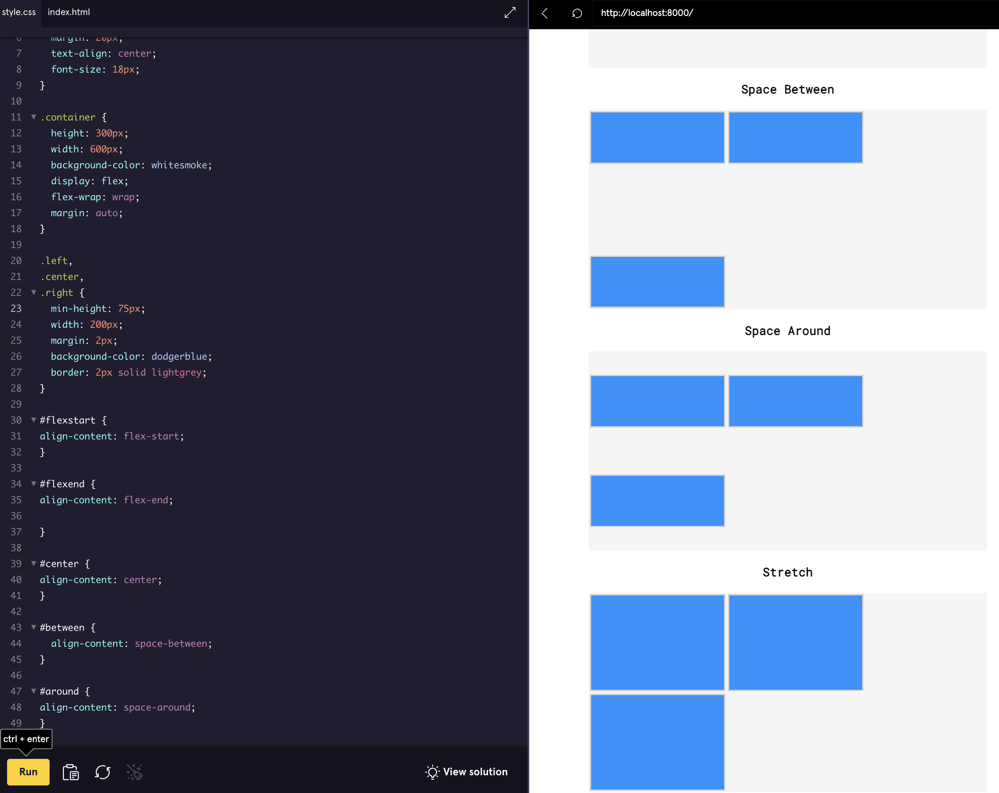

## **flex-direction**
Up to this point, we’ve only covered flex items that stretch and shrink horizontally and wrap vertically. As previously stated, flex containers have two axes: a main axis and a cross axis. By default, the main axis is horizontal and the cross axis is vertical.  The main axis is used to position flex items with the following properties: 
* justify-content 
* flex-wrap
* flex-grow 
* flex-shrink  
The cross axis is used to position flex items with the following properties:  
* align-items 
* align-content 
The main axis and cross axis are interchangeable. We can switch them using the flex-direction property and give it a value of column, the flex items will be ordered vertically, not horizontally.

The flex-direction property can accept four values. It must be defined on flex containers:
* row — elements will be positioned from left to right across the parent element starting from the top left corner (default).
* row-reverse — elements will be positioned from right to left across the parent element starting from the top right corner.
* column — elements will be positioned from top to bottom of the parent element starting from the top left corner.
* column-reverse — elements will be positioned from the bottom to the top of the parent element starting from the bottom left corner.
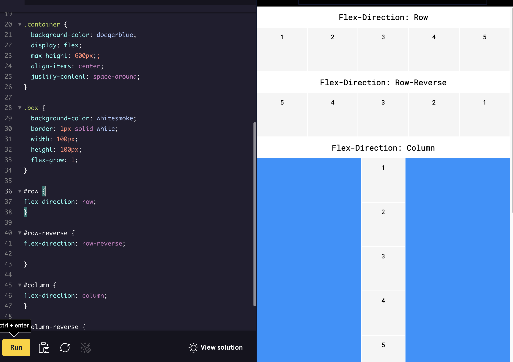
## 
## **flex-flow**
Like the shorthand flex property, the shorthand flex-flow property is used to declare both the flex-wrap and flex-direction properties in one line. It must be defined on flex containers

```
.container {
  display: flex;
  flex-flow: column wrap;
}

```


## **Nested Flexboxes**
It is also possible to position flex containers inside of one another
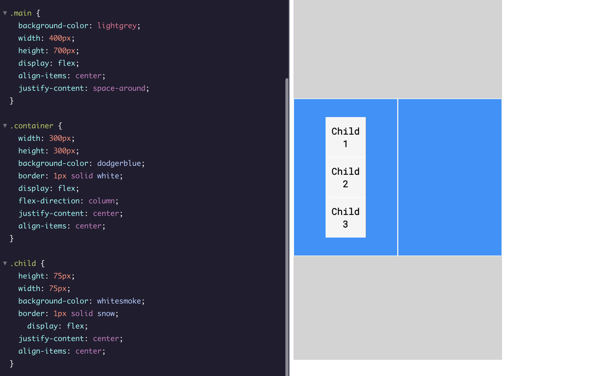
## 
## **Review**
* **display**: flex rende un elemento un contenitore flessibile.
* **display**: inline-flex permette ai contenitori flessibili di apparire in linea.
* **justify**-content allinea gli elementi lungo l’asse principale.
* **align-items** allinea gli elementi lungo l’asse trasversale.
* **flex-grow** determina quanto spazio in più un elemento può occupare.
* **flex-shrink** determina quanto un elemento può ridursi.
* **flex-basis** imposta la dimensione iniziale di un elemento.
* **flex** combina flex-grow, flex-shrink e flex-basis.
* **flex-wrap** permette agli elementi di andare su una nuova riga o colonna.
* **align-content** allinea le righe lungo l’asse trasversale.
* **flex-direction** definisce l’asse principale.
* **flex-flow** combina flex-direction e flex-wrap.
* I contenitori flessibili possono essere annidati.
