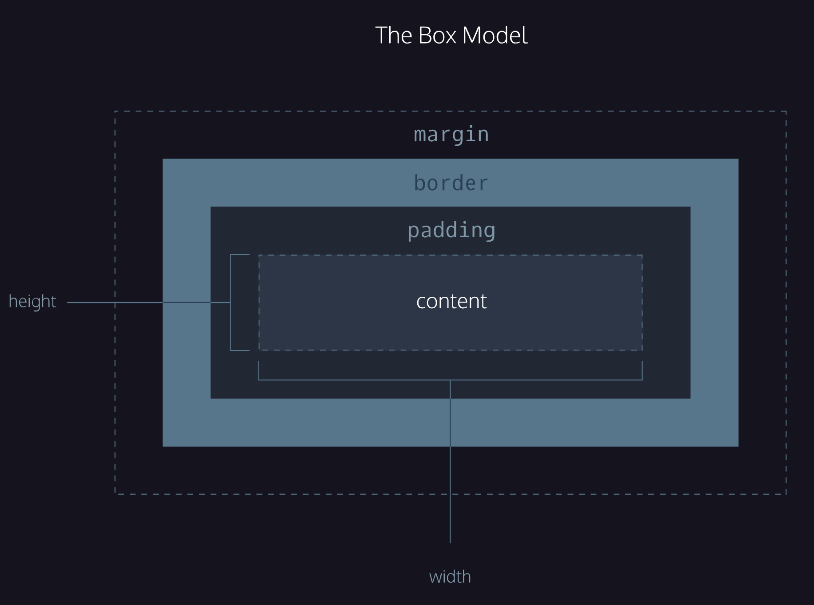
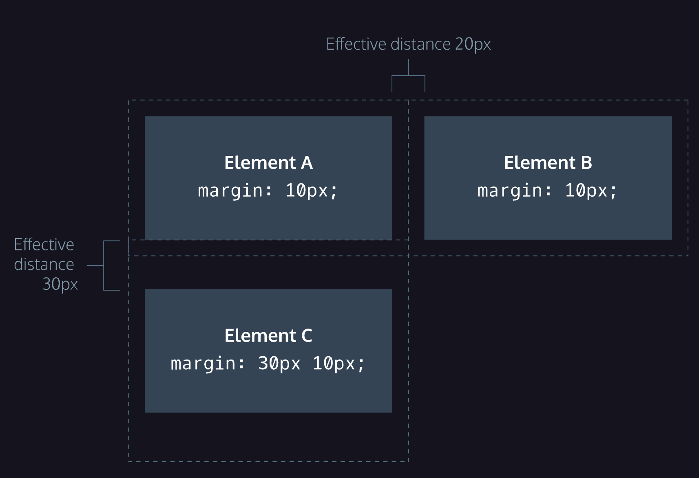
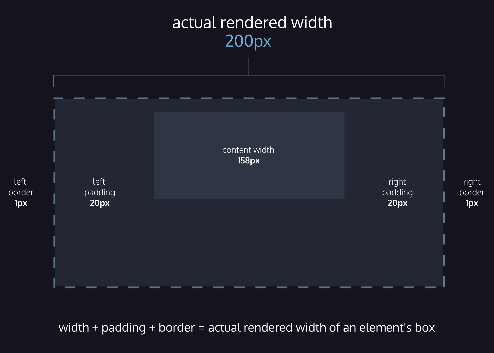

# 5. Box model




## Border
### Border
The default border is medium none color, where color is the current color of the element.
Width, type (solid, dotted, …), color

```
border: 3px solid white

```

### 
### Border-radius
To make the box not squared

```
border-radius: 5px;
border-radius: 50%;

```


## Padding
### 4 values

```
padding-top:
padding-right:
padding-bottom:
padding-left:

```

### 3 values
The first value sets the padding-top value (5px), the second value sets the padding-left and padding-right values (10px), and the third value sets the padding-bottom value (20px).

```
padding: 5px 10px 20px;

```


### 2 values
The first value sets the padding-top and padding-bottom values (5px), and the second value sets the padding-left and padding-right values (10px).

```
padding: 5px 10px;

```


## Margin
In order to center an element, a width must be set for that element. Otherwise, the width of the div will be automatically set to the full width of its containing element, like the <body>, for example. It’s not possible to center an element that takes up the full width of the page, since the width of the page can change due to display and/or browser window size.
In the example below, margin: 0 auto; will center the divs in their containing elements. The 0 sets the top and bottom margins to 0 pixels. The auto value instructs the browser to adjust the left and right margins until the element is centered within its containing element.

```
margin: 0 auto;

```


### Margin collapse


The box min/max dimensions if the page is resized

```
min-width: 300px;
max-width: 600px;
min-height: 150px;
max-height: 300px;

```


## Overflow
The overflow property controls what happens to content that spills, or overflows, outside its box. The most commonly used values are:
* hidden—when set to this value, any content that overflows will be hidden from view.
* scroll—when set to this value, a scrollbar will be added to the element’s box so that the rest of the content can be viewed by scrolling.
* visible—when set to this value, the overflow content will be displayed outside of the containing element. Note, this is the default value.
In order for overflow to work on an element’s content, the element needs to have a definite measurement, otherwise, the element container will keep on expanding to accommodate as many content elements it can have or no matter the content’s size, but if the container element has a set height or a cap height ( max-height), once its content reaches those limits, it will follow the overflow rule, which in case of scroll, it will hide any content that should be surpassing the height of the container, and it will allow us to see it by dragging a scroll bar.

## Reset defaults
All major web browsers have a default stylesheet they use in the absence of an external stylesheet. These default stylesheets are known as *user agent stylesheets*.
User agent stylesheets often have default CSS rules that set default values for <u>[padding](https://www.codecademy.com/resources/docs/css/padding/padding)</u> and <u>[margin](https://www.codecademy.com/resources/docs/css/margins/margin)</u>. This affects how the browser displays HTML elements, which can make it difficult for a developer to design or style a web page.

Many developers choose to reset these default values so that they can truly work with a clean slate.

```
* {
  margin: 0;
  padding: 0;
}

```


## Visibility
The visibility property can be set to one of the following values:
* hidden — hides an element.
* visible — display an element.
* collapse — collapses an element.
Keep in mind, however, that users can still view the contents of the list item by viewing the source code in their browser. Furthermore, the web page will *only* hide the contents of the element. It will still leave an empty space where the element is intended to display.
An element with display: none will be completely removed from the web page. An element with visibility: hidden, however, will not be visible on the web page, but the space reserved for it will.


## **Content-Box**
Study the diagram to the right. It illustrates the default box model used by the browser, content-box. When you’re done, continue to the next exercise.



```
box-sizing: border-box;

```

In this box model, the height and <u>[width](https://www.codecademy.com/resources/docs/css/sizing/width)</u>of the box will remain fixed. The <u>[border](https://www.codecademy.com/resources/docs/css/borders/border)</u>thickness and <u>[padding](https://www.codecademy.com/resources/docs/css/padding/padding)</u> will be included inside of the box, which means the overall dimensions of the box do not change.
Per applicarlo a tutti gli elementi

```
* {
  box-sizing: border-box;
}

```


