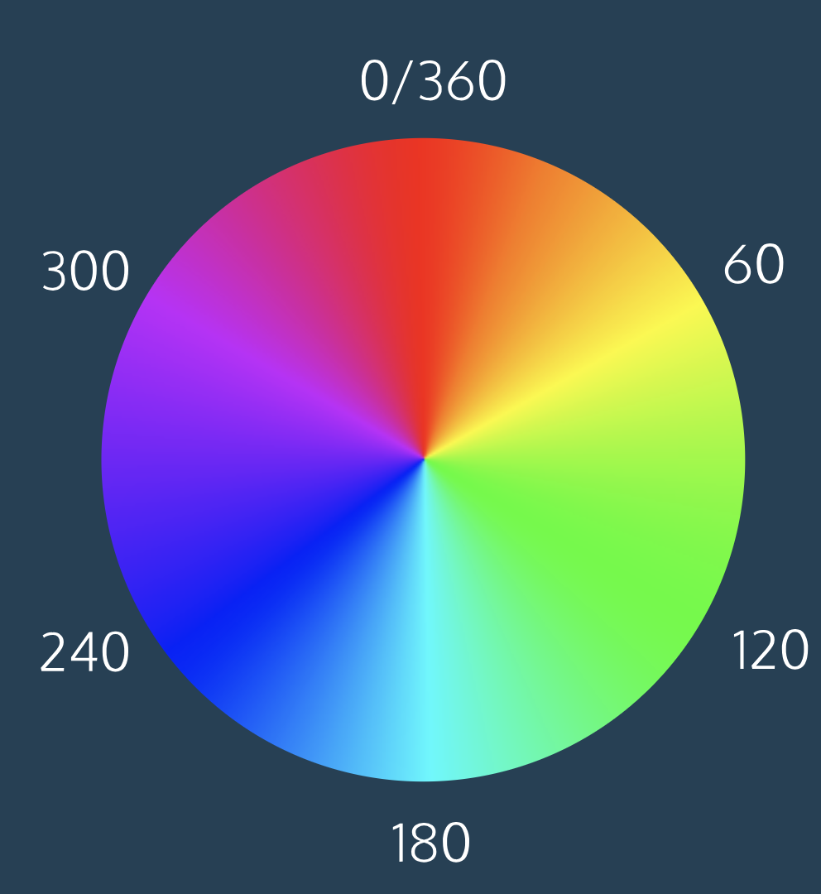

# 8. Colors


## hsl
There’s another equally powerful system in CSS called the hue-saturation-lightness color scheme, abbreviated as *HSL*.
The syntax for HSL is similar to the decimal form of RGB, though it differs in important ways. The first number represents the degree of the hue, and can be between 0 and 360. The second and third numbers are percentages representing saturation and lightness respectively. 
HSL is convenient for adjusting colors. In RGB, making the color a little darker may affect all three color components. In HSL, that’s as easy as changing the lightness value. HSL is also useful for making a set of colors that work well together by selecting various colors that have the same lightness and saturation but different hues. Here is an example:

```
color: hsl(120, 60%, 70%);

```

*Hue* is the first number. It refers to an angle on a color wheel. Red is 0 degrees, Green is 120 degrees, Blue is 240 degrees, and then back to Red at 360. You can see an example of a color wheel below.
*Saturation* refers to the intensity or purity of the color. The saturation increases towards 100% as the color becomes richer. The saturation decreases towards 0% as the color becomes grayer.
*Lightness* refers to how light or dark the color is. Halfway, or 50%, is normal lightness. Imagine a sliding dimmer on a light switch that starts halfway. Sliding the dimmer up towards 100% makes the color lighter, closer to white. Sliding the dimmer down towards 0% makes the color darker, closer to black.



## hsla
To use opacity in the HSL color scheme, use hsla instead of hsl, and four values instead of three. For example:

```
color: hsla(34, 100%, 50%, 0.1);

```

The first three values work the same as hsl. The fourth value (which we have not seen before) is the *alpha*. This last value is sometimes called opacity.
Alpha is a decimal number from zero to one. If alpha is zero, the color will be completely transparent. If alpha is one, the color will be opaque. The value for half-transparent would be 0.5.

There is, however, a named color keyword for zero opacity, transparent

## rgba
The RGB color scheme has a similar syntax for opacity, rgba. Again, the first three values work the same as rgb and the last value is the alpha. Here’s an example:

```
color: rgba(234, 45, 98, 0.33);

```

