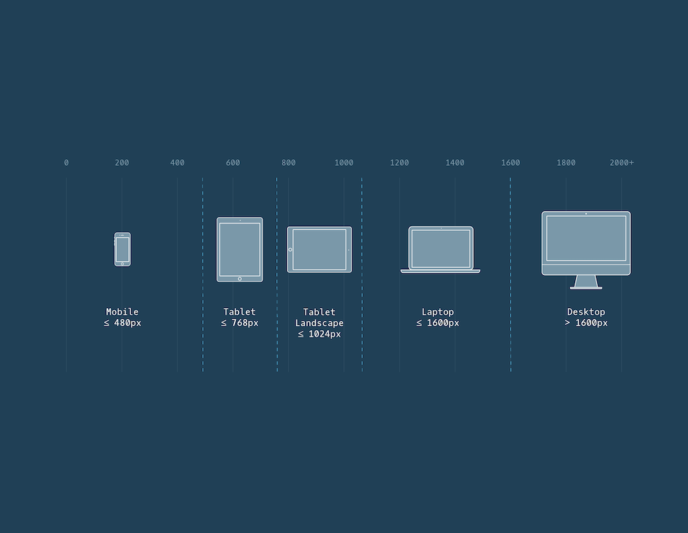

# 9. Responsive design

[https://www.smashingmagazine.com/2011/01/guidelines-for-responsive-web-design/](https://www.smashingmagazine.com/2011/01/guidelines-for-responsive-web-design/)
[https://www.taniarascia.com/you-dont-need-a-framework/](https://www.taniarascia.com/you-dont-need-a-framework/)

## **Relative Measurements**
Responsive design refers to the ability of a website to resize and reorganize its content based on:
* The size of other content on the website.
* The size of the screen the website is being viewed on.
With CSS, you can avoid hard coded measurements (such as pixels) and use *relative measurements* instead. Relative measurements offer an advantage over hard coded measurements, as they allow for the proportions of a website to remain intact regardless of screen size or layout.

 <span style="background-color: #FF9502;">
     ### **em**
 </span>
the em represents the font-size of the current element or the default base font-size set by the browser if none is given. For example, if the base font of a browser is 16 pixels (which is normally the default size of text in a browser), then 1 em is equal to 16 pixels. 2 ems would equal 32 pixels, and so on.

Per mantenere lo stesso rapporto di dimensione dei font standard, puoi utilizzare i fattori di moltiplicazione basati sui valori predefiniti dei browser. Ecco i rapporti comuni:  <h1>: 2em (200%) <h2>: 1.5em (150%) <h3>: 1.17em (117%) <h4>: 1em (100%) <h5>: 0.83em (83%) <h6>: 0.67em (67%) Se imposti un font-size di base, puoi moltiplicarlo per questi fattori per mantenere proporzioni simili. Ad esempio, se il font-size di base è 22px, <h2> sarebbe:  2 2 px × 1 . 5 = 3 3 px 22px×1.5=33px.

 <span style="background-color: #FF9502;">
     ### rem
 </span>
Rem stands for *root em*. It acts similar to em, but instead of checking parent elements to size font, it checks the *root element*. The root element is the <html> tag.
Most browsers set the font size of <html> to 16 pixels, so by default rem measurements will be compared to that value. To set a different font size for the root element, you can add a CSS rule.
One advantage of using rems is that all elements are compared to the same font size value, making it easy to predict how large or small font will appear. If you are interested in sizing elements consistently across an entire website, the rem measurement is the best unit for the job. If you’re interested in sizing elements in comparison to other elements nearby, then the em unit would be better suited for the job.

### Percentages width-height
To size non-text HTML elements relative to their parent elements on the page you can use *percentages*.
Percentages are often used to size box-model values, like width and height, padding, border, and margins. They can also be used to set positioning properties (top, bottom, left, right).

```
.main {
  height: 300px;
  width: 500px;
}
 
.main .subsection {
  height: 50%;
  width: 50%;
}

```

When percentages are used, elements are sized relative to the dimensions of their parent element (also known as a container). Therefore, the dimensions of the .subsection div will be 150 pixels tall and 250 pixels wide. Be careful, a child element’s dimensions may be set erroneously if the dimensions of its parent element aren’t set first.
**Note:** Because the box model includes padding, borders, and margins, setting an element’s width to 100% may cause content to overflow its parent container. While tempting, 100% should only be used when content will not have padding, border, or margin.

### **Percentages Padding & Margin**
### When percentages are used to set padding and margin, however, they are calculated based only on the *width* of the parent element.
**Note:** When using relative sizing, ems and rems should be used to size text and dimensions on the page related to text size (i.e. padding around text). This creates a consistent layout based on text size. Otherwise, percentages should be used.

### Max width/height
Elements on a website can lose their integrity when they become too small or large. You can limit how wide an element becomes with the following properties:
* min-width — ensures a minimum width for an element.
* max-width — ensures a maximum width for an element.
**Note**: The unit of pixels is used to ensure hard limits on the dimensions of the element(s).
What will happen to the contents of an element if the 

### **Scaling Images and Videos**
When a website contains such media, it’s important to make sure that it is scaled proportionally so that users can correctly view it.

```
.container {
  width: 50%;
  height: 200px;
  overflow: hidden;
}

.container img {
  max-width: 100%;
  height: auto;
  display: block;
}

```

In the example above, .container represents a container div. It is set to a width of 50% (half of the browser’s width, in this example) and a height of 200 pixels. Setting overflow to hidden ensures that any content with dimensions larger than the container will be hidden from view.
The second CSS rule ensures that images scale with the width of the container. The height property is set to auto, meaning an image’s height will *automatically* scale proportionally with the width. Finally, the last line will display images as block level elements (rather than inline-block, their default state). This will prevent images from attempting to align with other content on the page (like text), which can add unintended margin to the images.
**Note:** The example above scales the width of an image (or video) to the width of a container. If the image is larger than the container, the vertical portion of the image will overflow and will not display. To swap this behavior, you can set max-height to 100% and width to auto (essentially swapping the values). This will scale the *height* of the image with the height of the container instead. If the image is larger than the container, the horizontal portion of the image will overflow and not display.

### **Scaling Background Images**
Background images of HTML elements can also be scaled responsively using CSS properties.

```
body {
  background-image: url('#');
  background-repeat: no-repeat;
  background-position: center;
  background-size: cover;
}

```

In the example above, the first CSS declaration sets the background image (# is a placeholder for an image URL). 
The second declaration instructs the CSS compiler to not repeat the image (by default, images will repeat). The third declaration centers the image within the element.
The final declaration, however, is the focus of the example above. It’s what scales the background image. The image will *cover* the entire background of the element, all while keeping the image in proportion. If the dimensions of the image exceed the dimensions of the container then only a portion of the image will display.


## Media queries

### **Viewport Meta Tag**
Let’s start with the *viewport*, which is the total viewable area for a user; this area varies depending on device. The viewport is smaller on a mobile device and larger on a desktop.
Based on the size of the viewport, the *meta tag* (<meta>) is used to instruct the browser on how to render the webpage’s scale and dimensions. For instance, say if a web page is 960px and the device is 320px wide. Adding the viewport meta tag will squish the content down until it is 320px — there is no need for the user to zoom out and view the whole page!

```
<!DOCTYPE html> 
<html lang="en"> 
  <head> 
    ...
    <meta name="viewport" content="width=device-width, initial-scale=1">
    ...
  </head>

```

* the name="viewport" attribute: tells the browser to display the web page at the same width as its screen
* the content attribute: defines the values for the <meta> tag, including width and initial-scale
* the width=device-width key-value pair: controls the size of the viewport in which it sets the width of the viewport to equal the width of the device
* the initial-scale=1 key-value pair: sets the initial zoom level (Read more about scale at <u>[MDN’s viewport documentation](https://developer.mozilla.org/en-US/docs/Web/HTML/Viewport_meta_tag#viewport_basics)</u>)
### 
 <span style="background-color: #FF9502;">
     ### @media
 </span>
CSS uses *media queries* to adapt a website’s content to different screen sizes. With media queries, CSS can detect the size of the current screen and apply different CSS styles depending on the width of the screen.

```
@media only screen and (max-width: 480px) {
  body {
    font-size: 12px;
  }
}

```

* @media — This keyword begins a media query rule and instructs the CSS compiler on how to parse the rest of the rule.
* only screen — Indicates what types of devices should use this rule. In early attempts to target different devices, CSS incorporated different media types (screen, print, handheld). The rationale was that by knowing the media type, the proper CSS rules could be applied. However, “handheld” and “screen” devices began to occupy a much wider range of sizes and having only one CSS rule per media device was not sufficient. screen is the media type always used for displaying content, no matter the type of device. The only keyword is added to indicate that this rule only applies to one media type (screen).
* and (max-width : 480px) — This part of the rule is called a *media feature*, and instructs the CSS compiler to apply the CSS styles to devices with a width of 480 pixels or smaller. Media features are the conditions that must be met in order to render the CSS within a media query.
* CSS rules are nested inside of the media query’s curly braces. The rules will be applied when the media query is met. In the example above, the text in the body element is set to a font-size of 12px when the user’s screen is less than 480px.

By using multiple widths and heights, a range can be set for a media query.

```
@media only screen and (min-width: 320px) and (max-width: 480px) {
    /* ruleset for 320px - 480px */
}

```


### **Dots Per Inch (DPI)**
Another media feature we can target is screen resolution. Many times we will want to supply higher quality media (images, video, etc.) only to users with screens that can support high resolution media. Targeting screen resolution also helps users avoid downloading high resolution (large file size) images that their screen may not be able to properly display.
To target by resolution, we can use the min-resolution and max-resolution media features. These media features accept a resolution value in either dots per inch (dpi) or dots per centimeter (dpc).

```
@media only screen and (min-resolution: 300dpi) {
    /* CSS for high resolution screens */
}

```


 <span style="background-color: #FF9502;">
     ### and
 </span> operator
By placing the and operator between the two media features, the browser will require both media features to be true before it renders the CSS within the media query. The and operator can be used to chain as many media features as necessary.

```
@media only screen and (max-resolution: 150dpi) and (max-width: 480px) {
  .page-description {font-size: 20px;}
}

```


 <span style="background-color: #FF9502;">
     ### ,
 </span> operator
If only one of multiple media features in a media query must be met, media features can be separated in a comma separated list.

```
@media only screen and (min-width: 480px), (orientation: landscape) {
    /* CSS ruleset */
}

```

The orientation media feature detects if the page has more width than height. If a page is wider, it’s considered landscape, and if a page is taller, it’s considered portrait.

### **Breakpoints**
Setting breakpoints (@media rule) for every device imaginable would be incredibly difficult because there are many devices of differing shapes and sizes. In addition, new devices are released with new screen sizes every year.
Rather than set breakpoints based on specific devices, the best practice is to resize your browser to view where the website naturally breaks based on its content. The dimensions at which the layout breaks or looks odd become your media query breakpoints. Within those breakpoints, we can adjust the CSS to make the page resize and reorganize.


