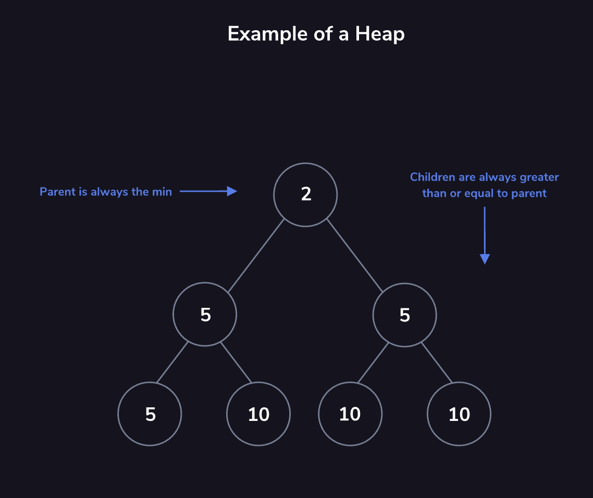
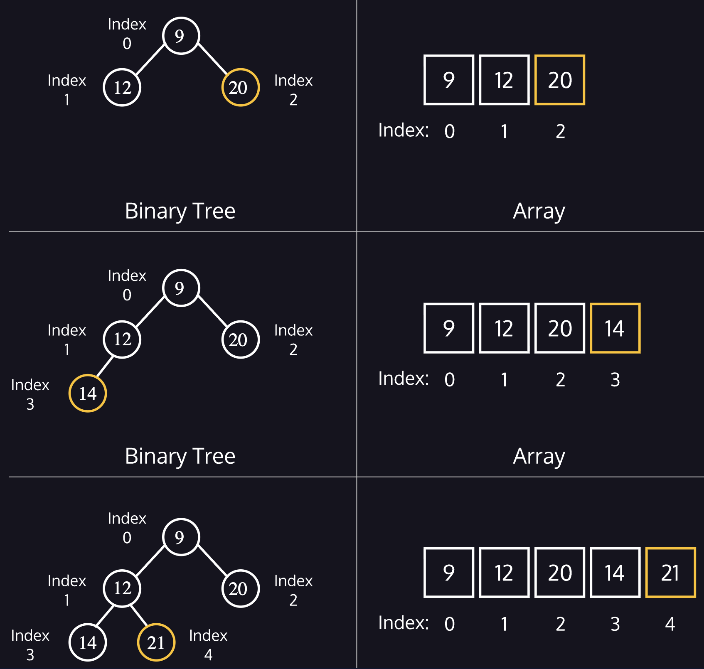

# 3. Heaps

Heaps are another variation of the tree data structure and are adept at keeping track of the maximum or minimum value held within, referred to as max-heaps and min-heaps, respectively. Specifically, heaps are a type of binary tree, since each child node is either greater or less than its parent (depending on if it’s a max-heap or min-heap). They are efficient for accessing the root value, which will either be the max or min (again, depending on the type of heap) and inserting new values.

You can manage this problem using a **priority queue** to ensure you’re always working on the most pressing assignment and heaps are commonly used to create a priority queue.
Heaps tracking the maximum or minimum value are *max-heaps* or *min-heaps*. We will focus on min-heaps, but the concepts for a max-heap are nearly identical.
Think of the min-heap as a <u>[binary](https://www.codecademy.com/resources/docs/general/binary)</u> tree with two qualities:
* The root is the **minimum value** of the dataset.
* Every child’s value is **greater than or equal to its parent**.
These two properties are the defining characteristics of the min-heap. By maintaining these two properties, we can efficiently retrieve and update the minimum value.

## **Heap Representations**
We can picture min-heaps as <u>[binary](https://www.codecademy.com/resources/docs/general/binary)</u> trees, where each node has **at most** two children. As we add elements to the heap, they’re added from left to right until we’ve filled the entire level.
At the top, we’ve filled the level containing  
     12
  and  
     20
 . The next addition comes as the left child of  
     12
 , starting a new level in the tree. We would continue filling this level from left to right until  
     20
  had its right child filled.
Conceptually, the tree representation is beneficial for understanding. Practically, we implement heaps in a sequential data structure like an <u>[array](https://www.codecademy.com/resources/docs/general/data-structures/array)</u> or list for efficiency.
Notice how by filling the tree from left to right; we’re leaving no gaps in the array. The location of each child or parent derives from a formula using the <u>[index](https://www.codecademy.com/resources/docs/general/database/index)</u><u>.</u>
* left child: (index * 2) + 1
* right child: (index * 2) + 2
* parent: (index - 1) / 2 — **not used on the root!**
## 
## **Adding an Element: Heapify Up**
Sometimes you will add an element to the heap that violates the heap’s essential properties.
We therefore need to restore the fundamental heap properties. This restoration is known as *heapify* or *heapifying*. We’re adding an element to the bottom of the tree and moving upwards, so we’re *heapifying up*.
As long as we’ve violated the heap properties, we’ll swap the offending child with its parent until we restore the properties, or until there’s no parent left. If there is no parent left, that element becomes the new root of the tree.

## **Removing an Element: Heapify Down**
This process is similar to heapifying up, except we have two options ( 
     5
  and  
     10
 ) where we can make a swap. We’ll choose the **lesser of the two values** and swap  
     20
  with  
     5
 . This is necessary for the heap property, if we had chosen to swap  
     20
  with  
     10
 , then the minimum value would **not** be at the root. With  
     5
  at the root, the root node is the minimum value in the heap again.