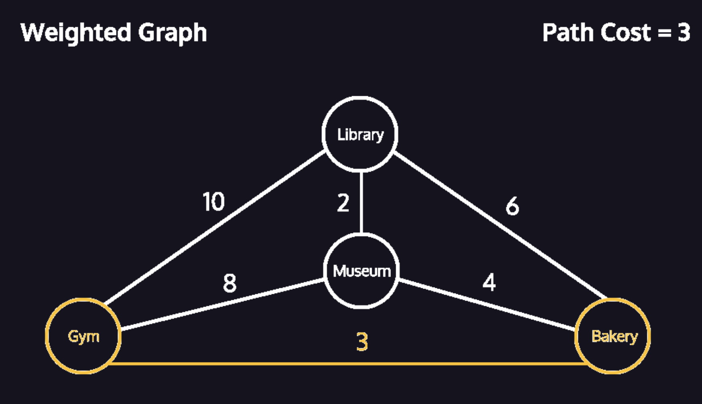
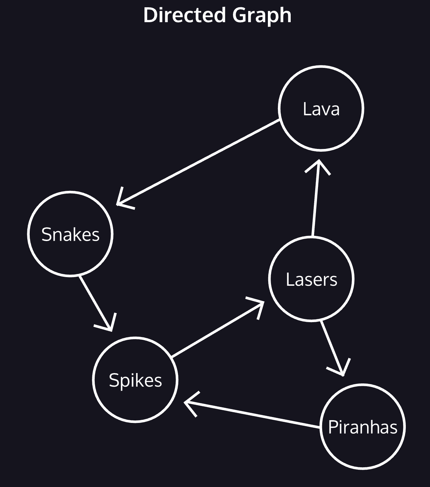
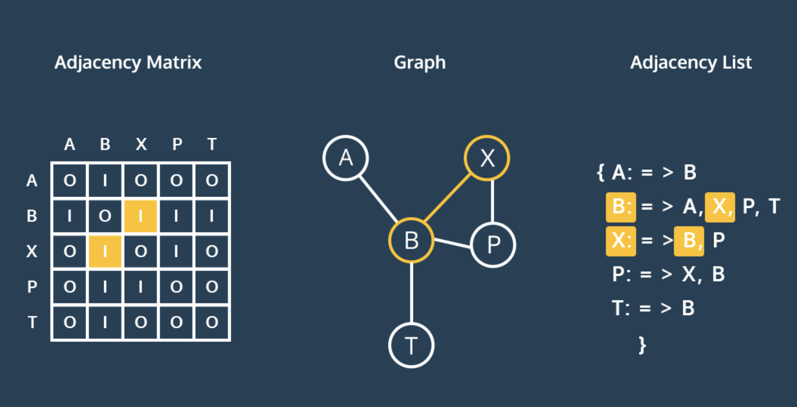

# 4. Graphs

The last type of data structure you are going to look at is graphs. Graphs are used to represent data points, or vertices, that are connected by edges. Common applications for graphs are things like maps, where each location is a vertex, and each path, or road, between the locations is an edge. Graphs can be directed (a one-way street) or undirected (a two-way street), as well as weighted or unweighted (think of the length of each street as a potential measurement of weight).

This is a *weighted* graph, where edges have a number or cost associated with traveling between the vertices. When tallying the cost of a path, we add up the **total** cost of the edges used.
These costs are essential to algorithms that find the shortest distance between two vertices.

## 
## **Directed Graphs**
*directed* graph, where edges restrict the direction of movement between vertices.

## **Representing Graphs**
We typically represent the vertex-edge relationship of a graph in two ways: an adjacency list or an adjacency matrix.
An adjacency matrix is a table. Across the top, every vertex in the graph appears as a column. Down the side, every vertex appears again as a row. Edges can be bi-directional, so each vertex is listed twice.
To find an edge between B and P, we would look for the B row and then trace across to the P column. The contents of this cell represent a possible edge.
Our diagram uses 1 to mark an edge, 0 for the absence of an edge. In a weighted graph, the cell contains the cost of that edge.
In an adjacency list, each vertex contains a list of the vertices where an edge exists. To find an edge, one looks through the list for the desired vertex.

