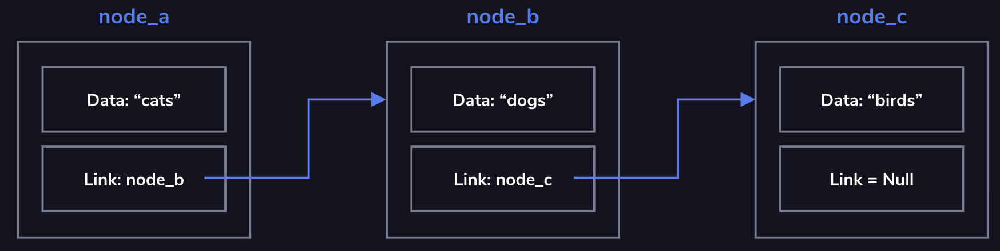

# 4. Singly Linked Lists

Linked lists are one of the basic <u>[data structures](https://www.codecademy.com/resources/docs/general/data-structures)</u> used in computer science. They have many direct applications and serve as the foundation for more complex data structures.
The list is comprised of a series of nodes as shown in the diagram. The head node is the node at the beginning of the list. Each node contains data and a link (or pointer) to the next node in the list. The list is terminated when a node’s link is null. This is called the tail node.
Since the nodes use links to denote the next node in the sequence, the nodes are not required to be sequentially located in memory. These links also allow for quick insertion and removal of nodes as you will see in future exercises.
Common operations on a linked list may include:
* adding nodes
* removing nodes
* finding a node
* traversing (or traveling through) the linked list
Linked lists typically contain unidirectional links (next node), but some implementations make use of bidirectional links (next and previous nodes).

## 
## **Adding a new node**
Adding a new node to the beginning of the list requires you to link your new node to the current head node. This way, you maintain your connection with the following nodes in the list.

## Removing a node
If you accidentally remove the single link to a node, that node’s data and any following nodes could be lost to your application, leaving you with orphaned nodes.
To properly maintain the list when removing a node from the middle of a linked list, you need to be sure to adjust the link on the previous node so that it points to the following node.
Depending on the language, nodes which are not referenced are removed automatically. “Removing” a node is equivalent to removing all references to the node.

