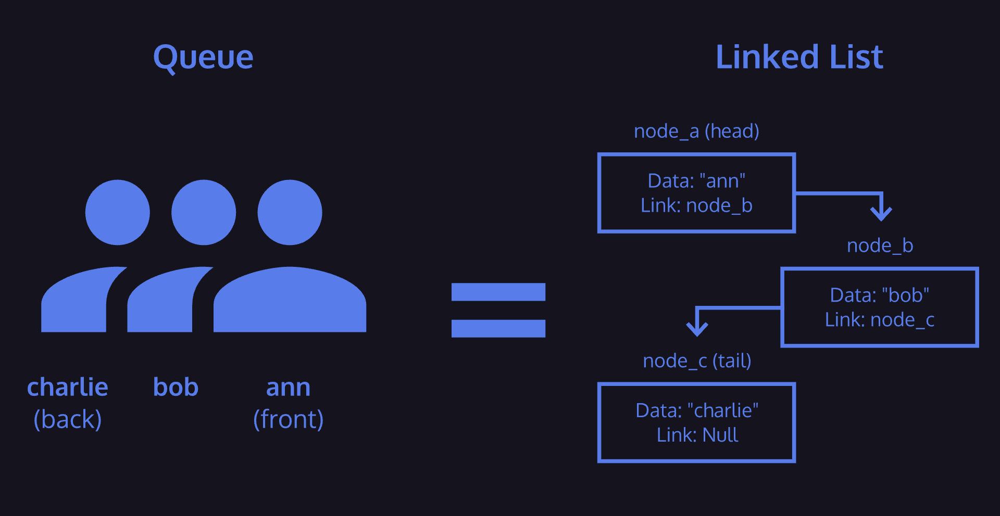

# 6. Queues

A queue is a linear collection of nodes that exclusively adds (enqueues) nodes to the tail, and removes (dequeues) nodes from the head of the queue. They can be implemented using different underlying data structures, but one of the more common methods is to use a singly linked list, which is what you will be using for your JavaScript Queue class.
Queues provide three methods for interaction:
* Enqueue - adds data to the “back” or end of the queue
* Dequeue - provides and removes data from the “front” or beginning of the queue
* Peek - reveals data from the “front” of the queue without removing it
Queues are a First In, First Out or FIFO structure.
Queues can be implemented using a linked list as the underlying data structure. The front of the queue is equivalent to the head node of a linked list and the back of the queue is equivalent to the tail node.
One last constraint that may be placed on a queue is its length. If a queue has a limit on the amount of data that can be placed into it, it is considered a *bounded queue*.
Similar to stacks, attempting to enqueue data onto an already full queue will result in a *queue overflow*. If you attempt to dequeue data from an empty queue, it will result in a *queue underflow*.

