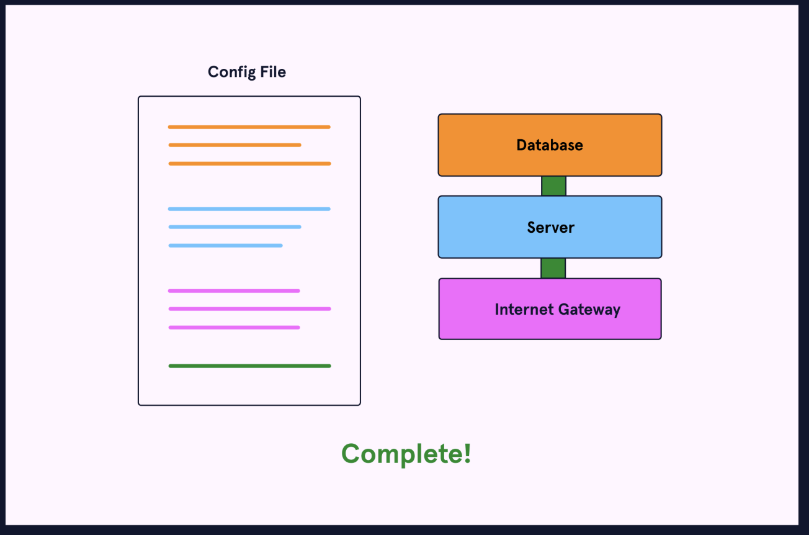

# 4. Infrastructure Configuration


Before an application is deployed, its infrastructure must be *provisioned* and *configured*. Traditionally, business staff performed these tasks manually. Let’s dig a little bit deeper into what they entail.

## **Provisioning**
Provisioning means setting up servers, network equipment, and other infrastructure. Traditional server provisioning has several steps:
1. An operations team member must acquire a server and install an operating system.
2. Next, they configure the IP address, hostname, firewall, and DNS settings.
3. Finally, they connect it to a network.
In today’s <u>[cloud](https://www.codecademy.com/resources/docs/general/cloud-computing)</u> world, server provisioning means spinning up a virtual machine. There are other types of provisioning as well:
* **Network provisioning** means setting up network components such as switches, <u>[routers](https://www.codecademy.com/resources/docs/general/routing)</u>, and gateways.
* **User provisioning** means setting up users, user groups, and privileges.
* **Service provisioning** refers to the provisioning of cloud services.
Once infrastructure has been provisioned it can be configured.
## 
## **Configuration**
Infrastructure configuration involves customizing provisioned resources. Some example tasks include:
* Installing dependencies on a server.
* Updating to a specific <u>[Linux](https://www.codecademy.com/resources/docs/general/linux)</u> distribution.
* Setting up logging.
* Creating <u>[database](https://www.codecademy.com/resources/docs/general/database)</u> configuration files.
Unlike the initial step of provisioning, infrastructure configuration can be ongoing. Software needs updating. Passwords need changing. Further changes to infrastructure fall under the realm of infrastructure configuration.
As a company grows, its infrastructure needs to scale as well. Keeping up with infrastructure configuration becomes a daunting task. Let’s dive into some of the problems that arise.

## **Modern Infrastructure configuration**
Realizing the flaws with manual configuration, teams began to automate tasks. At first, this consisted of shell scripts that configured servers. Tools such as <u>[csshx](https://github.com/brockgr/csshx)</u> allowed commands to be passed to many servers simultaneously.
These steps helped pave the way for how DevOps handles infrastructure. People realized that many common-sense development practices were missing from infrastructure configuration. A developer would never change code without checking it into version control. Why was it okay for server configurations to remain untracked? This thinking led to one of the core principles of DevOps, which is discussed in the next section.

## **Infrastructure as Code**
**Infrastructure as Code (IaC)** is the act of defining infrastructure in configuration files that are stored and tracked in version control. With IaC, best practices from development are applied to infrastructure. For example:
* Configuration files should be version-controlled.
* Configuration files should be the source of truth for infrastructure state.
* Changes to configuration files should be tested before they are deployed.
* Provisioning and configuration should be automated as much as possible.

## 
## **Benefits of IaC**
Compared to manual configuration, IaC has the following benefits:
* Speed: It is easier to automate repetitive tasks since configuration files are machine-readable.
* Consistency: It leads to reliable configurations since setup tasks are automated from configuration files.
* Visibility: It is easy to tell exactly when and where changes are made.
* Cost: It lowers staff hours spent configuring and troubleshooting infrastructure.
Given these benefits, IaC is an important concept. How is it achieved in practice? IaC gave rise to some important tools in the DevOps toolbox. Let’s look at a few of them.
# 
## **IaC tools**
IaC tools can be classified as either **configuration orchestration** or **configuration management** tools. Configuration orchestration focuses on the provisioning of cloud resources. Configuration management focuses on maintaining a desired state in already provisioned resources. Most tools can perform some degree of both tasks but specialize in one.
One example of a configuration orchestration tool is <u>[Terraform](https://www.terraform.io/)</u>. It has native support for the most common cloud providers. Configuration files are written in either HashiCorp Configuration Language (HCL) or <u>[JavaScript Object Notation (JSON)](https://www.codecademy.com/resources/docs/general/json)</u>. These files are then passed into Terraform. Terraform makes the cloud <u>[API](https://www.codecademy.com/resources/docs/general/api)</u> calls needed to spin up the declared resources.
Configuration management tools include <u>[Ansible](https://www.ansible.com/)</u>, <u>[Chef](https://www.chef.io/)</u>, and <u>[Puppet](https://puppet.com/)</u>. These tools maintain a consistent state across cloud resources. They can help automate daily tasks. Examples of these tasks are:
* Updating dependencies.
* Modifying database settings.
* Monitoring health are examples.
These are the goals of IaC tools, but they take different approaches to achieve them. Let’s look at how IaC tools are categorized based on their approach.

## **Declarative vs imperative approach**
IaC tools take one of two approaches to configuration files. In the **declarative approach**, configuration files describe the desired state of infrastructure. With the declarative approach, an IaC tool will configure your infrastructure for you based on this defined state. In the **imperative approach**, configuration files list the specific commands, in a specific order, needed for configuring infrastructure.
Both approaches are capable of achieving the same configuration. The difference is that the declarative approach focuses on *what* infrastructure state you want to achieve, while the imperative approach focuses on *how* to get there.
Most IaC tools, such as Terraform and Puppet, fall under the declarative approach. Chef is a notable exception; it follows the imperative approach. Ansible is a tool that allows for declarative or imperative configuration files. Let’s look at an example in Ansible to see how both approaches can achieve the same result.

### **Configuration examples**
Below we have an Ansible “play” which is written in <u>[YAML](https://yaml.org/)</u>. Ansible will execute tasks in the order in which they appear in the play.
The following play is declarative — it describes the desired state and lets Ansible determine the correct way to achieve it. The play ensures that a database server is always running the latest version:

```
- name: Update mysql server
  hosts: databases
  remote_user: root

  tasks:
  - name: Update mysql server to the latest version
    ansible.builtin.yum:
      name: mysql-server
      state: latest
      update-cache: yes
  - name: Restart mysql server
    ansible.builtin.service:
      name: mysql-server
      state: restarted
      sleep: 1

```

The first task in this declarative play updates the MySQL server to the latest version. It uses the built-in Ansible package manager called yum. The second task restarts the MySQL server with one second of downtime. It uses another built-in Ansible module called service.
Below, we have another play that achieves the same configuration. This time, however, we list the exact shell commands that will configure the server. This makes it an example of the imperative approach:

```
- name: Update mysql server
  hosts: databases
  remote_user: root

  tasks:
  - name: Update mysql server to the latest version
    ansible.builtin.shell:
      echo “Ensuring mysql-server is at latest version”
      yum clean mysql-server
      ​​yum update mysql-server
  - name: Restart mysql server
    ansible.builtin.shell:
      echo “Restarting mysql server”
      service mysql stop
      sleep 1
      service mysql start

```

As is often the case, these two approaches offer a tradeoff. The declarative approach is convenient. We don’t have to know exactly how to achieve the desired configuration. The imperative approach offers more control and insight into what is going on. This control comes at the expense of convenience.
Either way, the use of IaC tools helps maintain a healthy and scalable infrastructure. We’ve come a long way since the early days of infrastructure configuration. Let’s review what we learned.


