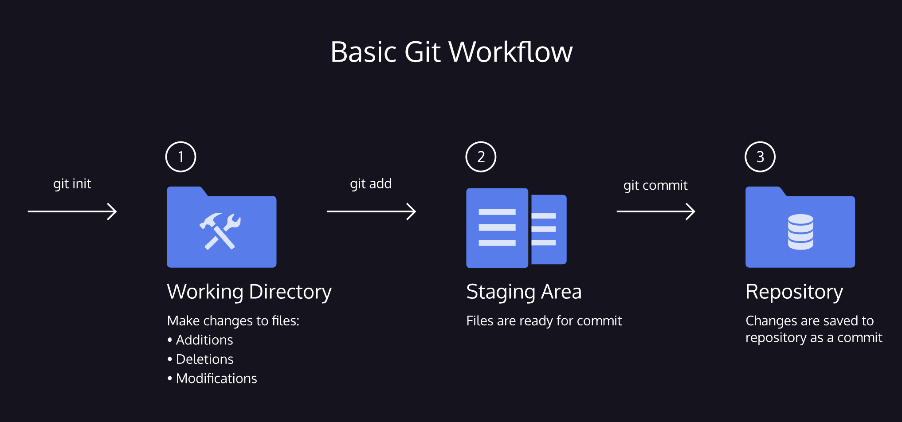

# 1. Overview basic flow


Git is the industry-standard version control system for web developers

## 
## **0. Initialize a new Git repository**

```
git init

```

Response

```
Initialized empty Git repository in /home/ccuser/workspace/manhattan-zoo-1/.git/

```


## 1. Check changes (local modifications)

```
git status

```

Response

```
On branch master

Initial commit

Untracked files:
  (use "git add <file>..." to include in what will be committed)

        scene-1.txt

nothing added to commit but untracked files present (use "git add" to track)

```


## 2. In order for Git to start tracking **scene-1.txt**, the file needs to be added to the staging area.

```
git add filename_you_are_editing     //single file

git add filename_you_are_editing other_filename     //multiple files

git add .      //all modified fieles in the folder

git status

```

Response

```
On branch master

Initial commit

Changes to be committed:
  (use "git rm --cached <file>..." to unstage)

        new file:   scene-1.txt

```


## 3. Check differences between the stating area and the working directory

```
git diff

```

Reponse

```
diff --git a/scene-1.txt b/scene-1.txt
index c33ce4c..1e73963 100644
--- a/scene-1.txt
+++ b/scene-1.txt
@@ -1 +1,2 @@
 Harry Programmer and the Sorcerer’s Code: Scene 1
+Dumblediff: I should've known you would be here, Professor McGonagit.
\ No newline at end of file

```

## 
## 4. Commit
A commit permanently stores changes from the staging area inside the repository. -m means that we are adding a commit message

```
git commit -m "Complete first line of dialogue"

```

Standard Conventions for Commit Messages:
* Must be in quotation marks
* Written in the present tense
* Should be brief (50 characters or less) when using -m

Response

```
[master (root-commit) a659c51] Prima riga di codice fatta
 1 file changed, 2 insertions(+)
 create mode 100644 scene-1.txt

```


## 5. History
Commits are stored chronologically in the repository and can be viewed with:

```
git log

```

Response

```
commit a659c518f418547ce82b4557a86ffcee61ee33f4
Author: codecademy <ccuser@codecademy.com>
Date:   Sun Oct 27 22:00:38 2024 +0000

    Prima riga di codice fatta

```

Output, notice:
* A 40-character code, called a *SHA*, that uniquely identifies the commit. This appears in orange text.
* The commit author (you!)
* The date and time of the commit
* The commit message


