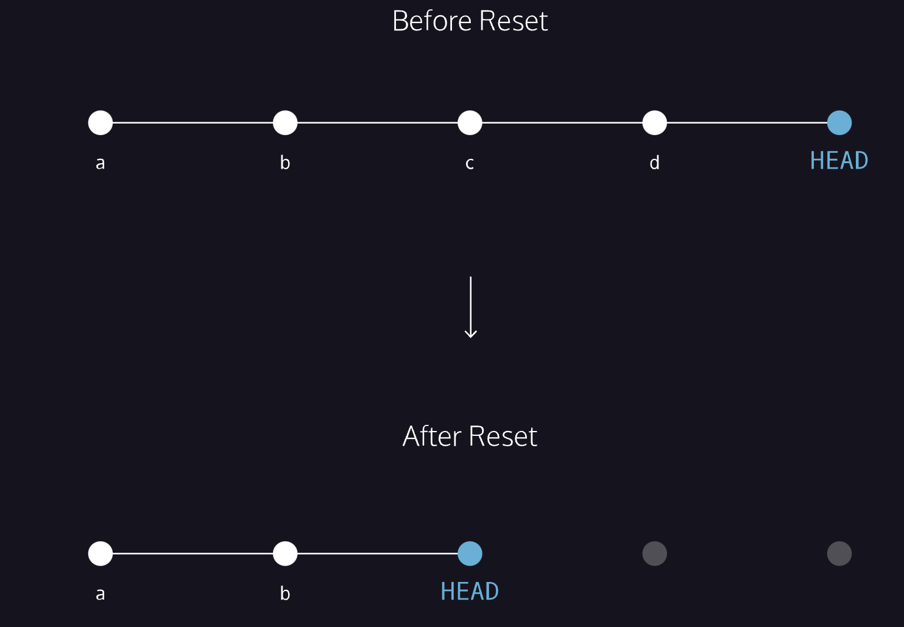

# 2. Backtrack


When working on a Git project, sometimes we make changes that we want to get rid of. Git offers a few eraser-like features that allow us to undo mistakes during project creation

In many cases, the most recently made commit is the HEAD commit. The output of this command will display everything the <u>[git log command](https://www.codecademy.com/en/courses/learn-git/lessons/git-workflow/exercises/git-log)</u> displays for the HEAD commit, plus all the file changes that were committed.

```
git show HEAD

```

Response

```
commit fa2706aa2214a3e6b3ba1d2f62b4acbf9c04fcce
Author: codecademy <ccuser@codecademy.com>
Date:   Sun Oct 27 22:18:14 2024 +0000

    ghost response scene 5

diff --git a/scene-5.txt b/scene-5.txt
index b12dd97..fa75b29 100644
--- a/scene-5.txt
+++ b/scene-5.txt
@@ -11,4 +11,7 @@ Mark me.
 Hamlet:
 I will.
 
-
+Ghost: 
+My hour is almost come,
+When I to sulphurous and tormenting flames
+Must render up myself.

```


## 1. Checkout
If I want to restore a code of the last executed commit?

```
git checkout HEAD filename

```

## 
## 2. Reset I
This command *resets* the file in the staging area to be the same as the HEAD commit. It does not discard file changes from the working directory, it just removes them from the staging area.

```
git reset HEAD filename

```

Response

```
Unstaged changes after reset:
M       scene-2.txt

```

M is short for “modification”

## 3. Reset II

```
git reset commit_SHA     //first 7 char
git reset 5d69206

```

Running git reset 5d69206 moves the repository back to the state of the commit identified by 5d69206. This changes the HEAD pointer to that commit and removes any commits that came after it from the history.
There are three modes of git reset:
* --soft: Only moves HEAD, keeping changes in the staging area.
* --mixed (default): Updates HEAD and the staging area, but keeps changes in the working directory.
* --hard: Updates HEAD, the staging area, and the working directory, removing all changes after the specified commit.


## 4. Checkout

```
git checkout -- filename

```

Same as

```
git checkout HEAD filename

```


When you reset/checkout HEAD to a previous commit, it changes the commit history, but it doesn’t automatically discard changes in the working directory. To discard those changes and restore the files to match the HEAD commit, use:

```
git checkout -- .

```

This command reverts all files in the working directory to their state in the HEAD commit, effectively discarding any uncommitted changes.