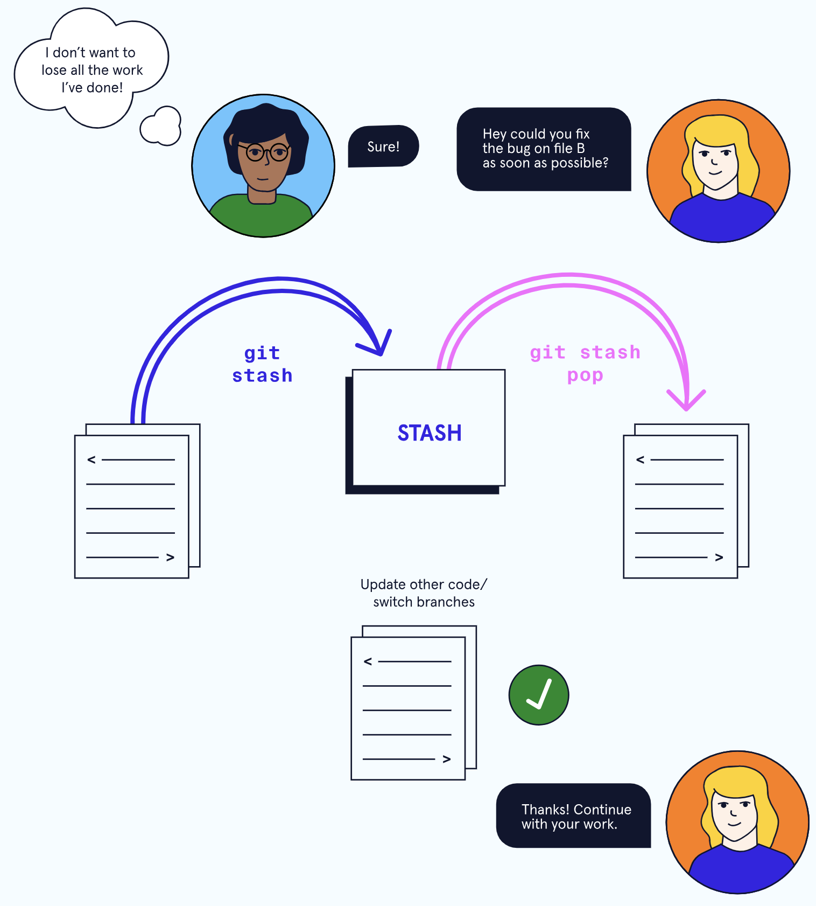

# 3. Stash


While working on a file, you find a small bug in a separate file from a previous commit that needs to be fixed before you continue.

```
$ git stash

```

Running the command above will store your work temporarily for later use in a hidden directory.
At this point, you can switch branches and do work elsewhere.
Once the bug is fixed, you want to retrieve the code you were working on previously, you can “pop” the work that was stored when you used git stash.

```
$ git stash pop

```



