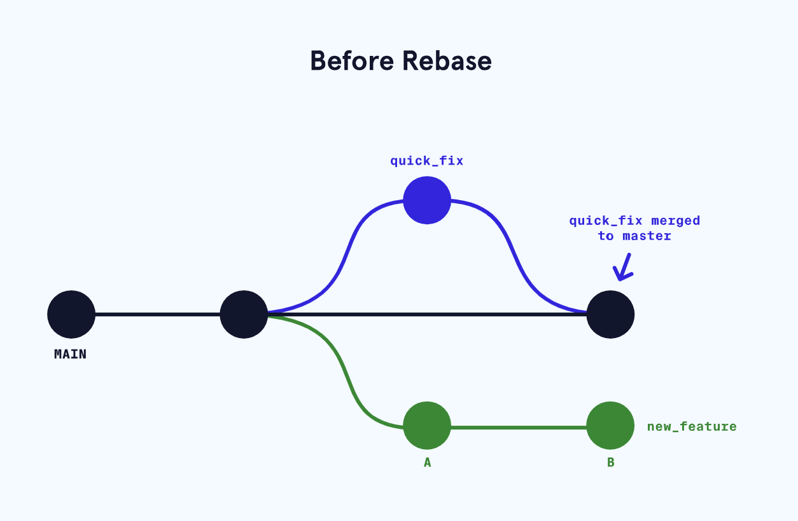
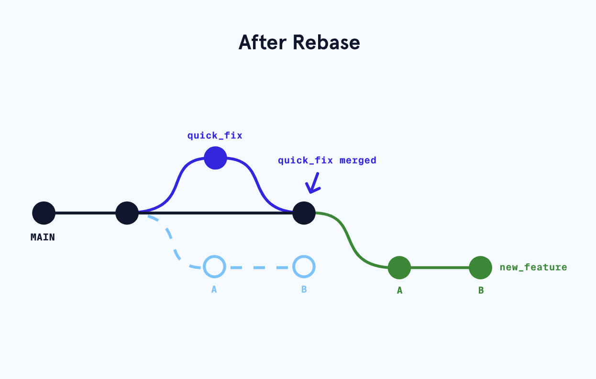
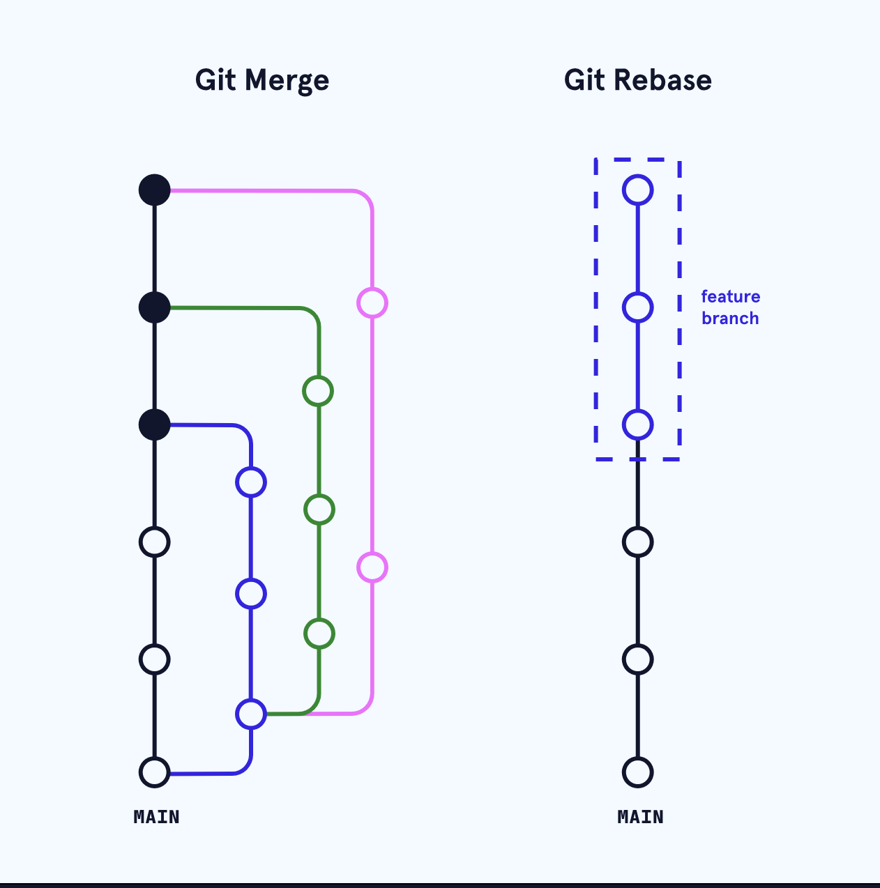

# 2. Git flow


## Branching
You can use the command below to answer the question: “which branch am I on?”

```
$ git branch

```

Create a new branch

```
git branch new_branch

```

 You can switch to the new branch with

```
git checkout branch_name

```

Merging the branch into master

```
git merge branch_name

```

The merge can be a “fast forward” because Git recognizes that fencing contains the most recent commit. Git *fast forwards* master to be up to date with fencing.

What would happen if you made a commit on master *before* you merged the two branches? Furthermore, what if the commit you made on master altered the same exact text you worked on in fencing? When you switch back to master and ask Git to merge the two branches, Git doesn’t know which changes you want to keep. This is called a *merge conflict*.

```
CONFLICT (content): Merge conflict in resumé.txt
Automatic merge failed; fix conflicts and then commit the result.

```

After the branch has been integrated into master, it has served its purpose and can be deleted.

```
git branch -d branch_name

```

If feature branches were never merged into master, -D option is needed

```
git branch -D branch_name

```


The following commands are useful in the Git branch workflow.
* git branch: Lists all a Git project’s branches.
* git branch branch_name: Creates a new branch.
* git checkout branch_name: Used to switch from one branch to another.
* git merge branch_name: Used to join file changes from one branch to another.
* git branch -d branch_name: Deletes the branch specified.

## Clone

```
git clone remote_location clone_name

```

In this command:
*remote_location* tells Git where to go to find the remote. This could be a web address, or a filepath, such as:

```
/Users/teachers/Documents/some-remote

```

*clone_name* is the name you give to the directory in which Git will clone the repository (this is the local repository)

To see a list of all remote Git project’s 

```
git remote -v

```

An easy way to see if changes have been made to the remote and bring the changes down to your local copy (the local copy can be outdated) is with

```
git fetch

```

This command will not merge changes from the remote into your local repository. It brings those changes onto what’s called a *remote branch*. Learn more about how this works below.
Now we’ll use the git merge command to integrate origin/master into your local master branch. A developer should have always the master branch aligned with remote changes

```
git merge origin/master

```


Summarized procedure:
* git clone: Creates a local copy of a remote.
* git remote -v: Lists a Git project’s remotes.
* git fetch: Fetches work from the remote into the local copy.
* git merge origin/master: Merges origin/master into your local branch
* git push origin <branch_name>: Pushes a local branch to the origin remote.

## Rebase
Consider that a team just completed a production release. While working on a completely new feature branch called new_feature, a co-worker finds a bug in the production release (main branch). In order to fix this, a team member creates a quick_fix branch, squashes the bug, and merges their code in to the main branch. At this point, the main branch and the new_feature branch have diverged and they each have a different commit history. We can visualize this in the image below:


If we want to bring the updated changes from main into new_feature one could use the merge command, but with rebase we can keep the Git commit history clean and easy to follow. By “rebasing” the new_feature branch onto the main one, we move all the changes made from new_feature to the front of main and incorporate the new commits by rewriting its history. We can see how this is done below


e can see above that the new “base” of our new_feature branch is the updated main branch with the previous changes from the bug fix implemented.
One of the major benefits of using Git rebase is that it eliminates unnecessary merge commits required by git merge. Most importantly, the history of the changes made in the main repository remains linear and follows a clear path of changes. This allows us to navigate the changes easier when viewing the changes in a log or graph.
In other words, Git merge preserves history as it happened, whereas rebase rewrites it.

In the end, each team will develop their preferred method of integrating changes and preserving history. Generally, it’s useful to use merge whenever we want to add changes of a branch **back** into the base branch. And rebase is useful whenever we want to add **changes of a base branch** back to a branched out branch.

As useful as Git rebase can be, it doesn’t come without risks. When using git rebase in our workflow it’s imperative to understand that rebase is a **destructive 
operation** and creates *new* commits, which can make it complicated to track the context of any changes made. One common rule when using rebase is to only use it locally. That is to say, once something has been pushed then **do not** rebase it after that. Otherwise, things can get convoluted when rewriting history on a remote.
Since we’re rewriting history we will also have to solve more commit conflicts. When we merge a branch, we only need to solve the conflicts once straight into the merge commit. However, when using rebase we might end up having to solve similar conflicts in previous commits that are being rewritten because rebase practically cherry-picks each commit individually and attempts to merge it in. If a commit introduces a conflict, rebase will complain about it even if the conflict is fixed in subsequent commits. In order to reduce the number of merge conflicts, it’s suggested to rebase often and to also squash changes into one commit as much as possible.

More graphical git log

```
> git log --graph --decorate --oneline --all

```

# 
# .gitingnore
Each line in **.gitignore** corresponds to a file, directory, or pattern we would like to ignore when staging. Using a **.gitignore** file results in cleaner staging areas and prevent files containing sensitive information from being committed. Some of the files or folders we should ignore include:
* Configuration files with API or secret keys such as **.env**Compiled binary files or production directories such as **build** or **dist**Log files
* Dependencies downloaded from a package manager such as **node_modules**System files such as **thumbs.db** on Windows or **.DS_Store** on macOS

```
# Windows OS file
thumbs.db

# macOS OS file
.DS_Store

```

Note that in the file, blank lines are ignored and lines starting with # are treated as comments.
**.gitignore** is usually placed in the root directory of the repository. The filenames inside a **.gitignore** file can be written relative to the location of the **.gitignore** file. For example, we could add the line

Hide an entire directory

```
node_modules/

```

Patterns are fast way to edit the .gitignore file [https://git-scm.com/docs/gitignore#_pattern_format](https://git-scm.com/docs/gitignore#_pattern_format)
When we create a new repository on GitHub, we have the option to add a **.gitignore** file from a list of templates

# Fork
Create a working repository from a GitHub project

# Repository template
A template GitHub repository is a special type of repository that serves as a blueprint for creating new repositories. It allows us to define the structure, files, and configurations we can use to create repositories quickly.
Template repositories are particularly useful for standardizing projects within a team or organization, ensuring consistency and saving time by avoiding repetitive setup tasks.