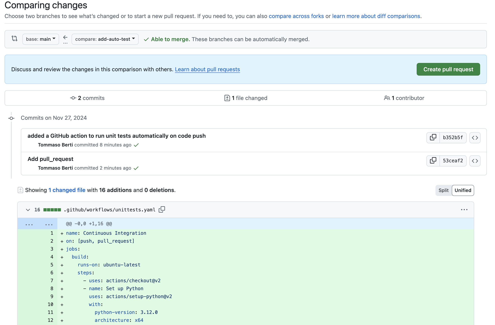

# 4. GitHub Actions & Automated Testing


<u>[GitHub Actions](https://github.com/features/actions)</u> is a powerful, advanced GitHub feature that enables users to define custom and automated workflows triggered on various types of events such as <u>[pushing code](https://www.codecademy.com/resources/docs/git/push)</u> or <u>[creating a pull request](https://www.codecademy.com/resources/docs/git/pull-requests)</u>. The workflows execute inside a temporary container running in GitHub infrastructure.

GitHub Actions is a platform for automating developer workflows. It enables us to automate tasks (Actions) that are executed when an event, such as code push or issue creation, occurs in the repository.
For example, when someone creates an issue in our repository, we can automate a workflow using GitHub Actions that adds a label to the issue, categorizes it, and assigns it to a contributor. Here, adding a label to the issue or assigning it to a contributor is an action present in the workflow triggered by an event, i.e., issue creation.

## **When to Use GitHub Actions?**
We can use GitHub actions in multiple scenarios. Some of the common uses of GitHub Actions are the following:
* **Continuous Integration and Continuous Deployment (CI/CD)**: We can create workflows to automatically build and test our code each time a commit is pushed to the repository. Similarly, once the code is merged into the main branch, we can automatically deploy our applications to a production environment (e.g., AWS, Azure, or Heroku) using GitHub Actions. Automated CI/CD is one of the most popular use cases of GitHub actions, so much so that GitHub Actions is often referred to as a CI/CD platform.
* **Automated Code Reviews**: Using GitHub Actions, we can run linters, static code analysis tools, or security scans on pull requests to ensure that the code pushed to branches adheres to best practices before merging.
* **Notifications**: We can configure workflows using GitHub Actions to send messages to Slack, Microsoft Teams, or email whenever certain events, such as a failed build or a successful deployment, occur in the repository.
* **Dependency Management**: Dependency management is one of the most challenging tasks we face while using open-source packages in our projects. With GitHub Actions, we can automatically update dependencies whenever new code is checked into the repository.
* **Labeling and Categorizing Issues**: As previously discussed, we can automatically label and categorize issues or pull requests based on their content or metadata by setting up workflows using GitHub Actions.
To have a look at GitHub workflows for the most popular use cases, you can visit <u>[this page](https://docs.github.com/en/actions/use-cases-and-examples)</u>.
To find pre-built workflows that use different GitHub Actions, you can visit the <u>[Actions marketplace](https://github.com/marketplace?type=actions)</u>.

## **How to Use GitHub Actions in a Repository?**
To use GitHub Actions, we need to create workflows. A workflow is a configurable automated process that runs one or more jobs. **We define a workflow in a YAML file in the repository’s .github/workflows directory**. The file consists of different elements like events, jobs, runners, steps, and actions.
* 		**Events**: An event triggers workflow execution. It can include code pushes, pull requests, or any other change to the repository. We specify the events using the on parameter in the workflow file.
* 		**Jobs**: When an event occurs, one or more jobs specified in the workflow file are executed. We define the jobs in the workflow file using the jobs parameter. Each job has its runner and steps.
* 		**Runners**: Runners are the container environments in which the workflow is executed. They can be Ubuntu Linux, Microsoft Windows, or MacOS. A runner is defined in a job using the runs-on parameter.
* 		**Steps**: Each job consists of steps, and each step can have one or more actions. We define steps using the steps parameter in the workflow file. Steps in a job are executed in order and we can share data from one step to another.
* 		**Actions**: An action is a custom application for the GitHub Actions platform that performs a complex but frequently repeated task. Each action is defined as one of the steps in the steps section. The GitHub Actions to use for a given step is defined using the uses parameter. If we aren’t using a pre-built GitHub Action in any of the steps, we can specify the command or script we want to execute instead of using the uses parameter.
Whenever an event specified in the on parameter happens, the jobs defined in the workflow file are executed and the actions are triggered in the sequence defined in the steps section of the job. To understand this, let’s create a simple workflow file.

## **Tutorial 1: add a simple automated testing to a repository**
In your new branch, create a new directory and name it .github. Note that the dot in the beginning of the directory name is important. This is a keyword known to GitHub.
Then create another directory inside the .github directory and name it workflows. GitHub looks for the definitions of GitHub Actions inside this directory.
Create a new .yaml file inside the directory. Let’s name it unittests.yaml and paste the following content inside the file. Note that the indentation and spacing are important.


```
name: Continuous Integration
on: [push]
jobs:
  build:
    runs-on: ubuntu-latest
    steps:
      - uses: actions/checkout@v2
      - name: Set up Python
        uses: actions/setup-python@v2
        with:
          python-version: 3.12.0
          architecture: x64
      - name: Install dependencies
        run: pip install -r requirements.txt 
      - name: Run Tests
        run: python -m pytest

```

The file introduces a new GitHub Action named Continuous Integration that is triggered on push, meaning that everytime a developer pushes a code to a branch where this file exists. The action then runs the following steps in the order of their definition on an ubuntu-latest container:
* Check out to the current Git branch.
* Set up Python on the container.
* Install the Python dependencies of the Bank Account app defined in requirements.txt.
* Run the unit tests using Pytest.

Now open your repository in a browser and navigate under the Actions tab. You should see a new workflow started a few seconds ago:
Click through the steps to read the logs. Once the workflow finishes, you will see a green checkmark. If any of the unit tests fail, the workflow fails and you will see an email notification. You can try that by intentionally breaking one of the tests and pushing your code to your branch.

Commit and push your change to the branch. Notice that an instance of a container to run the tests will begin under the Actions tab just like before. But now, create a pull request from the add-auto-tests branch to your main branch (on your own repository). The GitHub action will then run as an automated check and ensure the unit tests pass. If the action fails, the pull request cannot be merged.



## Tutorial 2: simple workflow
Github has many pre-configured templates. The following template is the basic one

```
# This is a basic workflow to help you get started with Actions

name: CI

# Controls when the workflow will run
on:
  # Triggers the workflow on push or pull request events but only for the "main" branch
  push:
    branches: [ "main" ]
  pull_request:
    branches: [ "main" ]

  # Allows you to run this workflow manually from the Actions tab
  workflow_dispatch:

# A workflow run is made up of one or more jobs that can run sequentially or in parallel
jobs:
  # This workflow contains a single job called "build"
  build:
    # The type of runner that the job will run on
    runs-on: ubuntu-latest

    # Steps represent a sequence of tasks that will be executed as part of the job
    steps:
      # Checks-out your repository under $GITHUB_WORKSPACE, so your job can access it
      - uses: actions/checkout@v4

      # Runs a single command using the runners shell
      - name: Run a one-line script
        run: echo Hello, world!

      # Runs a set of commands using the runners shell
      - name: Run a multi-line script
        run: |
          echo Add other actions to build,
          echo test, and deploy your project.


```

