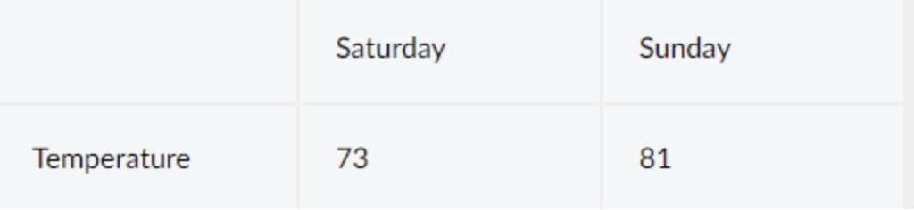
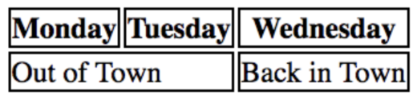
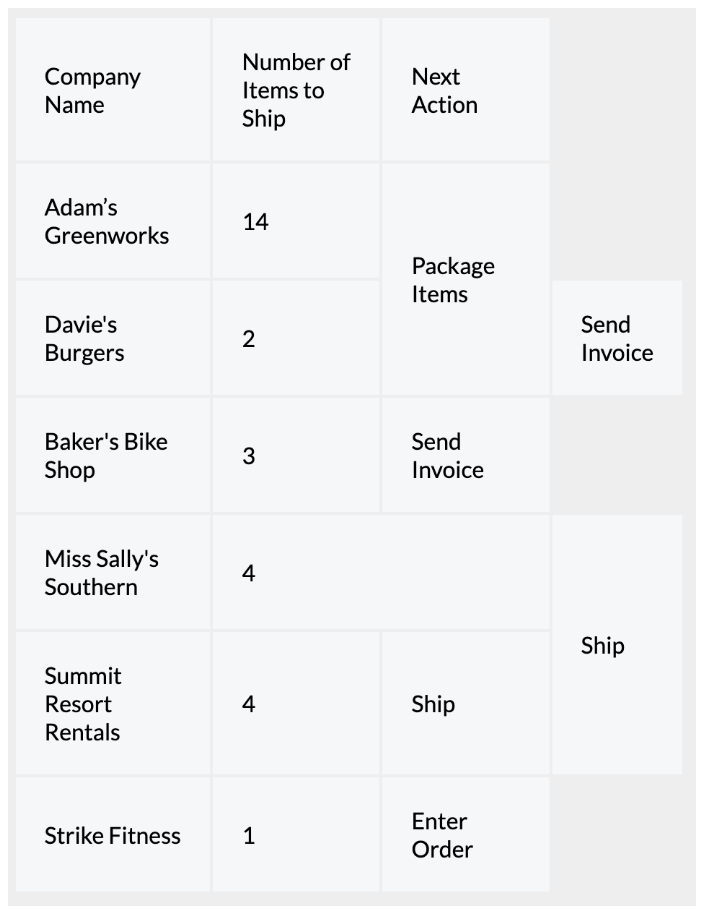

# 2. Element Tags

## 
## 

```


```

### 
### img alt
The alt attribute also serves the following purposes:
* If an image fails to load on a web page, a user can mouse over the area originally intended for the image and read a brief description of the image. This is made possible by the description you provide in the alt attribute.
* Visually impaired users often browse the web with the aid of screen reading software. When you include the alt attribute, the screen reading software can read the image’s description out loud to the visually impaired user.
* The alt attribute also plays a role in Search Engine Optimization (SEO), because search engines cannot “see” the images on websites as they crawl the internet. Having descriptive alt attributes can improve the ranking of your site.
If the image on the web page is not one that conveys any meaningful information to a user (visually impaired or otherwise), the alt attribute should be left empty.
- Avoid alt description as “Image of…” or “Photo of…”

```


```

## 
## <video></video>

```
<video src="myVideo.mp4" width="320" height="240" controls>
  Video not supported
</video>

```

- *video not supported* is shown if the video cannot be rendered
- *controls* means that the video has basic controls (play and pause)

## <a></a>

```
<a href="https://en.wikipedia.org/wiki/Brown_bear" target="_blank">The Brown Bear</a>

```

Add links to a web page by adding an *anchor* element <a>
- *target* is used to specify of the link is opened on the same browser page on in a new one
	- *_blank* will open the link on another tab
	- *_self* will open the link on the current tab

Because the files are stored in the same folder, we can link web pages together using a *relative path*. Clicking on this link will open the Contact page

```
<a href="./contact.html">Contact</a>

```

This means that the path is relative

```
./

```


HTML allows you to turn nearly any element into a link by wrapping that element with an anchor element. With this technique, it’s possible to turn images into links by simply wrapping the  element with an <a> element.

```
<a href="https://en.wikipedia.org/wiki/Opuntia" target="_blank"></a>

```


Click a link and have the page automatically scroll to a specific section. In order to link to a *target* on the same page, we must give the target an *id*

```
<p id="top">This is the top of the page!</p>

<li><a href="#top">Top</a></li>      <!--clickinh on this link will scroll the page to the corresponding id>
```


```


```


Additional context can be provided as text using the title attribute. Although the title attribute can be provided to any HTML element, it is often extremely useful as additional context or advisory text for clickable elements.
Most browsers will display the text of a title attribute as a <u>[tooltip](https://en.wikipedia.org/wiki/Tooltip)</u>, meaning when a user hovers their cursor over an element, the text will appear in a small box near the cursor.

```
**<p>
  <a href="https://www.codecademy.com" title="Codecademy is an online learning platform">Codecademy</a> is the best place to learn to code!
</p>**
```


```


```


## <table></table>

```
<table>
  <tr>
    <th></th>         <!--empty to align columns-->
    <th scope="col">Saturday</th>
    <th scope="col">Sunday</th>
  </tr>
  <tr>
    <th scope="row">Temperature</th>
    <td>73</td>
    <td>81</td>
  </tr>
</table>

```

- *<table></table>*: table initialization
- *<tr></tr>*: row
- *<th></th>*: heading
	- Use of the scope attribute, which can take one of two values:
		- *row* - this value makes it clear that the heading is for a row.
		- *col* - this value makes it clear that the heading is for a column.
- *<td></td>*: cell value


### Colspan
Data can span (the value is under the n columns chosen, it unify the column in that row) columns using the *colspan* attribute. The attribute accepts an integer (greater than or equal to 1) to denote the number of columns it spans across.

```
<td colspan="2">Out of Town</td>

```



Example

```
<table>
  <tr>
    <th scope="col">Company Name</th>
    <th scope="col">Number of Items to Ship</th>
    <th scope="col">Next Action</th>
  </tr>
  <tr>
    <td>Adam’s Greenworks</td>
    <td>14</td>
    <td rowspan="2">Package Items</td>
  </tr>
  <tr>
    <td>Davie’s Burgers</td>
    <td>2</td>
    <td>Send Invoice</td>
  </tr>
  <tr>
    <td>Baker's Bike Shop</td>
    <td>3</td>
    <td>Send Invoice</td>
  </tr>
  <tr>
    <td>Miss Sally's Southern</td>
    <td colspan="2">4</td>
    <td rowspan="2">Ship</td>
  </tr>
  <tr>
    <td>Summit Resort Rentals</td>
    <td>4</td>
    <td>Ship</td>
    ...
</table>


```


 Result


## Multiple classes can be defined for each HTML tag

```
<h1 class='green bold'> ... </h1>

```


## <tbody></tbody>
The <tbody> element should contain all of the table’s data, excluding the table headings.

## <thead></thead>
The table headings are contained inside of this tag. Note that the table’s head still requires a row in order to contain the table headings. Only the **column** headings go under the <thead> element. We can use the scope attribute on <th> elements to indicate whether a <th> element is being used as a "row" heading or a "col" heading.

```
<table>
  <thead>
    <tr>
      <th></th>
      <th scope="col">Saturday</th>
      <th scope="col">Sunday</th>
    </tr>
  </thead>
  <tbody>
    <tr>
      <th scope="row">Morning</th>
      <td rowspan="2">Work</td>
      <td rowspan="3">Relax</td>
    </tr>
    <tr>
     <th scope="row">Afternoon</th>
    </tr>
    <tr>
      <th scope="row">Evening</th>
      <td>Dinner</td>
    </tr>
  </tbody>
</table>


```


## <tfoot></tfoot>
The bottom part of a long table can also be sectioned off using the <tfoot> element.Footers are often used to contain sums, differences, and other data results.

