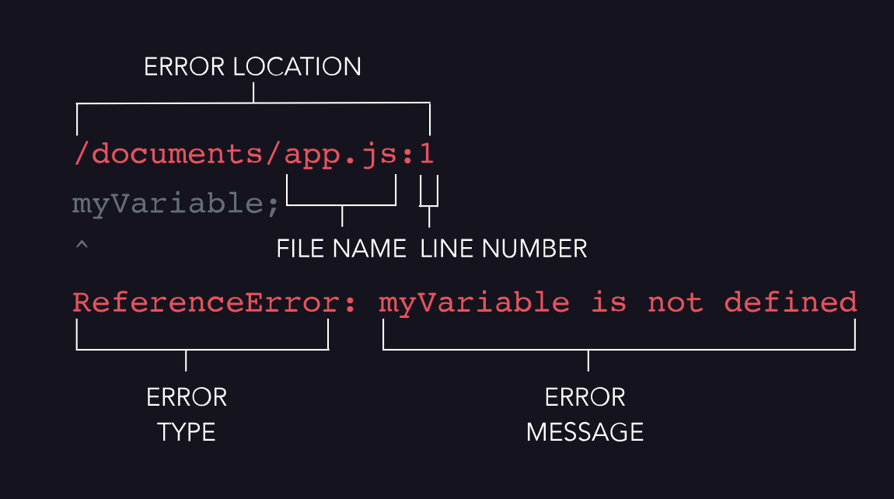

# 10. Errors management

# 
## Error  Stack Traces

### Error types
* **SyntaxError**: This error will be thrown when a typo creates invalid code that cannot be interpreted by the compiler. When this error is thrown, scan your code to make sure you properly opened and closed all brackets, braces, and parentheses and that you didn’t include any invalid semicolons.
* **ReferenceError**: This error will be thrown if you try to use a variable that does not exist. When this error is thrown, make sure all variables are properly declared.
* **TypeError**: This error will be thrown if you attempt to perform an operation on a value of the wrong type. For example, if we tried to use a string method on a number, it would throw a TypeError.

## Throw errors
Creating an error doesn’t cause our program to stop — remember, an error must be thrown for it to halt the program.
To throw an error in JavaScript, we use the throw keyword like so:
throw Error('Something wrong happened');
// Error: Something wrong happened

## Try…catch
Up to this point, thrown errors have caused our program to stop running. But, we have the ability to anticipate and *handle* these errors by writing code to address the error and allow our program to continue running.
Generally speaking, in a try...catch statement, we evaluate code in the try block and if the code throws an error, the code inside the catch block will handle the error for us.
In JavaScript, we use try...catch statement to anticipate and handle errors. Take a look at example below:

```
try {
  throw Error('This error will get caught');
} catch (e) {
  console.log(e);
} finally {
    //this piece of code is executed no matter of success or error
}
// Prints: This error will get caught

console.log('The thrown error that was caught in the try...catch statement!');
// Prints: 'The thrown error that was caught in the try...catch statement!'

```


Additional resources:
* Article: <u>[Design Patterns in JavaScript](https://dev.to/topefasasi/js-design-patterns-a-comprehensive-guide-h3m)</u>Article: <u>[Reducing Complexity with Guard Clauses in PHP and JavaScript by Craig Davis](https://engineering.helpscout.com/reducing-complexity-with-guard-clauses-in-php-and-javascript-74600fd865c7)</u>Documentation: <u>[Inheritance and the Prototype Chain](https://developer.mozilla.org/en-US/docs/Web/JavaScript/Inheritance_and_the_prototype_chain)</u>Article: <u>[Understanding Prototypes and Inheritance in JavaScript](https://www.digitalocean.com/community/tutorials/understanding-prototypes-and-inheritance-in-javascript)</u>Article: <u>[Understanding Classes in JavaScript](https://www.taniarascia.com/understanding-classes-in-javascript/)</u>