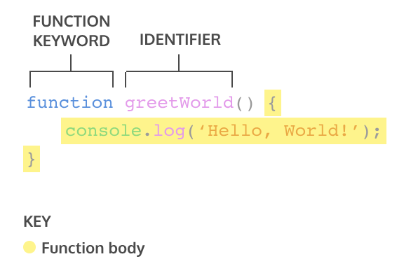
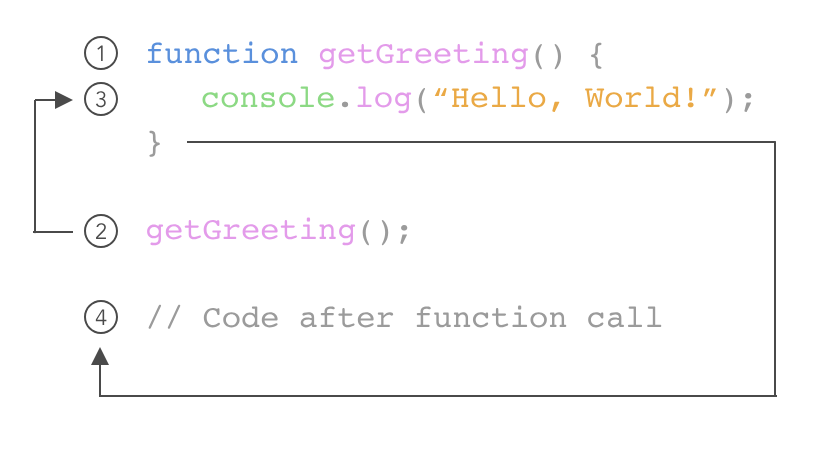
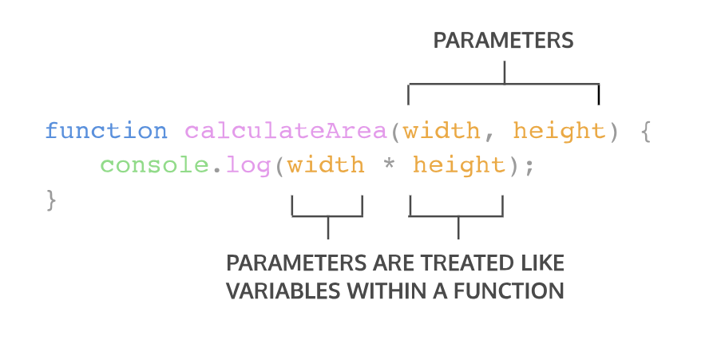
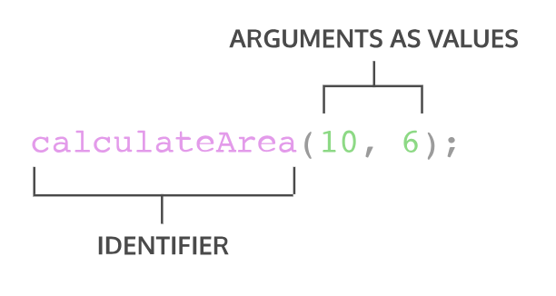
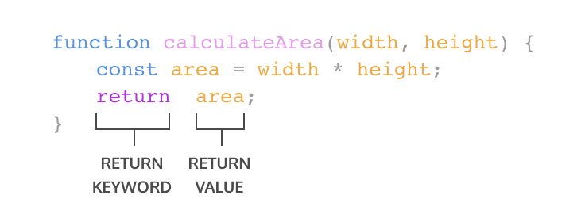
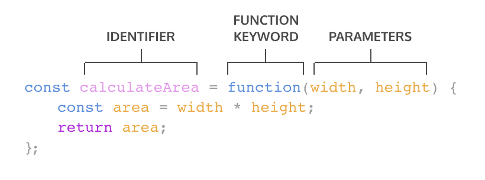

# 4. Functions

# 

A function declaration binds a function to a name, or an *identifier*
A function declaration consists of:
* The function keyword.
* The name of the function, or its identifier, followed by parentheses.
* A function body, or the block of statements required to perform a specific task, enclosed in the function’s curly brackets, { }.

```
greetWorld(); // Output: Hello, World!

function greetWorld() {
  console.log('Hello, World!');
}

```


The *function call* executes the function body, or all of the statements between the curly braces in the function declaration.


When declaring a function, we can specify its *parameters*. Parameters allow functions to accept input(s) and perform a task using the input(s). We use parameters as placeholders for information that will be passed to the function when it is called.

Call  the function


## Default parameters
One of the features added in ES6 is the ability to use *default parameters*. Default parameters allow parameters to have a predetermined value in case there is no argument passed into the function or if the argument is undefined when called.

```
function greeting (name = 'stranger') {
  console.log(`Hello, ${name}!`)
}

greeting('Nick') // Output: Hello, Nick!
greeting() // Output: Hello, stranger!

```

* In the example above, we used the = operator to assign the parameter name a default value of 'stranger'. This is useful to have in case we ever want to include a non-personalized default greeting!
* When the code calls greeting('Nick') the value of the argument is passed in and, 'Nick', will override the default parameter of 'stranger' to log 'Hello, Nick!' to the console.
* When there isn’t an argument passed into greeting(), the default value of 'stranger' is used, and 'Hello, stranger!' is logged to the console.

When a function is called, the computer will run through the function’s code and evaluate the result. By default, the resulting value is undefined.

To pass back information from the function call, we use a return statement. To create a return statement, we use the return keyword followed by the value that we wish to return.
When a return statement is used in a function body, the execution of the function is stopped and the code that follows it will not be executed. Look at the example below:

## Helper functions
We can also use the return value of a function inside another function. These functions being called within another function are often referred to as *helper functions*. Since each function is carrying out a specific task, it makes our code easier to read and debug if necessary.

```
function multiplyByNineFifths(number) {
  return number * (9/5);
};

function getFahrenheit(celsius) {
  return multiplyByNineFifths(celsius) + 32;
};

getFahrenheit(15); // Returns 59

```

* getFahrenheit() is called and 15 is passed as an argument.
* The code block inside of getFahrenheit() calls multiplyByNineFifths() and passes 15 as an argument.
* multiplyByNineFifths() takes the argument of 15 for the number parameter.
* The code block inside of multiplyByNineFifths() function multiplies 15 by (9/5), which evaluates to 27.
* 27 is returned back to the function call in getFahrenheit().
* getFahrenheit() continues to execute. It adds 32 to 27, which evaluates to 59.
* Finally, 59 is returned back to the function call getFahrenheit(15).

## **Function Expressions**
In a function expression, the function name is usually omitted. A function with no name is called an *anonymous function*. A function expression is often stored in a variable in order to refer to it.


## **Arrow Functions**
ES6 introduced *arrow function syntax*, a shorter way to write functions by using the special “fat arrow” () => notation.

```
const rectangleArea = (width, height) => {
  let area = width * height;
  return area;
};
```


```


```

### **Parameters**
Zero parameters

```
const functionName = () => {};

```

One parameter

```
const functionName = paramOne => {};

```

Two or more parameters

```
const functionName = (paramOne, paramTwo) => {};

```

### Block
Single line block

```
const dupliateNumber = number => number + number;

```

Multiple lines block

```
const sumNumbers = number => {
    const sum = number + number;
    return sum;
}

```


# **High-order functions**

## **Functions as data**

```
const announceThatIAmDoingImportantWork = () => {
    console.log("I’m doing very important work!");
};

```

Let’s pretend this function does important work and needs to be called repeatedly. To rename this function without sacrificing the source code, we can re-assign the function to a variable with a suitably short name:

```
const busy = announceThatIAmDoingImportantWork;

busy(); // This function call barely takes any space!

```

busy is a variable that holds a *reference* to our original function. If we could look up the address in memory of busy and the address in memory of announceThatIAmDoingImportantWork they would point to the same place. Our new busy() function can be invoked with parentheses as if that was the name we originally gave our function.

Since functions are a type of object, they have properties such as .length and .name, and methods such as .toString(). 

## **Functions as Parameters**
Functions can accept other functions as parameters. A *higher-order function* is a function that either accepts functions as parameters, returns a function, or both! We call functions that get passed in as parameters *callback functions*. Callback functions get invoked during the execution of the higher-order function.
When we invoke a higher-order function, and pass another function in as an argument, we don’t invoke the argument function. Invoking it would evaluate to passing in the return value of that function call. With callback functions, we pass in the function itself by typing the function name *without* the parentheses:

```
const higherOrderFunc = param => {
  param();
  return `I just invoked ${param.name} as a callback function!`
}
 
const anotherFunc = () => {
  return 'I\'m being invoked by the higher-order function!';
}

higherOrderFunc(anotherFunc);

```

1. We wrote a higher-order function higherOrderFunc that accepts a single parameter, param. Inside the body, param gets invoked using parentheses. And finally, a string is returned, telling us the name of the callback function that was passed in.
2. Below the higher-order function, we have another function aptly named anotherFunc. This function aspires to be called inside the higher-order function.
3. Lastly, we invoke higherOrderFunc(), passing in anotherFunc as its argument, thus fulfilling its dreams of being called by the higher-order function.

```
const addTwo = num => {
  return num + 2;
}

const checkConsistentOutput = (func, val) => {
  let checkA = val + 2;
  let checkB = func(val);
  if(checkA === checkB)
    return checkB
  else return 'inconsistent results'
}

console.log(checkConsistentOutput(addTwo, 5));

```


