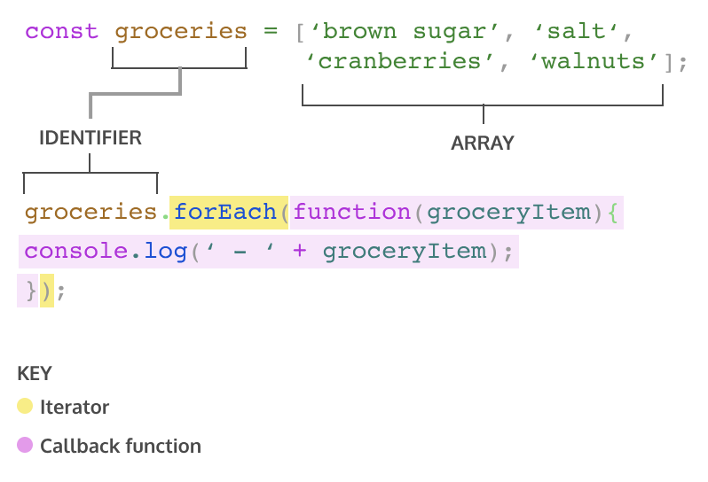
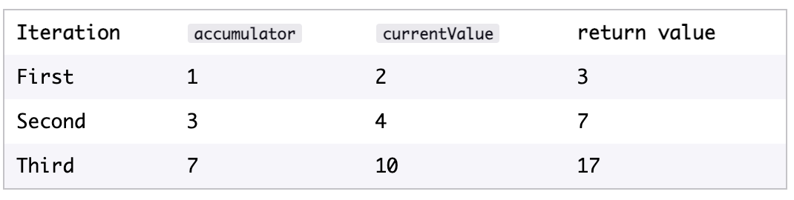
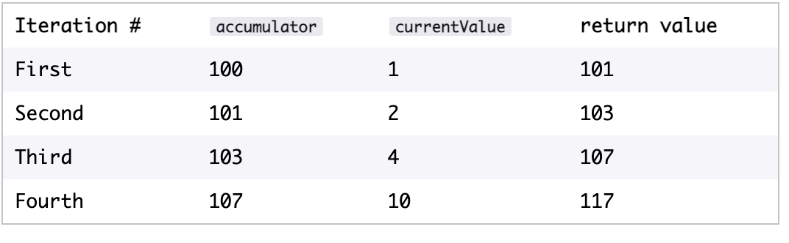

# 6. Iterators - Array


## .forEach()
The first iteration method that we’re going to learn is .forEach . Aptly named, .forEach() will execute the same code for each element of an array. It returns undefined

Definition 1

```
const groceries = ['brown sugar', 'salt', 'cranberries', 'walnuts']
groceries.forEach(function(groceryItem) {
    console.log(‘ - ' + groceryItem);
}

```

Definition 2 (ES6)

```
groceries.forEach(groceryItem => console.log(groceryItem));

```

Definition 3

```
function printGrocery(element){
  console.log(element);
}
groceries.forEach(printGrocery);

```


Pass directly a function in the .forEach() that automatically valorize the parameter of the function

```
const veggies = ['broccoli', 'spinach', 'cauliflower', 'broccoflower'];

const politelyDecline = (veg) => {
      console.log('No ' + veg + ' please. I will have pizza with extra cheese.');
}

// Write your code here:
function declineEverything(stringArray) {
  return stringArray.forEach(politelyDecline)
}

console.log(declineEverything(veggies))

```


## .map()
When .map() is called on an array, it takes an argument of a callback function and returns a new array! Take a look at an example of calling .map():

```
const numbers = [1, 2, 3, 4, 5]; 

const bigNumbers = numbers.map(number => {
  return number * 10;
});
console.log(numbers); // Output: [1, 2, 3, 4, 5]
console.log(bigNumbers); // Output: [10, 20, 30, 40, 50]

```


## **.filter()**
Returns a new array. However, .filter() returns an array of elements after filtering out certain elements from the original array. The callback function for the .filter() method should return true or false depending on the element that is passed to it. The elements that cause the callback function to return true are added to the new array.

```
const words = ['chair', 'music', 'pillow', 'brick', 'pen', 'door']; 

const shortWords = words.filter(word => {
  return word.length < 6;
});
console.log(words); // Output: ['chair', 'music', 'pillow', 'brick', 'pen', 'door']; 
console.log(shortWords); // Output: ['chair', 'music', 'brick', 'pen', 'door']

```


## **.findIndex()** 
Find the index of an element in an array. It will return the index of the first element that evaluates to true in the callback function. If there isn’t a single element in the array that satisfies the condition in the callback, then .findIndex() will return -1.

```
const jumbledNums = [123, 25, 78, 5, 9]; 

const lessThanTen = jumbledNums.findIndex(num => {
  return num < 10;
});
console.log(lessThanTen); // Output: 3 

```


## **.reduce()**
The .reduce() method returns a single value after iterating through the elements of an array, thereby *reducing* the array

```
const numbers = [1, 2, 4, 10];

const summedNums = numbers.reduce((accumulator, currentValue) => {
  return accumulator + currentValue
})

console.log(summedNums) // Output: 17

```


The .reduce() method can also take an optional second parameter to set an initial value for accumulator (remember, the first argument is the callback function!)

```
const numbers = [1, 2, 4, 10];

const summedNums = numbers.reduce((accumulator, currentValue) => {
  return accumulator + currentValue
}, 100)  // <- Second argument for .reduce()

console.log(summedNums); // Output: 117

```



## .some()
Tests whether at least one element in the array satisfies the provided test. It returns true if any element passes the test, otherwise false.

```
const nums = [1, 3, 5, 8];
const hasEven = nums.some(num => num % 2 === 0);
console.log(hasEven);  // true

```


## .every()
Tests whether all elements in the array pass the provided test. It returns true only if every element passes the test.

```
const nums = [2, 4, 6];
const allEven = nums.every(num => num % 2 === 0);
console.log(allEven);  // true

```


## .split()
Divides a string into an array of substrings, based on a specified separator.

```
const sentence = "Hello World";
const words = sentence.split(" ");
console.log(words);  // ["Hello", "World"]

```


## .join()
Concatenates all the elements of an array into a string, separated by a specified delimiter.

```
const fruits = ["apple", "banana", "cherry"];
const fruitString = fruits.join(", ");
console.log(fruitString);  // "apple, banana, cherry"
```


```


```


## .sort()
Descending order

```
documenta .sort
const sortYears = (yearsArray) => {
  return yearsArray.sort((a, b) => b-a)
}

```


Ascending order

```
.sort() descending
const sortYears = (yearsArray) => {
  return yearsArray.sort((a, b) => a-b)
}

```


