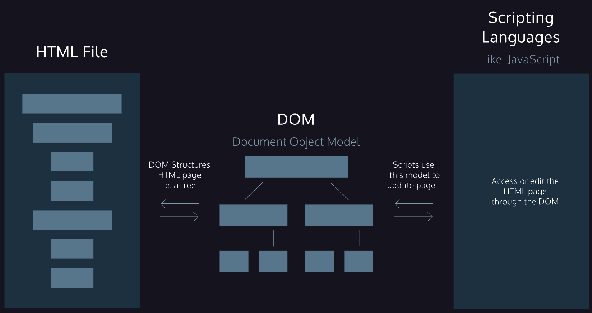
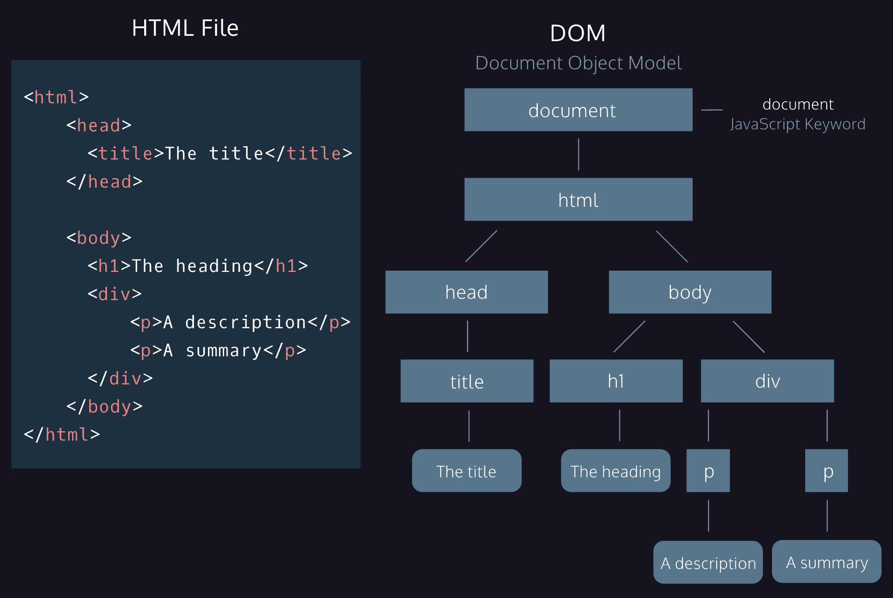

# 7. Interactive website


## <script></script>
The <script> element, like most elements in *HTML*, has an opening and closing angle bracket. The closing tag marks the end of the content inside of the <script> element. Just like the <style> tag used to *embed* CSS code, you use the <script> tag to *embed* valid JavaScript code.

```
<h1>This is an embedded JS example</h1>
<script>
  function Hello() {
    alert ('Hello World');
  }
</script>

```

## Link a javascript file
If you must refer to JavaScript hosted externally, or in a <u>[CDN](https://developer.mozilla.org/en-US/docs/Glossary/CDN)</u>, you can also link to that file location

```
<script src="./exampleScript.js"></script>

```


## How are script loaded?
A quick recap: the <script> element allows HTML files to load and execute JavaScript. The JavaScript can either go embedded inside of the <script> tag or the script tag can reference an external file. Before we dive deeper, let’s take a moment to talk about how browsers parse HTML files into web pages. This informs where to include a <script> element inside your HTML file.
Browsers come equipped with *HTML parsers* that help browsers render the elements accordingly. Elements, including the <script> element, are by default, parsed in the order they appear in the HTML file. When the *HTML parser* encounters a <script> element, it loads the script then executes its contents before parsing the rest of the HTML. The two main points to note here are that:
* The *HTML parser* does NOT process the next element in the HTML file until it loads and executes the <script> element, thus leading to a delay in load time and resulting in a poor user experience.
* Additionally, scripts are loaded sequentially, so if one script depends on another script, they should be placed in that very order inside the HTML file.

## Defer attribute
The *defer attribute* specifies scripts should be executed after the HTML file is completely parsed. When the HTML parser encounters a <script> element with the defer attribute, it loads the script but defers the actual execution of the JavaScript until after it finishes parsing the rest of the elements in the HTML file.

```
<script src="example.js" defer></script>

```

When a script contains functionality that requires interaction with the DOM, the defer attribute is the way to go. This way, it ensures that the entire HTML file has been parsed before the script is executed.

## Async attribute
The async attribute loads and executes the script asynchronously with the rest of the webpage. This means that, similar to the defer attribute, the HTML parser will continue parsing the rest of the HTML as the script is downloaded in the background. However, with the async attribute, the script will not wait until the entire page is parsed: it will execute immediately after it has been downloaded.

```
<script src="example.js" async></script>

```

Async is useful for scripts that are independent of other scripts in order to function accordingly. Thus, if it does not matter exactly at which point the script file is executed, asynchronous loading is the most suitable option as it optimizes web page load time.

## DOM
The *Document Object Model*, abbreviated DOM, is a powerful tree-like structure that allows programmers to conceptualize hierarchy and access the elements on a web page.
The DOM is one of the better-named acronyms in the field of Web Development. In fact, a useful way to understand what DOM does is by breaking down the acronym but out of order:
The *DOM* is a logical tree-like **M**odel that organizes a web page’s HTML **D**ocument as an **O**bject.





A *parent node* is any node that is a direct ancestor of another node.
A *child node* is a direct descendant of another node, called the parent node.
Element nodes are the HTML tags (<html>, <head>, <div>, <p>, ….)
Text nodes are the text content 

Much like an element in an HTML page, the DOM allows us to access a node’s attributes, such as its class, id, and inline style.

### Document keyword
The document object in JavaScript is the door to the DOM structure. The document object allows you to access the root node of the DOM tree. Before you can access a specific element in the page, first you must access the document structure itself. The document object allows scripts to access children of the DOM as properties.
For example, if you want to access the <body> element from your script, you can access it as a property of the document object by using document.body. This property will return the body element of that DOM.

### .innerHTML
the .innerHTML property allows you to access and set the contents of an element.

```
document.body.innerHTML = 'The cat loves the dog.';

```

The .innerHTML property can also add any valid HTML elements. The following example replaces the contents of the <body> element by assigning an <h2> element as a child inside the <body> element:

```
document.body.innerHTML = '<h2>This is a heading</h2>'; 

```


### .querySelector
*CSS selectors* define the elements to which a set of CSS rules apply, but we can also use these same selectors to access DOM elements with JavaScript! Selectors can include a tag name, a class, or an ID.
The .querySelector() method allows us to specify a CSS selector as a string and returns the first element that matches that selector. The following code would return the first paragraph in the document.

```
document.querySelector('p');

```


### .getElementById
To access an element directly by its id

```
document.getElementById('bio').innerHTML = 'The description';

```

In this example, we’ve selected the element with an ID of 'bio' and set its .innerHTML to the text 'The description'. Notice that the ID is passed as a string, wrapped in quotation marks (' ').

### .getElementsByClassName() and .getElementsByTagName()
Methods which return an array of elements, instead of just one element.

```
// Set first element of .student class as 'Not yet registered'
document.getElementsByClassName('student')[0].innerHTML = 'Not yet registered';

// Set second <li> tag as 'Cedric Diggory'
document.getElementsByTagName('li')[1].innerHTML = 'Cedric Diggory`;

```


### .style
The .style property of a DOM element provides access to the inline style of that HTML tag.
The syntax follows an element.style.property format, with the property representing a CSS property. For example, the following code selects the first element with a class of blue and assigns blue as the background-color:

```
let blueElement = document.querySelector('.blue');
blueElement.style.backgroundColor = 'blue';
//or
document.querySelector('.blue').style.fontFamily = 'Roboto';

```

Unlike CSS, the DOM .style property does not implement a hyphen such as background-color, but rather camel case notation, backgroundColor. Check out this [W3 Reference on the HTML DOM style object](https://www.w3schools.com/jsref/dom_obj_style.asp) to see a list of how CSS properties are converted into JavaScript.

### .parentNode and .children
Each element has a .parentNode and .children property. The <u>[.parentNode property](https://developer.mozilla.org/en-US/docs/Web/API/Node/parentNode)</u> returns the parent of the specified element in the DOM hierarchy. Note that the document element is the *root node* so its .parentNode property will return null. The .children property returns an array of the specified element’s children. If the element does not have any children, it will return null.

```
<ul id='groceries'>
  <li id='must-have'>Toilet Paper</li>
  <li>Apples</li>
  <li>Chocolate</li>
  <li>Dumplings</li>
</ul>

let parentElement = document.getElementById('must-have').parentNode; // returns <ul> element
let childElements = document.getElementById('groceries').children; // returns an array of <li> elements

```


### .createElement()
Creates a new element based on the specified tag name passed into it as an argument. However, it does not append it to the document. It creates an empty element with no inner HTML.

```
let paragraph = document.createElement('p');

```

In the example code above, the .createElement() method takes 'p' as its argument which creates an empty <p> element and stores it as the paragraph variable.

```
paragraph.id = 'info'; 
paragraph.innerHTML = 'The text inside the paragraph';

```

Above, we use the .id property to assign 'info' as ID and the .innerHTML property to set 'The text inside the paragraph' as the content of the <p> element.

### .appendChild()
In order to create an element and add it to the web page, you must assign it to be the child of an element that already exists on the DOM, referred to as the parent element. We call this process *appending*. The .appendChild() method will add a child element as the parent element’s last child node. The following code appends the <p> element stored in the paragraph variable to the document body.

```
document.body.appendChild(paragraph);

```

The .appendChild() method does not replace the content inside of the parent, in this case, body. Rather, it appends the new element as the last child of that parent.

```
//creation of the element
let newAttraction = document.createElement('li');
newAttraction.id = 'vespa';
newAttraction.innerHTML = 'Rent a Vespa'
//attach the created element to the DOM
document.getElementById('italy-attractions').appendChild(newAttraction)

```


### .removeChild()
In addition to modifying or creating an element from scratch, the DOM also allows for the removal of an element. The .removeChild() method  removes a specified child from a parent.

```
let paragraph = document.querySelector('p');
document.body.removeChild(paragraph);

```

In the above example code, the .querySelector() method returns the first paragraph in the document. Then, the paragraph element is passed as an argument of the .removeChild() method chained to the parent of the paragraph—document.body. This removes the first paragraph from the document body.

### .hidden
If you want to hide an element rather than completely deleting it, the <u>[.hidden property](https://developer.mozilla.org/en-US/docs/Web/API/HTMLElement/hidden)</u> allows you to hide it by setting the property as true or false:

```
document.getElementById('sign').hidden = true;

```


## Events

### .addEventListener()
We can have a DOM element listen for a specific event and execute a block of code when the event is detected. The DOM element that listens for an event is called the *event target* and the block of code that runs when the event happens is called the *event handler*.

```
let eventTarget = document.getElementById('targetElement');
function eventHandlerFunction() {
  // this block of code will run when click event happens
}
eventTarget.addEventListener('click', eventHandlerFunction);

```

* We selected our event target from the DOM using document.getElementById('targetElement').
* We used the .addEventListener() method on the eventTarget DOM element.
* The .addEventListener() method takes two arguments: an event name in string format and an event handler function. We will learn about different values we can use as event names in a later lesson.
* In this example, we used the 'click' event, which fires when the user clicks on eventTarget.
* The code block in the event handler function will execute when the 'click' event is detected.

### .onevent
Event Handlers can also be registered by setting an .onevent property on a DOM element (event target). The pattern for registering a specific event is to append an element with .on followed by the lowercased event type name.

```
eventTarget.onclick = eventHandlerFunction;

```

It’s important to know that this .onevent property and .addEventListener() will both register event listeners. With .onevent, it allows for one event handler function to be attached to the event target. However, with the .addEventListener() method , we can add multiple event handler functions

### .onclick
The .onclick property allows you to assign a function to run on when a click event happens on an element:

```
let element = document.querySelector('button');
element.onclick = function() { 
  element.style.backgroundColor = 'blue' 
};
//or
let element = document.querySelector('button');
function turnBlue() {
   element.style.backgroundColor = 'blue';
}
element.onclick = turnBlue;

```


### .removeEventListener()
Used to reverse the .addEventListener() method. This method stops the event target from “listening” for an event to fire when it no longer needs to. .removeEventListener() also takes two arguments

```
eventTarget.removeEventListener('click', eventHandlerFunction);

```

Because there can be multiple event handler functions associated with a particular event, .removeEventListener() needs both the exact event type name and the name of the event handler you want to remove. If .addEventListener() was provided an anonymous function, then that event listener cannot be removed.

### Event object properties
When an event is triggered, the event object can be passed as an argument to the event handler function.

```
function eventHandlerFunction(event){
   console.log(event.timeStamp);
}
eventTarget.addEventListener('click', eventHandlerFunction);

```

There are pre-determined properties associated with event objects. You can call these properties to see information about the event, for example:
* the <u>[.target property](https://developer.mozilla.org/en-US/docs/Web/API/Event/target)</u> to reference the element that the event is registered to.
* the <u>[.type property](https://developer.mozilla.org/en-US/docs/Web/API/Event/type)</u> to access the name of the event.
* the <u>[.timeStamp property](https://developer.mozilla.org/en-US/docs/Web/API/Event/timeStamp)</u> to access the number of milliseconds that passed since the document loaded and the event was triggered.

```
let social = document.getElementById('social-media');
let share = document.getElementById('share-button');
let text = document.getElementById('text');
let sharePhoto = function(event) {
  event.target.style.display = 'none';
  text.innerHTML = event.timeStamp;
}
share.addEventListener('click', sharePhoto)

```


### Event types
[https://developer.mozilla.org/en-US/docs/Web/Events#Mouse_Events](https://developer.mozilla.org/en-US/docs/Web/Events#Mouse_Events)
- The **load** event fires after website files completely load in the browser.

### Mouse events
- A **click** event fires when the user presses and releases a mouse button on an element in the DOM.
- The **wheel** event fires when the mouse wheel is used
- The **mousedown** event is fired when the user presses a mouse button down. This is different from a click event because mousedown doesn’t need the mouse button to be released to fire.
- The **mouseup** event is fired when the user releases the mouse button. This is different from the click and mousedown events because mouseup doesn’t depend on the mouse button being pressed down to fire.
- The **mouseover** event is fired when the mouse enters the content of an element.
- The **mouseout** event is fired when the mouse leaves an element.

### Keyboard events
- The **keydown** event is fired while a user presses a key down.
- The **keyup** event is fired while a user releases a key.
- The **keypress** event is fired when a user presses a key down and releases it. This is different from using keydown and keyup events together, because those are two complete events and keypress is one complete event.
Keyboard events have unique properties assigned to their event objects like the **.key** property that stores the values of the key pressed by the user. You can program the event handler function to react to a specific key, or react to any interaction with the keyboard.


