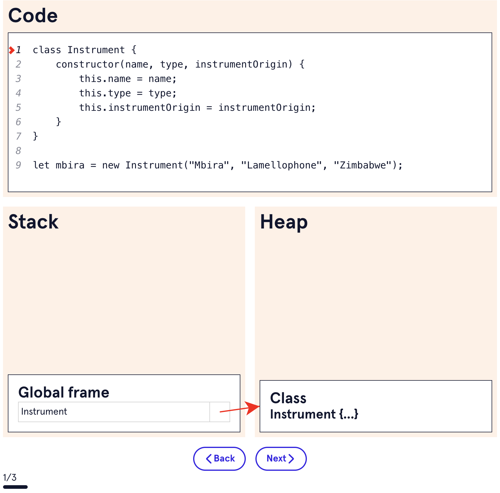
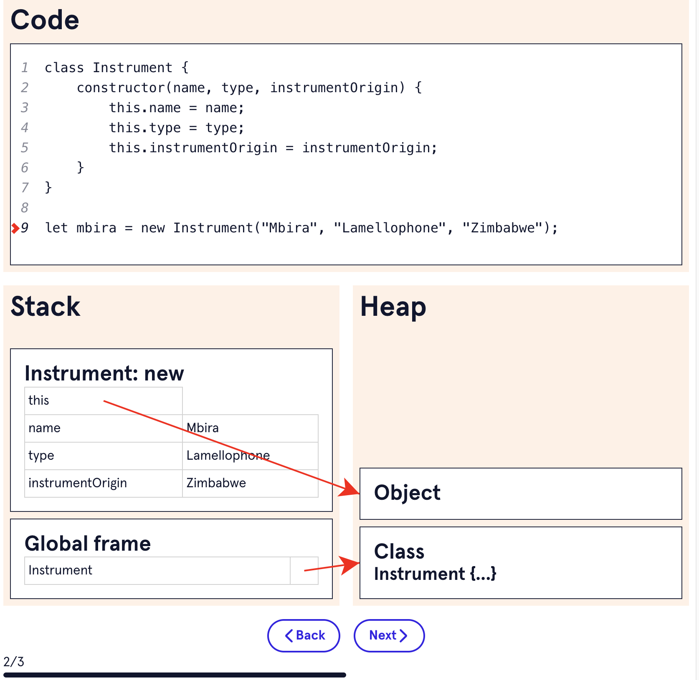
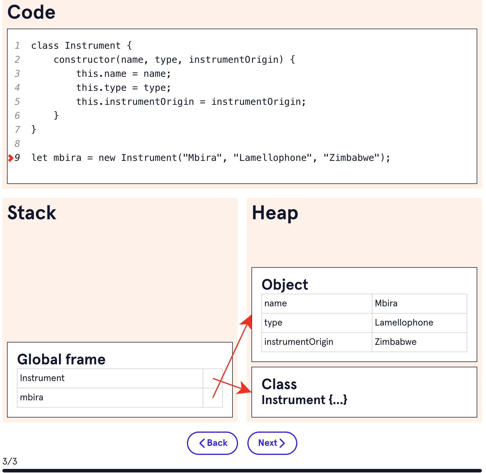

# 5. Memory management


In other programming languages, like C and C++, you use new/delete to manually allocate and release memory for objects. That kind of responsibility can be a frequent source of bugs. With JavaScript, the primary memory issues that come up relate to *memory leaks*, which is when memory that should be released is still in action.
JavaScript has two data structures for memory:
* 		The heap
* 		The stack
When you assign values to variables, the JavaScript engine is tasked with figuring out if the value is a primitive or a reference value. The outcome determines if the value is stored in the heap or the stack.

### **The Stack**
The stack is used for static storage, where the size of an object is known when the code is compiled. Since the size is known, a fixed amount of data is reserved for the object, and the stack remains ordered. The stack has a finite amount of space provided by the operating system, which you typically only exceed when you have problems in your code, like infinite recursion or memory leaks.
Primitive values, *references* to non-primitive values, and function call frames are stored in the stack. You can think of references as a parking space number in a massive (but disordered) parking garage telling JavaScript where to find objects and functions.

### **The Heap**
The heap provides dynamic memory allocation at runtime for data types that don’t have a fixed size, like objects and functions. These are *reference values* and we keep track of where to find them in the unstructured heap using a fixed-size *reference* in the stack. If you modify an object, you are modifying a reference to the object and not the object itself.

```
const cat = {
    name: "Jupiter"
}

const pets = ["Jupiter", "Moshi", "Hercules"]

```

In the example, cat is stored in the heap, a reference to cat is stored in the stack, and the property name is stored in the stack. The pets array is stored in the heap, while a reference to it is stored in the stack.

```
let object = new Object();
let object2 = object;
object.greeting = "Hello, world";

console.log(object2); // { greeting: 'Hello, world' }

```

In the example, object and object2 are pointing to the same object in memory in the heap, but with different variables that are saved in the stack.


## **Memory Life Cycle**
Now that we know about the different types of memory, we can talk about the memory life cycle. There are three parts to consider:
* Memory allocation (Values are declared and stored in memory)
* Memory in use (Values are read or rewritten)
* Releasing memory (Values are no longer in use and get removed from memory)

### Memory Allocation
When we create a variable or declare values, memory is allocated. This can be initiated in many ways:
* Regular variable assignment
* Assigning properties to an object
* Declaring callable functions
* Calling functions
In the applet below, an object is created using the Instrument() constructor function. Notice that the variable names take up memory in the stack, while function definitions and objects have memory in the heap. During function execution, a frame is added to the stack until the function is complete, then it can pop off the stack.







JavaScript allocates memory during function execution. When a function is called, a function frame is added to the stack and some memory is allocated. Then, as more local variables are declared as the function executes, more stack memory gets allocated on the function frame. Any new objects get stored in the heap with references in the function frame in the stack. If another function is called from within the function, another function frame is added to the stack.
When a function is done executing, its function frame is removed from the stack, and the memory it used is deallocated and becomes available again to the rest of your code. After function execution is done, any objects that were stored in the heap will no longer have references from the stack, so they can be garbage collected.

```
let str = "Hi";
let str2 = str;

```

In the snippet, str and str2 are two separate primitives, and both are saved in the stack with a fixed amount of memory allocation to store the string “Hi”. There are two separate versions of the string “Hi”.
Objects, on the other hand, are passed via a reference variable copy. This can be a source of bugs in your code, so it is important to be aware of how this works. If you pass an object and modify the object within the function, the original object will be modified, since both the original variable and the function’s internal variable are referencing the same object in memory.

```
let aaliyah = {
    name: "Aaliyah"
}

function nameObjectModification(obj, name) {
    obj.name = name;
    return obj;
}

let sarah = nameObjectModification(aaliyah, "Sarah");

console.log(aaliyah); // { name: 'Sarah' }
console.log(sarah); // { name: 'Sarah' }

```

In the example, we created an aaliyah object, which JavaScript saved in the heap with a reference to it in the stack. Then we called the nameObjectModification() function and assigned it to the variable sarah.
When we created the sarah object using the nameObjectModification() function, we used a copy of the reference to the aaliyah object. In the function call, the object we use and create still references the aaliyah object, even though we’re assigning the return value to a new variable. So in the end, both variables reference the same object, and the name is updated on both the aaliyah object and the new sarah object.

## **Memory in Use**
Memory is in use when you are reading and writing allocated memory and includes the following tasks:
* 		Variable reassignment
* 		Using variables
* 		Passing arguments to functions

## **Releasing Memory: Garbage Collection**
*Garbage collection* refers to the process of clearing memory. The JavaScript engine manages garbage collection using two key algorithms:
* 		Reference-counting
* 		Mark-and-sweep
Garbage collection algorithms use different approaches to detect if some piece of memory is no longer needed by the program. Once memory is no longer needed, it is released and can be reused. (Remember that we mentioned all memory relates back to RAM, so space is finite.) When you consider the idea of whether or not some piece of memory is still needed, it can get pretty complicated. Let’s take a quick look at how the reference-counting and mark-and-sweep algorithms work.

### **Reference-Counting**
As we learned about in the stack and heap section, all of the objects you make in your program have references and memory allocated to them.
*Reference-counting* makes use of the references to variables that live on the stack. When an object is created, it’s reference count is one. If you make a second variable point to that object, the reference count is two. If a function makes use of an object, the reference count is increased by one. Usually, inner elements from function calls are garbage collected when a function is done executing, unless the inner elements are still referenced.

```
let obj = new Object(); // reference count of one
let obj2 = obj; // reference count of two
obj2 = "string"; // obj has a reference count of one again

```


With the reference-counting algorithm, if the reference count drops down to zero, there are no more references to the object in your program, so the JavaScript engine can mark that memory block as free to use so future allocations can utilize and overwrite the block.

```
let monument = {
   name: "Eiffel Tower"
};
monument = "Golden Gate Bridge";

```


In the example, the monument variable is reassigned to the string value “Golden Gate Bridge,” so the name property can be garbage collected as it has a reference count of zero.
This type of algorithm does have some shortcomings. We’ll look into the concept of *circular references* in the memory leak section below and how reference counting doesn’t always cut it.

### **Mark-and-Sweep**
The *Mark-and-Sweep* algorithm runs periodically and starts at the root of your code, the global object. From the root, it’ll “sweep” across your code to find and mark anything that is “reachable” by traversing across all of the variables. The mark is generally something like a boolean. After that process, any of the variables that are unmarked (i.e. they were not marked in the first step and therefore were not reachable) will be garbage collected during the sweep phase. That process is repeated over and over again during code execution.
**What happens when your process runs out of memory**
When your code uses more and more memory, it can impact performance and cause Node applications or browser tabs to crash or experience latency. One way that happens is through *memory leaks*. If you have a memory leak, the program might try to allocate more memory than is actually available, and you can encounter memory errors. In the browser, that will just be the tab crashing.
When you don’t have enough memory allowed for Node, you might see a fatal error message:

```
==== JS stack trace =========================================
FATAL ERROR: CALL_AND_RETRY_LAST Allocation failed - JavaScript heap out of memory

```


While that error can be resolved by allocating more memory to your application in Node, that’s not really possible for frontend apps because that would equate to requiring end users to download more RAM. Even though memory leaks can be hidden by adding more hardware, finding and fixing the root cause of a memory leak is generally a better fix than throwing more hardware at a problem. Let’s take a look at how you can determine if you might have a memory leak.
**Memory Leaks**
When memory that’s no longer needed by a program persists, it is called a *memory leak*. The memory should be returned to the pool of free memory for future objects. A memory leak can happen when garbage collection fails to find an object that lost its connection to the root object, or when objects grow in size and are referenced by other objects. When this happens, it can be the source of slowdowns, crashes, and high latency in your code.
You can mostly avoid memory issues in your program if you have awareness of what causes memory problems in the first place. There are a few common scenarios that cause memory leaks in code. For now, learn what causes them so you can avoid them. Later, we’ll learn how to debug memory leaks using browser tools.

### **Messy Closures**

```
function bigObjMaker() {
    const bigObj = {};
    return (key, val) => {
        bigObj[key] = val;
        console.log(bigObj);
    }
}
let bigMemoryUser = bigObjMaker();

Array(1000).fill(1).map((x,i) => {
    bigMemoryUser(i, i);
});

```


In the example, the closure over the bigObj object keeps the memory in use, even after bigObjMaker() finishes executing. If you run this code in your browser, it might crash the browser due to the console.log() statements when bigMemoryUser() executes 1000 times. The object bigObj can grow infinitely depending on how many times bigMemoryUser() is called.
**Dangling Timers and Event Listeners**
You might be used to using setInterval() or other browser APIs in your code. Sometimes, you can wind up with a dangling timer or callback that references nodes or memory that your program doesn’t need anymore. If the handler is still active, anything it is referencing can’t be garbage collected.

```
function cb() {
    let count = 0;

    return function() {
         count++;
         console.log(count);
    }
}

setInterval(cb(), 1000);

```


In the example, the counter variable is in the closure when you call cb(). When we use the setInterval() callback, it repeatedly calls that function cb() every 1000ms (set by the second argument). If you don’t assign the setInterval() call to a variable, you’ll get a memory leak if you can’t clear the interval later.

```
let intervalID = setInterval(cb(), 100);
clearInterval(intervalID); // You can use a DOM element to call `clearInterval()`

```


The second snippet shows how you can assign a variable the value of calling setInterval() so that you can clear it when the time comes.
Another scenario to watch out for is the existence of anonymous functions when you use event listeners:

```
const lotsOfMemory = "Imagine this is a value that uses a lot of memory"

document.addEventListener('scroll', function() {
 cb(lotsOfMemory);
});

```


In the example, the lotsOfMemory string will be stored in the closure of the anonymous function that is called on scroll events.

### **Circular References**

```
If two objects have pointers that reference each other, a 
```


```
*circular reference*
```


```
 is formed.
let first = new Object();
let second = new Object();

first.aProperty = second;
second.anotherProperty = first;

```


As you can see in the example, the first object has a property aProperty that references the second object and the second object has a property anotherProperty that references the first object. Since these two objects reference each other through their properties, they’ll each wind up having a reference count of two. Circular references can cause memory leaks due to the reference-counting algorithm. Luckily, the mark-and-sweep algorithm — used by most browsers — handles that shortcoming.

### **Declaring Variables on the Global Object**

```
function helloWorld() {
  // below greeting does not use a `let`, `const` or `var` statement to
  // declare the variable, so it's added to the global object after we
  // call `helloWorld()`
   greeting = "Hello world"; 
  
// This also leaks into the global `this`
  this.greeting2 = "Goodbye!"; 
}

helloWorld();

```


This type of issue is easy to avoid as long as you remember scoping rules and always use an appropriate let orconst statement to assign your variables with the correct block scoping. You can also use strict-mode to help keep your global scope clean. Since global variables are available from the root, they never get garbage collected.
**Memory Behavior Can Cause Unexpected Outcomes in Code**
Since JavaScript handles garbage collection, it also determines how often it performs garbage collection. The frequency of garbage collection can cause performance issues for your application. Some aspects of your code, like high object churn, can cause more frequent garbage collection, which in turn can slow down your program. One solution to this is to use an object pool, which retains some memory as an unused object that you can recycle instead of allocating and garbage collecting memory.

