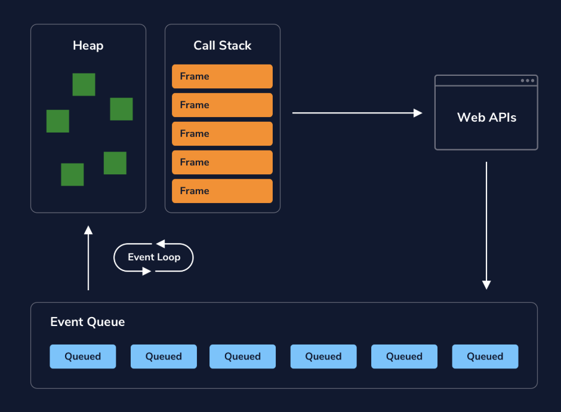

# 1. The Event Loop

# 1. The **Event Loop**
# 

## **What is Synchronous Code?**
 *Synchronous code* executes in sequential order — it starts with the code at the top of the file and executes line by line until it gets to the end of the file. This type of behavior is known as *blocking* (or blocking code) since each line of code cannot execute until the previous line finishes.
## 
## **What is Asynchronous Code?**
*Asynchronous code* can be executed in parallel to other code that is already running. Without the need to wait for other code to finish before executing, our apps can save time and be more efficient. This type of behavior is considered *non-blocking*.
For most programming languages, the ability to execute asynchronous code depends on the number of *threads* that an app has access to. We can think of a thread as a resource that a computer provides an app to do a task. Typically one thread allows for an app to complete one task. If we return to our house example, our computers thread tasks might look like this:

```
Thread 1: build house foundation -> build walls -> construct floor 

```

A single thread could work for a synchronous task like building a house. However, in our cake baking example, our threads would have to look like this:

```
Thread 1: preheat oven
Thread 2: prepare ingredients -> bake cake

```

We won’t discuss in-depth how many threads an app can access but we should note that the more threads we have, the more tasks we can run concurrently. Also, in most modern-day computers, multithreading is achieved by having a CPU that has multiple cores or by some other technology.

JavaScript is a *single-threaded* language. This means it has a single thread that can carry out one task at a time. However, Javascript has what is known as the *event loop*, a specific design that allows it to perform asynchronous tasks even while only using a single thread (more on this later!). Let’s examine some examples of asynchronous code in Javascript!

## **Asynchronous Callbacks**
One common example of asynchronicity in JavaScript is the use of *asynchronous callbacks*. This is a type of callback function that executes after a specific condition is met and runs concurrently to any other code currently running. Let’s look at an example:

```
easterEgg.addEventListener('click', () => {
  console.log('Up, Up, Down, Down, Left, Right, Left, Right, B, A');
});

```

In the code above, the function passed as the second argument of .addEventListener() is an asynchronous callback — this function doesn’t execute until the easterEgg is clicked.

### **setTimeout()**
setTimeout() is a Node API (a comparable API is provided by web browsers) that uses callback functions to schedule tasks to be performed after a delay. setTimeout() has two parameters: a callback function and a delay in milliseconds.
In addition to asynchronous callbacks, JavaScript provides a handful of built-in functions that can perform tasks asynchronously. One function that is commonly used is the <u>[setTimeout()](https://developer.mozilla.org/en-US/docs/Web/API/setTimeout)</u> function.
With setTimeout() we can write code that tells our JavaScript program to wait a minimum amount of time before executing its callback function. Take a look at this example:

```
setTimeout(() => {
  console.log('Delay the printing of this string, please.');
}, 1000);

```

Notice that setTimeout() takes 2 arguments, a callback function and a number specifying how long to wait before executing the function. In the example above, the function will print 'Delay the printing of this string, please.' after 1000 milliseconds (or 1 second) have passed.
In web development, this means we can write code to wait for an event to trigger all while a user goes on interacting with our app. One such example could be if a user goes to a shopping site and gets notified that an item is up for sale and only for a limited time. Our asynchronous code could allow the user to interact with our site and when the sale timer expires, our code will remove the sale item.

### **setInterval()**
Another common built-in function is <u>[setInterval()](https://developer.mozilla.org/en-US/docs/Web/API/setInterval)</u> which also takes a callback function and a number specifying how often the callback function should execute. For example:

```
setInterval(() => {
  alert('Are you paying attention???')
}, 300000)

```

The setInterval() would call the alert() function and show a pop-up message of 'Are you paying attention???' every 300000 milliseconds (or 5 minutes).

# **Concurrency Model and Event Loop in JavaScript**
JavaScript is a *single-threaded* language, which means that two statements can’t be executed simultaneously. For example, if you have a for loop that takes a while to process, it’ll have to finish executing before the rest of your code runs. That results in blocking code. But as we already learned, we can run non-blocking code in JavaScript, which is where the Event Loop comes in.
There are functions like setTimeout() that work differently thanks to the Event Loop

```
console.log("I’m learning about");
setTimeout(() => { console.log("Event Loop");}, 2000);
console.log("the");

```

In this case, the code snippet uses the setTimeout() function to demonstrate how JavaScript can be non-blocking with use of the event loop. Here’s what happens:
* A statement is logged.
* The setTimeout() function is executed.
* A third line of code executes and logs text: “the”.
* Finally, the setTimeout() function timer completes and additional text is logged: “Event Loop”.
In this case, JavaScript is still single-threaded, but the event loop is enabling something called concurrency.

Usually when we think about *concurrency* in programming, it means that two or more procedures are executed at the same time on the same shared resources. Since JavaScript is single-threaded, as we saw in the for loop example, we’ll never have that flavor of “true” concurrency. However, we can emulate concurrency using the event loop.

## **What Is the Event Loop?**
At a high level, the event loop is a system for managing code execution. In the diagram, you can see an overview of how the parts that make up the event loop fit together.
We have data structures that we call the heap and the call stack, which are part of the JavaScript engine. The heap and call stack interact with Node and Web APIs, which pass messages back to the stack via an event queue. The event queue’s interaction with the call stack is managed by an event loop. All together, those parts maintain the order of code execution when we run asynchronous functions. Don’t worry about understanding what those terms mean yet–we’ll dive into them shortly.


## **Components of the Event Loop**
The *event loop* is made up of these parts:
* Memory Heap
* Call Stack
* Event Queue
* Event Loop
* Node or Web APIs

### Heap
The *heap* is a block of memory where we store objects in an unordered manner. JavaScript variables and objects that are currently in use are stored in the heap.

### **The Call Stack**
The *stack*, or *call stack*, tracks what function is currently being run in your code.
When you invoke a function, a *frame* is added to the stack. Frames connect that function’s arguments and local variables from the heap. Frames enter the stack in a *last in, first out* (LIFO) order. In the code snippet below, a series of nested functions are declared, then foo() is called and logged.

```
function foo() {
 return function bar() {
   return function baz() {
     return 'I love CodeCademy'
   }
 }
}
console.log(foo()()());

```

The function executing at any given point in time is at the top of the stack. In our example code, since we have nested functions, they will all be added to the stack until the innermost function has been executed. When the function finishes executing e.g. returns, its frame is removed from the stack.

The *global execution context* is added to the call stack, which contains the global variable and lexical environment. Each subsequent frame for a called function has a function execution context that includes the function’s lexical and variable environment.
So when we say the call stack tracks what function is currently being run in our code, what we are tracking is the current execution context. When a function runs to completion, it is popped off of the call stack. The memory, or the frame, is cleared.

[CC78E094-5AF2-45BA-952F-EDDCED9CA1F7](attachments/CC78E094-5AF2-45BA-952F-EDDCED9CA1F7.mov)

### **The Event Queue**
The *event queue* is a list of messages corresponding to functions that are waiting to be processed. In the diagram, these messages are entering the event queue from sources such as various web APIs or async functions that were called and are returning additional events to be handled by the stack. Messages enter the queue in a first in, first out (FIFO) order. No code is executed in the event queue; instead, it holds functions that are waiting to be added back into the stack.
This event queue is a specific part of our overall event loop concept. Messages that are waiting in the event queue to be added back into the stack are added back via the event loop. When the call stack is empty, if there is anything in the event queue, the event loop can add those one at a time to the stack for execution.
* First the event loop will poll the stack to see if it is empty.
* It will add the first waiting message.
* It will repeat steps 1 and 2 until the stack has cleared.

### **The Event Loop in Action**

```
console.log("This is the first line of code in app.js.");
function usingsetTimeout() {
    console.log("I'm going to be queued in the Event Loop.");
}
setTimeout(usingsetTimeout, 3000);
console.log("This is the last line of code in app.js.");


```

* console.log("This is the first line of code in app.js."); is added to the stack, executes, then pops off of the stack.
* setTimeout() is added to the stack.
* setTimeout()’s callback is passed to be executed by a web API. The timer will run for 3 seconds. After 3 seconds elapse, the callback function, usingsetTimeout() is pushed to the Event Queue.
* The Event Loop, meanwhile, will check periodically if the stack is cleared to handle any messages in the Event Queue.
* console.log("This is the last line of code in app.js."); is added to the stack, executes, then pops off of the stack.
* The stack is now empty, so the event loop pushes usingsetTimeout onto the stack.
* console.log("I'm going to be queued in the Event Loop."); is added to the stack, executes, gets popped
* usingsetTimeout pops off of the stack.

Example

```
const shopForBeans = () => {
  return new Promise((resolve, reject) => {
    const beanTypes = ['kidney', 'fava', 'pinto', 'black', 'garbanzo'];
    setTimeout(() => {
      let randomIndex = Math.floor(Math.random() * beanTypes.length);
      let beanType = beanTypes[randomIndex];
      console.log(`2. I bought ${beanType} beans because they were on sale.`);
      resolve(beanType);
    }, 1000);
  });
}
async function getBeans() {
  console.log(`1. Heading to the store to buy beans...`);
  let value = await shopForBeans();
  console.log(`3. Great! I'm making ${value} beans for dinner tonight!`);
}
getBeans();
console.log("Describe what happens with this `console.log()` statement as well.");


```

The code will execute and log text in this order:
* Heading to the store to buy beans… Describe what happens with this console.log() statement as well.
* I bought fava beans because they were on sale.
* Great! I’m making fava beans for dinner tonight!
When the function getBeans() is called, getBeans() is added to the stack. The first console.log() statement within getBeans() is added to the stack, executes, and is popped off the stack. Next, the async function shopForBeans() is called and the return value is assigned to the variable value.
The response will be handled by the event queue and event loop and pushed back into the stack when it is cleared. While awaiting the resolution of the promise in shopForBeans(), the remaining code will continue to execute. The log statement on the very last line of the code block will be added to the stack, log its argument, and pop off the stack.
The stack will be clear afterward, so the response event in the event queue will get added back to the stack and executed. First, the anonymous function within setTimeout() will execute, logging its statement and resolving with a type of bean. Finally, within getBeans(), the variable value now contains the resolved value of the promise from shopForBeans() and the final logging statement executes.
