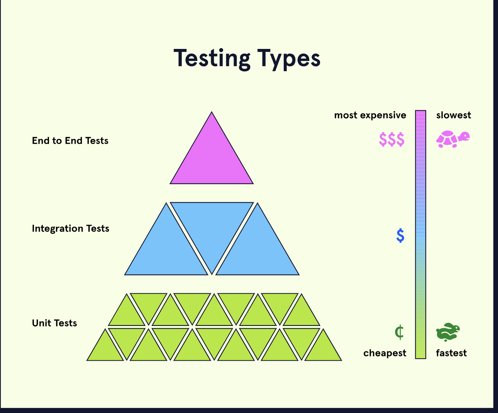

# 1. Automated testing


Compared to manual testing, automated testing is
* Faster: it tests more of your product in less time.
* More reliable: it’s less prone to error than a human is .
* Maintainable: you can review, edit, and extend a collection of tests.

Tests are written with code, just like the rest of your web app. You can refer to the code defining your app as *implementation code*, and the code defining your tests as *test code*.
Test code is included with and structured similarly to implementation code. Often times changes to test code are associated with changes to implementation code and vice versa. Both are easier to maintain when they are stored in the same place.
For example, if implementation code is written in index.js then the corresponding test code may be written in index-test.js.

Documentation can come in many forms, including plain text, diagrams…and tests! Tests as documentation provide what many other forms cannot: both human-readable text to describe the application and machine-executable code to confirm the app works as described.
This code block from the Cake Bar app describes and tests the “name” functionality.

```
it('accepts the customer name', () => {
  const name = 'Hungry Person';

  browser.url('/');
  browser.setValue('#name', name);
  browser.click('#submit-order');
  browser.url('/');

  assert.include(browser.getText('#deliver-to'), name);
});

```


## Regression
When adding a new feature to your product, it’s possible that something will break. If that break occurs within a feature developed earlier, it is called *regression*. When functionality previously developed and tested stops working, you may say the *functionality regressed*.


## **What are the Types of Testing?**
At different stages of production for a particular project, you may encounter the opportunity for different types of tests, which can vary in scale and resource intensity, as well as serve different purposes. The types of testing we will discuss in this article are:
* Unit tests
* Integration tests
* End to end tests

### **Unit Tests**
A *unit test* covers the smallest possible unit of testable code, such as a single function. In order to keep the scope of a unit test focused on the unit being tested, any data or behavior from other units or external sources that the unit relies on should be replaced with fake (*mock*) data or behavior.
For example, in a weather application, we might have a number of functions that each handle a small piece of computation, such as converting fahrenheit to celsius or formatting incoming weather data from an API. Unit tests would be written first to ensure that these functions can perform independently before we move on to testing how they work together. Any data that might come in from an external database or API would be mocked.

### **Integration Tests**
An *integration test* covers how the units of a particular program work with one another. When testing integrations with external services, only the handling of incoming data is tested while the data itself remains mocked.
For example, in a weather application, integration tests would be written to ensure that weather data fetched from an API will be properly formatted to be displayed to the user. It would also ensure that delays, errors, or invalid data from the external service would be handled properly once they are introduced. The data itself would be mocked.

### **End to End Tests**
An *end to end test* (sometimes referred to as a *UI layer test* or *e2e*) automates user flow to test the application in the way that a real user would experience it. To closely match the end user’s experience, this type of testing would also test interactions with external services such as databases and APIs.
For example, in a weather application, end to end tests might be written to simulate a user searching for a particular location, selecting that location, choosing celsius or fahrenheit, and clicking through various aspects of the UI. In this test, the actual database and external API is used.

A typical developer’s feedback loop using these various test types might be:
* Make code changes
* Make a pull request
* The code change has tests run against it (unit, integration, sometimes e2e)
* If there are any failures then the dev will work on fixes in their local development environment.
* Repeat steps 1-4 until all tests pass.
* The pull request is allowed to be merged.


Some software testing methodologies prioritize writing test cases before writing the code those test cases will validate. Those types include:
* Test-driven Development (TDD)
* Behavior-driven Development (BDD)
* Specification by Example (SBE)
* Acceptance Test-driven Development (ATDD)
### 
### **Test-driven development**
Testing doesn’t necessarily have to occur after code has been written. **Test-driven development** is a methodology that flips the order, where tests are written before the functioning code is written. By writing tests in this order, test cases can start with the definition of their purpose, or use case.
There are many other benefits of test-driven development:
* Developers can better understand the requirements of code, before writing the code.
* Code that will never be executed won’t be added to the codebase.
* The scope of development is reduced.
* Code is written with testability in mind.

### **Behavior-driven development**
Another testing methodology that uses the strategy of writing test cases before code is **behavior-driven development**, or BDD. It is extremely similar to TDD in terms of process. Where these two methodologies differ is in why or when tests are written, what an individual unit is considered to be, and how the language of the test is composed.
It can be said that BDD is more specific than TDD. Changes to the code base, such as changing the design of the code, will not occur unless there is a relevant change in the product. Since those changes are feature-related, the unit of tests is called a “feature.” Test cases are related to whether or not the feature works, rather than if the individual functions or classes you are writing to develop features work.
