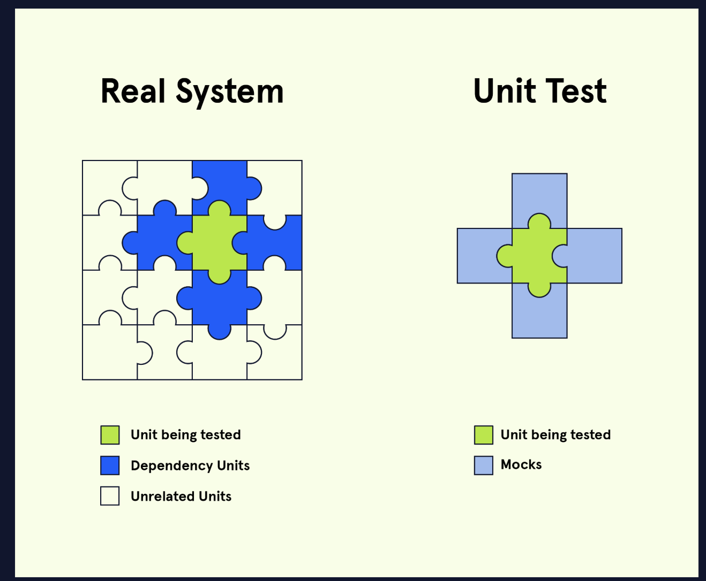

# 2. Code coverage and mocking


## Code coverage
Code coverage is the metric that measures the amount of application code that has been executed in testing, represented as a percentage. For example, if 90% of our code has been executed in our tests, then we would say that we have “90% code coverage”.

## **Code Coverage Criteria**
Measuring code coverage is conducted using one or more criteria, depending on the organization’s standards for code coverage. Though this is not an exhaustive list, some key criteria to use when measuring code coverage include:
* *Function Coverage*: Has each function been called?
* *Statement Coverage*: Has each statement been executed?
* *Path Coverage*: Has every edge in the <u>[control-flow graph](https://en.wikipedia.org/wiki/Control-flow_graph)</u> been executed?
* *Condition Coverage*: Has each boolean sub-expression evaluated to be both true and false?

### **Example**

```
function numSum(x, y) {
  if (x && y) {
    return (x + y);
  } else {
    return null;
  }
}

```

* Calling numSum(1, 2) achieves **100% function coverage**.
* Adding numSum(1, false) achieves **100% statement and path coverage**.
* To reach **100% condition coverage**, you also need: numSum(false, 1) and numSum().
Having 100% code coverage does not guarantee bug-free code – it simply validates the completeness of our tests using a given set of criteria relative to other test suites with lower code coverage. We still must be vigilant about writing robust test suites that specifically address both the intended use cases, and unintended edge cases, of our application.
We should consider the code coverage criteria as a set of guidelines to help you develop intuition for testing your code while remaining determined to write robust test suites that are specific in targeting the various use cases of our programs.

## Test coverage
Test coverage differs from code coverage in that test coverage measures the percentage of the required **features/specs** that are tested, as opposed to the percentage of lines executed. These features/specs are typically defined in a <u>[requirements document](https://en.wikipedia.org/wiki/Product_requirements_document)</u> provided by a client or product designer.
Suppose you are building a mobile-native application that needs to work on phones using the Android and iOS operating systems but is not expected to work on desktop browsers. Accordingly, to achieve high test coverage, you will be expected to write tests for your application’s performance on Android and iOS but not on browsers.

Code coverage measures the percentage of lines of code that are executed in a test while test coverage measures the percentage of required features that are tested.

## Moking
*Mocking* is the process of creating a fake version of an external service for testing purposes, particularly in unit tests and integration tests. Mocking is effective in testing individual units of code without relying on the functionality of other services or units such as APIs or databases.

### **Mocking in Unit Tests**
As mentioned above, mocking allows us to test a particular feature without needing to rely on other services or units. By removing dependencies, we are limiting the sources of potential bugs and unintended results to just the feature being tested.
In our blog application, the new feature has three steps:
* profile data must first be fetched from a database
* the data received must be parsed and formatted
* the formatted data is rendered
When unit testing how the data is displayed (step 3), we can skip the first two steps (fetching and formatting) by mocking the formatted data we need, allowing us to focus solely on testing how our feature renders that data. We can even mock bad or unexpected inputs to test how our feature might display an error message.


### **Mocking in Integration Tests**
While it’s helpful to use mocks in unit tests, we should avoid using mocks in integration tests to better simulate interactions between internal services (though external services should remain mocked).
In our blog application, we use an intermediate function to format incoming data from the database for our new feature that will render the data. To test this integration, we would no longer mock how that raw data is formatted and then displayed. We would, however, still mock the raw data coming in from the database.
