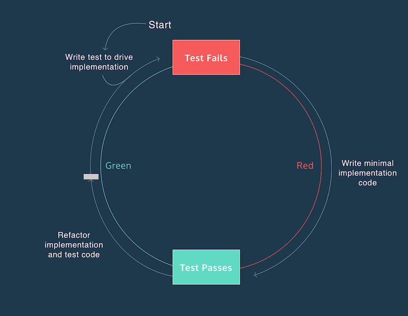

# 2. TDD with Mocha

Test-driven development (TDD) is a programming technique where you write test code before implementation code. Test code is written to define the desired behavior of your program. The test output provides descriptive error messages that inform the implementation of your program.

## **The Red-Green-Refactor Cycle**
One of the driving forces of TDD is the *red-green-refactor* cycle. “Red” and “green” correspond to the color of the text that our test framework produces in the terminal while running the tests in our suite. Red signifies failing tests and green corresponds to passing tests.

**Red**
Write a test that covers the functionality you would like to see implemented. You don’t have to know what your code looks like at this point, you just have to know what it will do.
Run the test. You should see it fail. Most test runners will output red for failure and green for success. While we say “failure” do not take this negatively. It’s a good sign! By seeing the test fail first, we know that once we make it pass, our code works.
**Green**
Read the error message from the failing test, and write as little code as possible to fix the current error message. By only writing enough code to see our test pass, we tend to write less code as a whole. Continue this process until the test passes.
This may involve writing intermediary features covering lower level functionality which require their own Red, Green, Refactor cycle. The **edge-case** was an example of this.
Do not focus on code quality at this point. Be shameless! We simply want to get our new test passing.
**Refactor**
Clean up your code, reducing any duplication you may have introduced. This includes your code as well as your tests.
Treat your test suite with as much respect as you would your live code, as it can quickly become difficult to maintain if not handled with care. You should feel confident enough in the tests you’ve written that you can make your changes without breaking anything.

### Assertion useful library
[https://www.chaijs.com/guide/styles/](https://www.chaijs.com/guide/styles/)